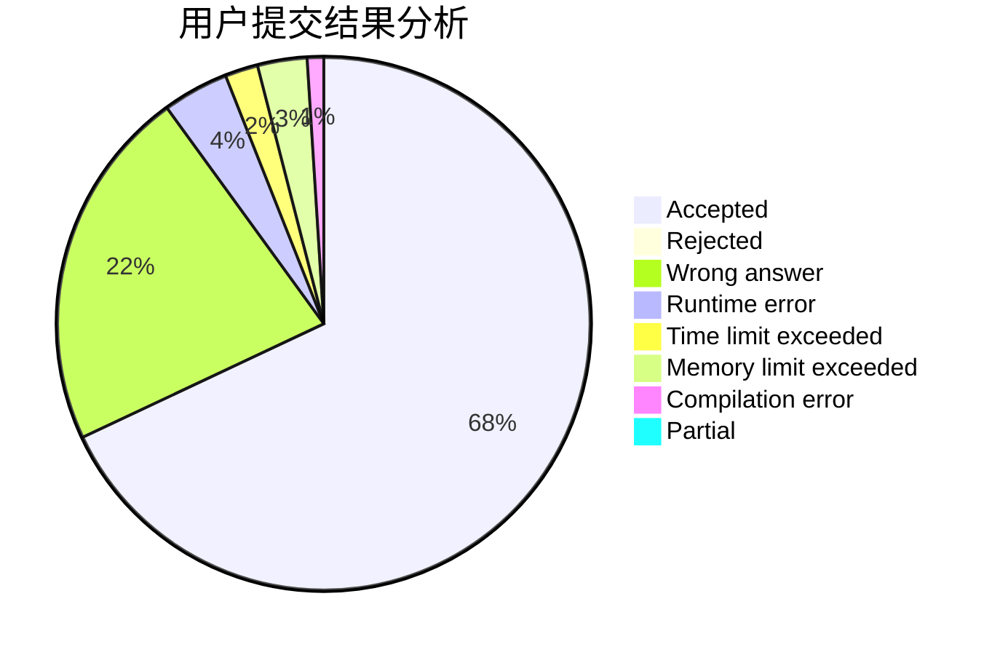
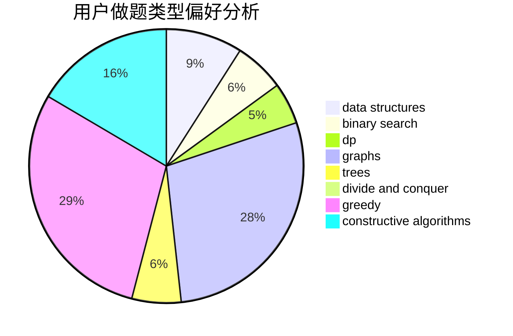
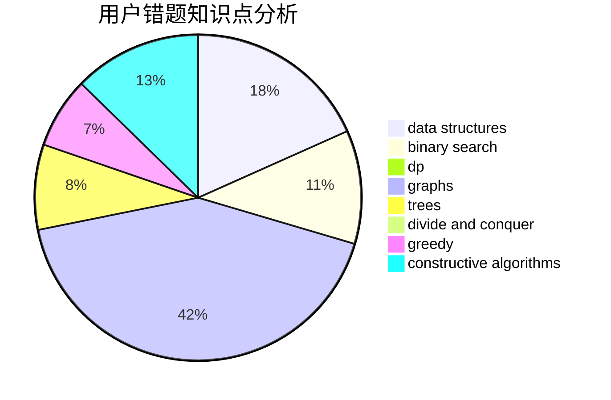

# 04lrw

<!-- tabs:start -->

#### **用户提交结果分析**

#### **用户做题类型偏好分析**

#### **用户错题知识点分析**

<!-- tabs:end -->
# 推荐题目
[1034A](https://codeforces.com/contest/1034/problem/A)		number theory		  
[1037H](https://codeforces.com/contest/1037/problem/H)		data structures,
                        string suffix structures		  
[1039B](https://codeforces.com/contest/1039/problem/B)		binary search,
                        interactive,
                        probabilities		  
[1036B](https://codeforces.com/contest/1036/problem/B)		math		  
[1033F](https://codeforces.com/contest/1033/problem/F)		bitmasks,
                        brute force,
                        fft,
                        math		  
[1033G](https://codeforces.com/contest/1033/problem/G)		games		  
[1037C](https://codeforces.com/contest/1037/problem/C)		dp,
                        greedy,
                        strings		  
[1033E](https://codeforces.com/contest/1033/problem/E)		binary search,
                        constructive algorithms,
                        dfs and similar,
                        graphs,
                        interactive		  
[1007A](https://codeforces.com/contest/1007/problem/A)		combinatorics,
                        data structures,
                        math,
                        sortings,
                        two pointers		  
[1038D](https://codeforces.com/contest/1038/problem/D)		dp,
                        greedy,
                        implementation		  
