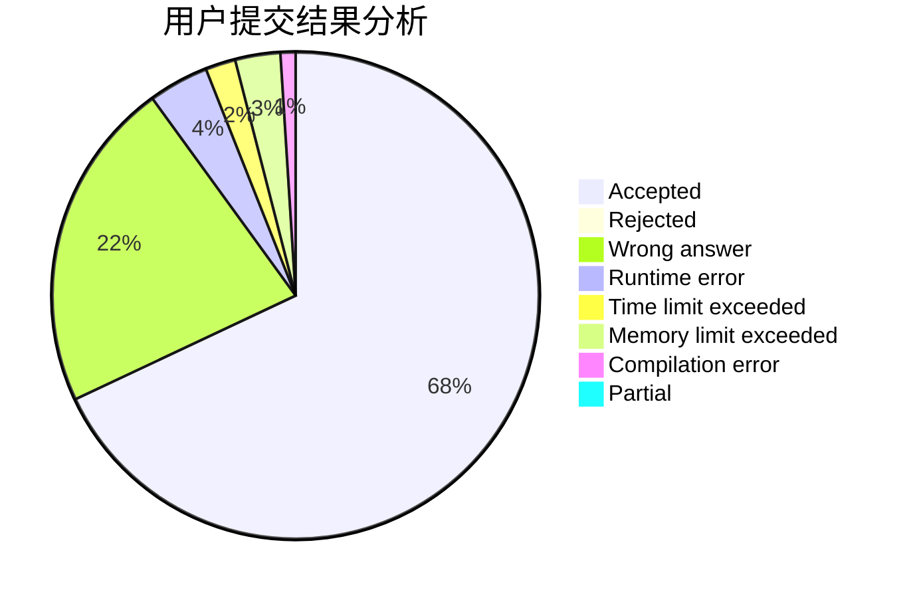
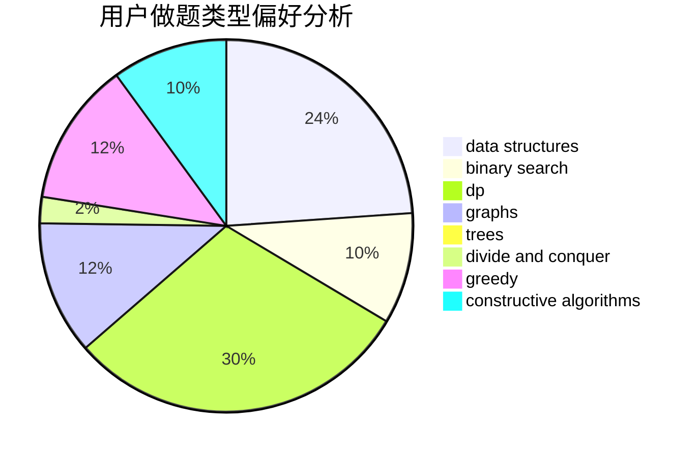
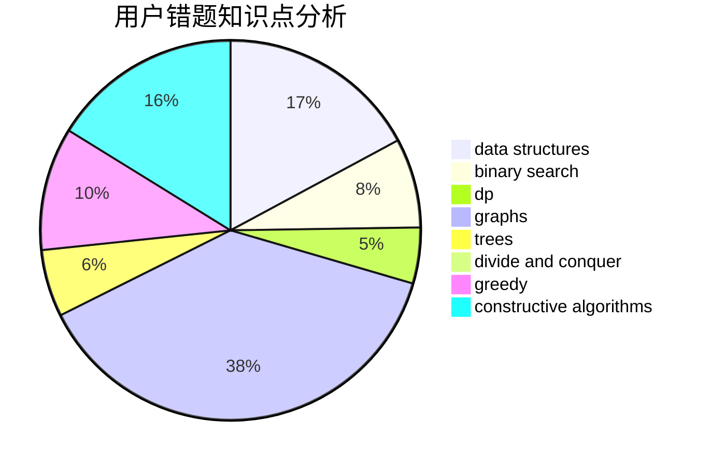

# 04lrw

<!-- tabs:start -->

#### **用户提交结果分析**

#### **用户做题类型偏好分析**

#### **用户错题知识点分析**

<!-- tabs:end -->
# 推荐题目
[1033E](https://codeforces.com/contest/1033/problem/E)		binary search,
                        constructive algorithms,
                        dfs and similar,
                        graphs,
                        interactive		  
[1037E](https://codeforces.com/contest/1037/problem/E)		graphs		  
[1038D](https://codeforces.com/contest/1038/problem/D)		dp,
                        greedy,
                        implementation		  
[1034D](https://codeforces.com/contest/1034/problem/D)		binary search,
                        data structures,
                        two pointers		  
[1033C](https://codeforces.com/contest/1033/problem/C)		brute force,
                        dp,
                        games		  
[1033D](https://codeforces.com/contest/1033/problem/D)		interactive,
                        math,
                        number theory		  
[1036F](https://codeforces.com/contest/1036/problem/F)		combinatorics,
                        math,
                        number theory		  
[1033B](https://codeforces.com/contest/1033/problem/B)		math,
                        number theory		  
[1006D](https://codeforces.com/contest/1006/problem/D)		implementation		  
[1038A](https://codeforces.com/contest/1038/problem/A)		implementation,
                        strings		  
