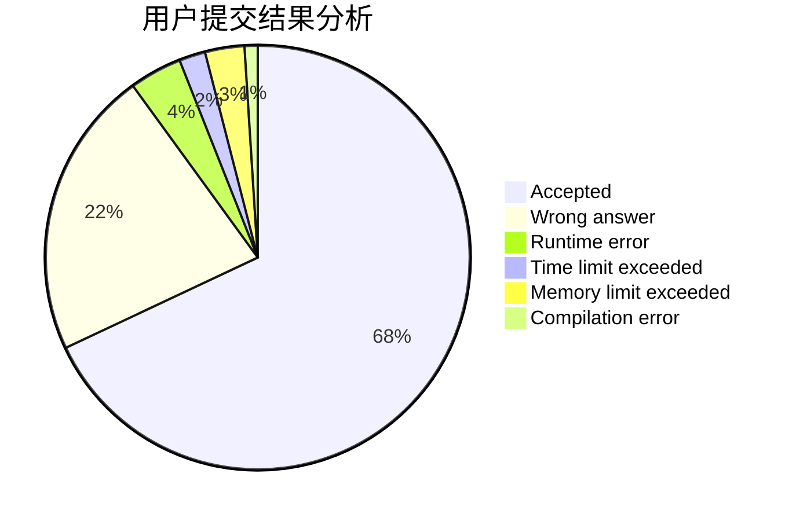
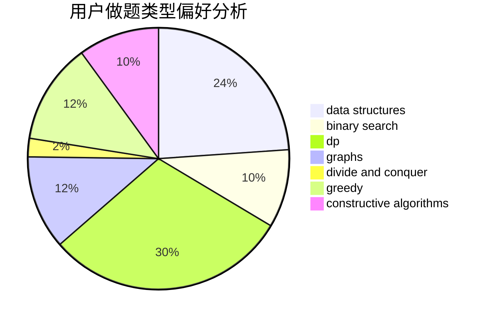
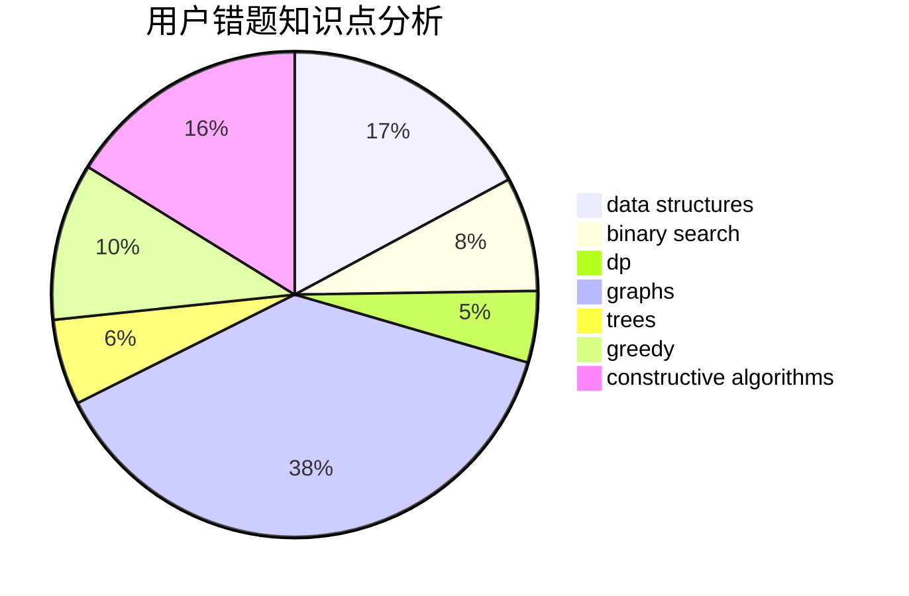

# 04lrw
<!-- tabs:start -->
#### **用户提交结果分析**

#### **用户做题类型偏好分析**

#### **用户错题知识点分析**

<!-- tabs:end -->
# 推荐题目
[Two Strings Swaps](http://codeforces.com/problemset/problem/1006/D)		implementation		  
[Slime](http://codeforces.com/problemset/problem/1038/D)		dp,
                        greedy,
                        implementation		  
[Divisors](http://codeforces.com/problemset/problem/1033/D)		interactive,
                        math,
                        number theory		  
[Permutation Game](http://codeforces.com/problemset/problem/1033/C)		brute force,
                        dp,
                        games		  
[Intervals of Intervals](http://codeforces.com/problemset/problem/1034/D)		binary search,
                        data structures,
                        two pointers		  
[Covered Points](http://codeforces.com/problemset/problem/1036/E)		fft,
                        geometry,
                        number theory		  
[Enlarge GCD](http://codeforces.com/problemset/problem/1034/A)		number theory		  
[Square Difference](http://codeforces.com/problemset/problem/1033/B)		math,
                        number theory		  
[Relatively Prime Powers](http://codeforces.com/problemset/problem/1036/F)		combinatorics,
                        math,
                        number theory		  
[Gambling](http://codeforces.com/problemset/problem/1038/C)		greedy,
                        sortings		  
<!-- tabs:start -->
#### **data structures**
[Intervals of Intervals](http://codeforces.com/problemset/problem/1034/D)		binary search,
                        data structures,
                        two pointers		  
[Security](http://codeforces.com/problemset/problem/1037/H)		data structures,
                        string suffix structures		  
[Timetable](http://codeforces.com/problemset/problem/1039/A)		constructive algorithms,
                        data structures,
                        greedy,
                        math		  
[Store](http://codeforces.com/problemset/problem/1010/E)		data structures		  
[Maximum Reduction](http://codeforces.com/problemset/problem/1037/F)		combinatorics,
                        data structures,
                        math		  
[Maximum width](http://codeforces.com/problemset/problem/1492/C)		binary search,
                        data structures,
                        dp,
                        greedy,
                        two pointers		  
[Old Floppy Drive](http://codeforces.com/problemset/problem/1490/G)		binary search,
                        data structures,
                        math		  
[Odd Mineral Resource](http://codeforces.com/problemset/problem/1479/D)		binary search,
                        bitmasks,
                        brute force,
                        data structures,
                        probabilities,
                        trees		  
[Meximization](http://codeforces.com/problemset/problem/1497/A)		brute force,
                        data structures,
                        greedy,
                        sortings		  
[Pekora and Trampoline](http://codeforces.com/problemset/problem/1491/C)		brute force,
                        data structures,
                        dp,
                        greedy,
                        implementation		  
#### **binary search**
[Intervals of Intervals](http://codeforces.com/problemset/problem/1034/D)		binary search,
                        data structures,
                        two pointers		  
[Hidden Bipartite Graph](http://codeforces.com/problemset/problem/1033/E)		binary search,
                        constructive algorithms,
                        dfs and similar,
                        graphs,
                        interactive		  
[Maximum width](http://codeforces.com/problemset/problem/1492/C)		binary search,
                        data structures,
                        dp,
                        greedy,
                        two pointers		  
[Pairs](http://codeforces.com/problemset/problem/1463/D)		binary search,
                        constructive algorithms,
                        greedy,
                        two pointers		  
[Old Floppy Drive](http://codeforces.com/problemset/problem/1490/G)		binary search,
                        data structures,
                        math		  
[Odd Mineral Resource](http://codeforces.com/problemset/problem/1479/D)		binary search,
                        bitmasks,
                        brute force,
                        data structures,
                        probabilities,
                        trees		  
[Complicated Computations](http://codeforces.com/problemset/problem/1436/E)		binary search,
                        data structures,
                        two pointers		  
[Divide and Summarize](http://codeforces.com/problemset/problem/1461/D)		binary search,
                        brute force,
                        data structures,
                        divide and conquer,
                        implementation,
                        sortings		  
[K-beautiful Strings](http://codeforces.com/problemset/problem/1493/C)		binary search,
                        brute force,
                        constructive algorithms,
                        greedy,
                        strings		  
[Pythagorean Triples](http://codeforces.com/problemset/problem/1487/D)		binary search,
                        brute force,
                        math,
                        number theory		  
#### **dp**
[Slime](http://codeforces.com/problemset/problem/1038/D)		dp,
                        greedy,
                        implementation		  
[Permutation Game](http://codeforces.com/problemset/problem/1033/C)		brute force,
                        dp,
                        games		  
[The Unbearable Lightness of Weights](http://codeforces.com/problemset/problem/1032/E)		dp,
                        math		  
[Equalize](http://codeforces.com/problemset/problem/1037/C)		dp,
                        greedy,
                        strings		  
[Maximum Matching](http://codeforces.com/problemset/problem/1038/E)		bitmasks,
                        brute force,
                        dfs and similar,
                        dp,
                        graphs		  
[Vasya and Maximum Matching](http://codeforces.com/problemset/problem/1032/F)		dp,
                        trees		  
[Little C Loves 3 III](http://codeforces.com/problemset/problem/1034/E)		bitmasks,
                        dp,
                        math		  
[Region Separation](http://codeforces.com/problemset/problem/1034/C)		combinatorics,
                        dp,
                        number theory,
                        trees		  
[Classy Numbers](http://codeforces.com/problemset/problem/1036/C)		combinatorics,
                        dp		  
[Maximum width](http://codeforces.com/problemset/problem/1492/C)		binary search,
                        data structures,
                        dp,
                        greedy,
                        two pointers		  
#### **graph**
[Little C Loves 3 II](http://codeforces.com/problemset/problem/1034/B)		brute force,
                        constructive algorithms,
                        flows,
                        graph matchings		  
[Maximum Matching](http://codeforces.com/problemset/problem/1038/E)		bitmasks,
                        brute force,
                        dfs and similar,
                        dp,
                        graphs		  
[Valid BFS?](http://codeforces.com/problemset/problem/1037/D)		dfs and similar,
                        graphs,
                        shortest paths,
                        trees		  
[King Escape](http://codeforces.com/problemset/problem/1033/A)		dfs and similar,
                        graphs,
                        implementation		  
[Hidden Bipartite Graph](http://codeforces.com/problemset/problem/1033/E)		binary search,
                        constructive algorithms,
                        dfs and similar,
                        graphs,
                        interactive		  
[Trips](http://codeforces.com/problemset/problem/1037/E)		graphs		  
[Minimum Ties](http://codeforces.com/problemset/problem/1487/C)		brute force,
                        constructive algorithms,
                        dfs and similar,
                        graphs,
                        greedy,
                        implementation,
                        math		  
[Chef Monocarp](http://codeforces.com/problemset/problem/1437/C)		dp,
                        flows,
                        graph matchings,
                        greedy,
                        math,
                        sortings		  
[Strange Housing](http://codeforces.com/problemset/problem/1470/D)		constructive algorithms,
                        dfs and similar,
                        graph matchings,
                        graphs,
                        greedy		  
[Longest Simple Cycle](http://codeforces.com/problemset/problem/1476/C)		dp,
                        graphs,
                        greedy		  
#### **trees**
[Vasya and Maximum Matching](http://codeforces.com/problemset/problem/1032/F)		dp,
                        trees		  
[Valid BFS?](http://codeforces.com/problemset/problem/1037/D)		dfs and similar,
                        graphs,
                        shortest paths,
                        trees		  
[Region Separation](http://codeforces.com/problemset/problem/1034/C)		combinatorics,
                        dp,
                        number theory,
                        trees		  
[Odd Mineral Resource](http://codeforces.com/problemset/problem/1479/D)		binary search,
                        bitmasks,
                        brute force,
                        data structures,
                        probabilities,
                        trees		  
[Yet Another Card Deck](http://codeforces.com/problemset/problem/1511/C)		brute force,
                        data structures,
                        implementation,
                        trees		  
[Diameter Cuts](http://codeforces.com/problemset/problem/1499/F)		combinatorics,
                        dfs and similar,
                        dp,
                        trees		  
[Fib-tree](http://codeforces.com/problemset/problem/1491/E)		brute force,
                        dfs and similar,
                        divide and conquer,
                        number theory,
                        trees		  
[13th Labour of Heracles](http://codeforces.com/problemset/problem/1466/D)		data structures,
                        greedy,
                        sortings,
                        trees		  
[BFS Trees](http://codeforces.com/problemset/problem/1495/D)		combinatorics,
                        dfs and similar,
                        graphs,
                        math,
                        shortest paths,
                        trees		  
[Sum of Prefix Sums](http://codeforces.com/problemset/problem/1303/G)		data structures,
                        divide and conquer,
                        geometry,
                        trees		  
#### **divide and conquer**
[Divide and Summarize](http://codeforces.com/problemset/problem/1461/D)		binary search,
                        brute force,
                        data structures,
                        divide and conquer,
                        implementation,
                        sortings		  
[Song of the Sirens](http://codeforces.com/problemset/problem/1466/G)		combinatorics,
                        divide and conquer,
                        hashing,
                        math,
                        string suffix structures,
                        strings		  
[Permutation Transformation](http://codeforces.com/problemset/problem/1490/D)		dfs and similar,
                        divide and conquer,
                        implementation		  
[Skyline Photo](https://codeforces.com/contest/1483/problem/C)		data structures,
                        divide and conquer,
                        dp		  
[Fib-tree](http://codeforces.com/problemset/problem/1491/E)		brute force,
                        dfs and similar,
                        divide and conquer,
                        number theory,
                        trees		  
[Sum of Prefix Sums](http://codeforces.com/problemset/problem/1303/G)		data structures,
                        divide and conquer,
                        geometry,
                        trees		  
[Dogeforces](http://codeforces.com/problemset/problem/1494/D)		constructive algorithms,
                        data structures,
                        dfs and similar,
                        divide and conquer,
                        dsu,
                        greedy,
                        sortings,
                        trees		  
[Logistical Questions](http://codeforces.com/problemset/problem/566/C)		dfs and similar,
                        divide and conquer,
                        trees		  
[Fruit Sequences](http://codeforces.com/problemset/problem/1428/F)		binary search,
                        data structures,
                        divide and conquer,
                        dp,
                        two pointers		  
[Dr. Evil Underscores](http://codeforces.com/problemset/problem/1285/D)		bitmasks,
                        brute force,
                        dfs and similar,
                        divide and conquer,
                        dp,
                        greedy,
                        strings,
                        trees		  
#### **greedy**
[Slime](http://codeforces.com/problemset/problem/1038/D)		dp,
                        greedy,
                        implementation		  
[Gambling](http://codeforces.com/problemset/problem/1038/C)		greedy,
                        sortings		  
[Equalize](http://codeforces.com/problemset/problem/1037/C)		dp,
                        greedy,
                        strings		  
[Timetable](http://codeforces.com/problemset/problem/1039/A)		constructive algorithms,
                        data structures,
                        greedy,
                        math		  
[Vasya and Arrays](http://codeforces.com/problemset/problem/1036/D)		greedy,
                        two pointers		  
[Packets](http://codeforces.com/problemset/problem/1037/A)		constructive algorithms,
                        greedy,
                        math		  
[Reach Median](http://codeforces.com/problemset/problem/1037/B)		greedy		  
[Maximum width](http://codeforces.com/problemset/problem/1492/C)		binary search,
                        data structures,
                        dp,
                        greedy,
                        two pointers		  
[Diamond Miner](https://codeforces.com/contest/1496/problem/C)		geometry,
                        greedy,
                        math,
                        sortings		  
[Anti-knapsack](http://codeforces.com/problemset/problem/1493/A)		constructive algorithms,
                        greedy		  
#### **constructive algorithms**
[Little C Loves 3 II](http://codeforces.com/problemset/problem/1034/B)		brute force,
                        constructive algorithms,
                        flows,
                        graph matchings		  
[Timetable](http://codeforces.com/problemset/problem/1039/A)		constructive algorithms,
                        data structures,
                        greedy,
                        math		  
[Colored Cubes](http://codeforces.com/problemset/problem/1025/E)		constructive algorithms,
                        implementation,
                        matrices		  
[Non-Coprime Partition](http://codeforces.com/problemset/problem/1038/B)		constructive algorithms,
                        math		  
[Hidden Bipartite Graph](http://codeforces.com/problemset/problem/1033/E)		binary search,
                        constructive algorithms,
                        dfs and similar,
                        graphs,
                        interactive		  
[Packets](http://codeforces.com/problemset/problem/1037/A)		constructive algorithms,
                        greedy,
                        math		  
[Anti-knapsack](http://codeforces.com/problemset/problem/1493/A)		constructive algorithms,
                        greedy		  
[Pairs](http://codeforces.com/problemset/problem/1463/D)		binary search,
                        constructive algorithms,
                        greedy,
                        two pointers		  
[XOR-gun](https://codeforces.com/contest/1456/problem/B)		bitmasks,
                        brute force,
                        constructive algorithms		  
[Genius's Gambit](http://codeforces.com/problemset/problem/1492/D)		bitmasks,
                        constructive algorithms,
                        greedy,
                        math		  
#### **sortings**
[Gambling](http://codeforces.com/problemset/problem/1038/C)		greedy,
                        sortings		  
[Diamond Miner](https://codeforces.com/contest/1496/problem/C)		geometry,
                        greedy,
                        math,
                        sortings		  
[Meximization](http://codeforces.com/problemset/problem/1497/A)		brute force,
                        data structures,
                        greedy,
                        sortings		  
[Avoiding Zero](http://codeforces.com/problemset/problem/1427/A)		math,
                        sortings		  
[Divide and Summarize](http://codeforces.com/problemset/problem/1461/D)		binary search,
                        brute force,
                        data structures,
                        divide and conquer,
                        implementation,
                        sortings		  
[Chef Monocarp](http://codeforces.com/problemset/problem/1437/C)		dp,
                        flows,
                        graph matchings,
                        greedy,
                        math,
                        sortings		  
[Replacing Elements](http://codeforces.com/problemset/problem/1473/A)		greedy,
                        implementation,
                        math,
                        sortings		  
[Eastern Exhibition](http://codeforces.com/problemset/problem/1486/B)		binary search,
                        geometry,
                        shortest paths,
                        sortings		  
[The Great Hero](http://codeforces.com/problemset/problem/1480/B)		greedy,
                        implementation,
                        sortings		  
[Rescue Nibel!](http://codeforces.com/problemset/problem/1420/D)		combinatorics,
                        data structures,
                        sortings		  
<!-- tabs:end -->
