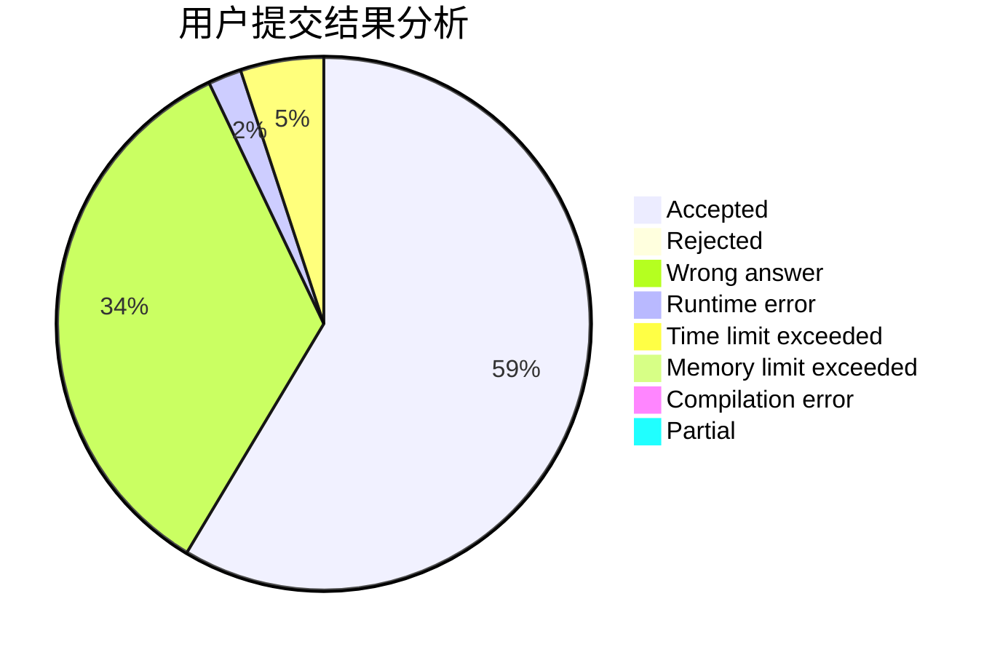
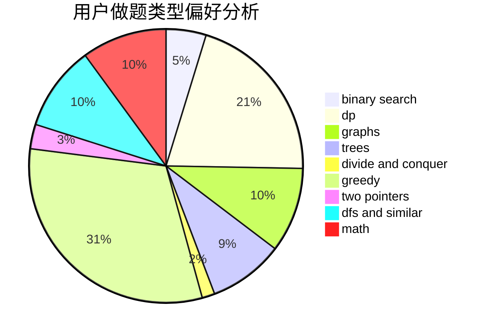

# 2020loveme

<!-- tabs:start -->

#### **用户提交结果分析**

#### **用户做题类型偏好分析**

<!-- tabs:end -->
# 推荐题目
[1293D](https://codeforces.com/contest/1293/problem/D)
[1296F](https://codeforces.com/contest/1296/problem/F)
[1296B](https://codeforces.com/contest/1296/problem/B)
[1278D](https://codeforces.com/contest/1278/problem/D)
[1292E](https://codeforces.com/contest/1292/problem/E)
[1086C](https://codeforces.com/contest/1086/problem/C)
[1298D](https://codeforces.com/contest/1298/problem/D)
[1295E](https://codeforces.com/contest/1295/problem/E)
[1293C](https://codeforces.com/contest/1293/problem/C)
[1294F](https://codeforces.com/contest/1294/problem/F)
