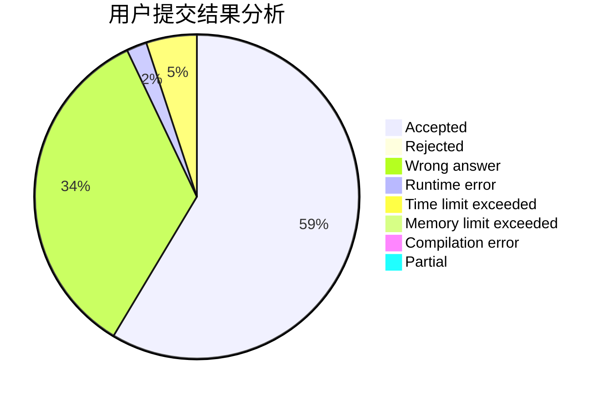
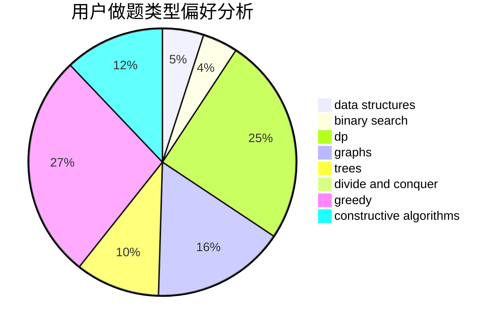
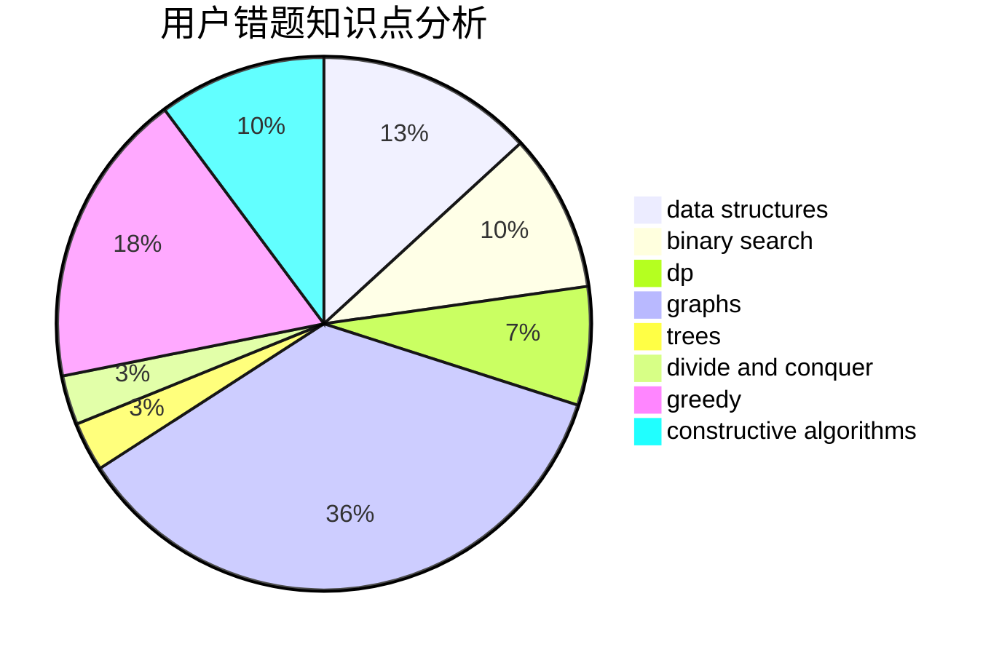

# 2020loveme

<!-- tabs:start -->

#### **用户提交结果分析**

#### **用户做题类型偏好分析**

#### **用户错题知识点分析**

<!-- tabs:end -->
# 推荐题目
[1293D](https://codeforces.com/contest/1293/problem/D)		dsu,graphs,sortings,trees		  
[1296F](https://codeforces.com/contest/1296/problem/F)		constructive algorithms,
                        dfs and similar,
                        greedy,
                        sortings,
                        trees		  
[1296B](https://codeforces.com/contest/1296/problem/B)		math		  
[1278D](https://codeforces.com/contest/1278/problem/D)		data structures,
                        dsu,
                        graphs,
                        trees		  
[1292E](https://codeforces.com/contest/1292/problem/E)		constructive algorithms,
                        greedy,
                        interactive,
                        math		  
[1086C](https://codeforces.com/contest/1086/problem/C)		dsu,graphs,sortings,trees		  
[1298D](https://codeforces.com/contest/1298/problem/D)		dsu,graphs,sortings,trees		  
[1295E](https://codeforces.com/contest/1295/problem/E)		data structures,
                        divide and conquer		  
[1293C](https://codeforces.com/contest/1293/problem/C)		dsu,graphs,sortings,trees		  
[1294F](https://codeforces.com/contest/1294/problem/F)		dfs and similar,
                        dp,
                        greedy,
                        trees		  
