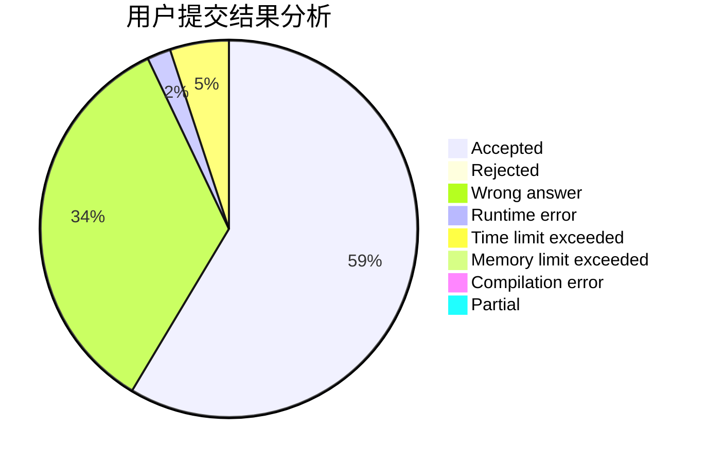
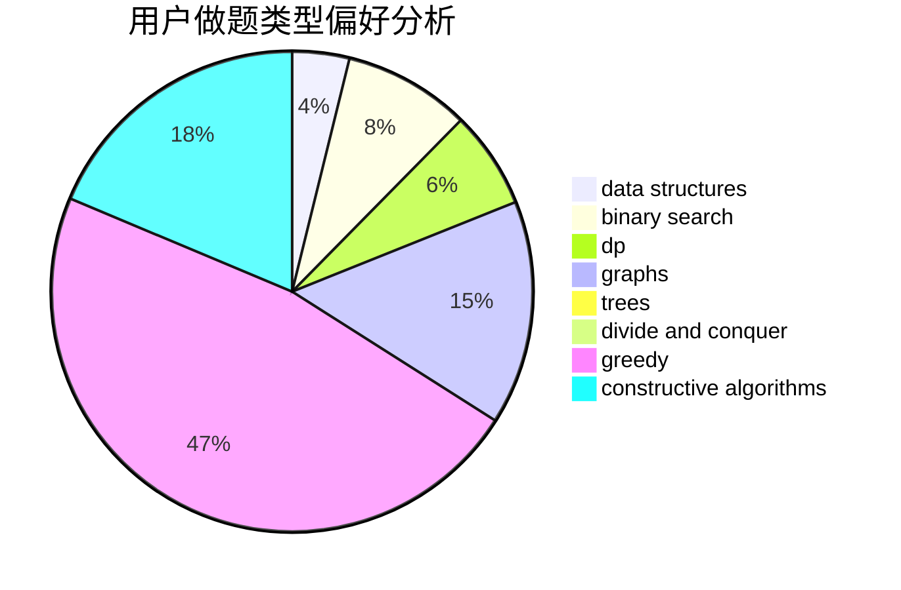
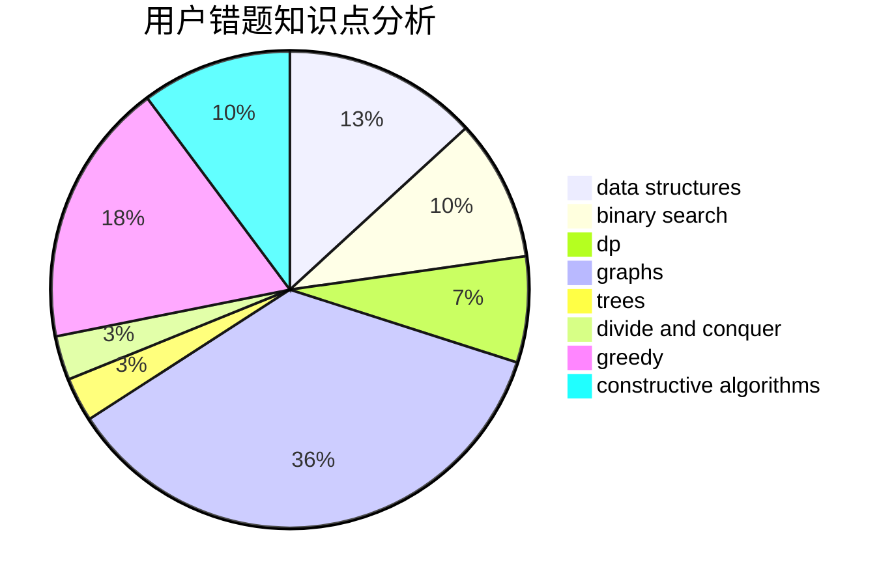

# 2020loveme

<!-- tabs:start -->

#### **用户提交结果分析**

#### **用户做题类型偏好分析**

#### **用户错题知识点分析**

<!-- tabs:end -->
# 推荐题目
[1286C1](https://codeforces.com/contest/1286C/problem/1)		brute force,
                        constructive algorithms,
                        interactive,
                        math		  
[1290C](https://codeforces.com/contest/1290/problem/C)		dfs and similar,
                        dsu,
                        graphs		  
[128C](https://codeforces.com/contest/128/problem/C)		combinatorics,
                        dp		  
[1269D](https://codeforces.com/contest/1269/problem/D)		dsu,graphs,sortings,trees		  
[1285D](https://codeforces.com/contest/1285/problem/D)		bitmasks,
                        brute force,
                        dfs and similar,
                        divide and conquer,
                        dp,
                        greedy,
                        strings,
                        trees		  
[1085G](https://codeforces.com/contest/1085/problem/G)		combinatorics,
                        data structures,
                        dp		  
[1291E](https://codeforces.com/contest/1291/problem/E)		dsu,graphs,sortings,trees		  
[1288C](https://codeforces.com/contest/1288/problem/C)		combinatorics,
                        dp		  
[1286B](https://codeforces.com/contest/1286/problem/B)		constructive algorithms,
                        data structures,
                        dfs and similar,
                        graphs,
                        greedy,
                        trees		  
[1287C](https://codeforces.com/contest/1287/problem/C)		dsu,graphs,sortings,trees		  
