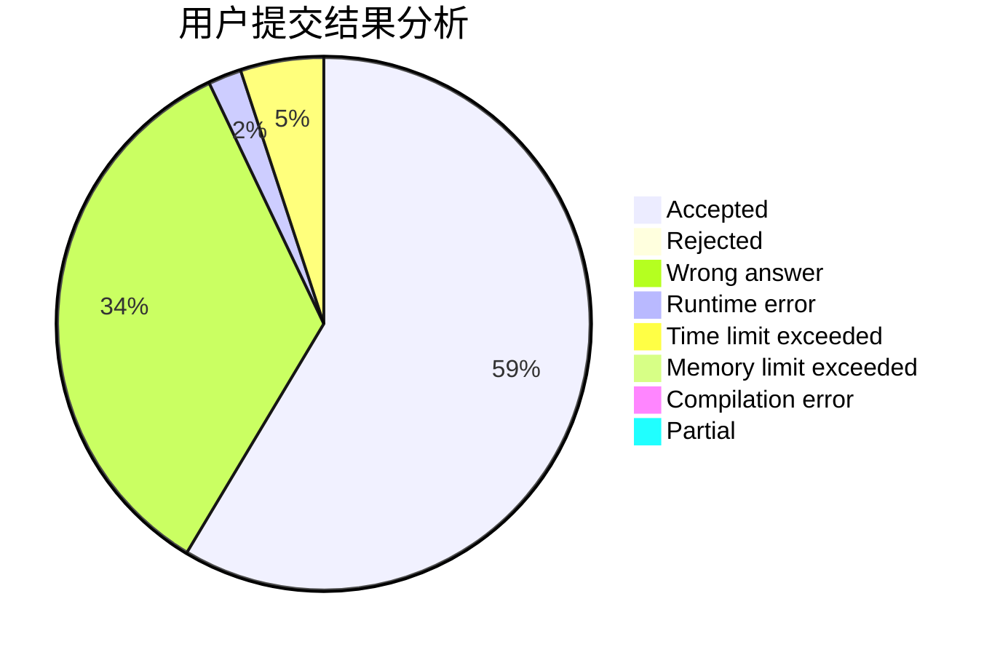
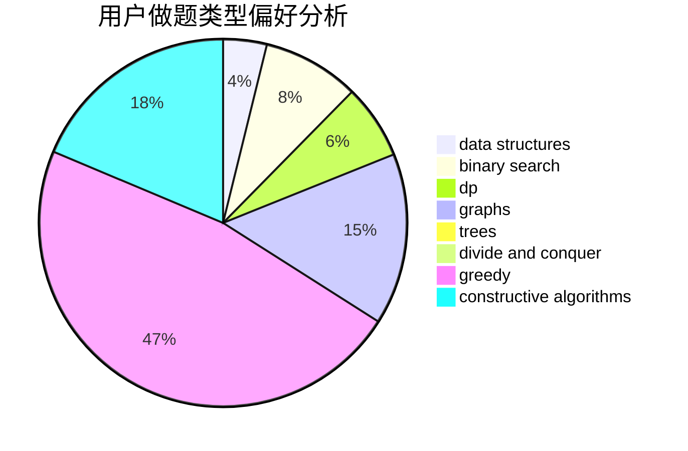
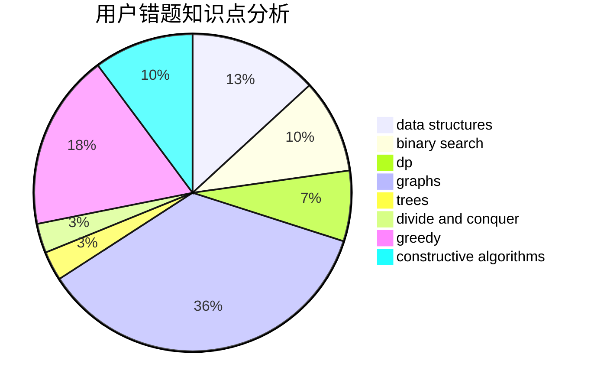

# 2020loveme
<!-- tabs:start -->
#### **用户提交结果分析**

#### **用户做题类型偏好分析**

#### **用户错题知识点分析**

<!-- tabs:end -->
# 推荐题目
[Prefix Enlightenment](https://codeforces.com/contest/1291/problem/E)		dfs and similar,
                        dsu,
                        graphs		  
[Prefix Enlightenment](http://codeforces.com/problemset/problem/1290/C)		dfs and similar,
                        dsu,
                        graphs		  
[Integer Sequence Dividing](http://codeforces.com/problemset/problem/1102/A)		math		  
[Delete a Segment](http://codeforces.com/problemset/problem/1285/E)		brute force,
                        constructive algorithms,
                        data structures,
                        dp,
                        graphs,
                        sortings,
                        trees,
                        two pointers		  
[Yet Another Meme Problem](http://codeforces.com/problemset/problem/1288/B)		math		  
[Beautiful Matrix](http://codeforces.com/problemset/problem/1085/G)		combinatorics,
                        data structures,
                        dp		  
[Making Shapes](http://codeforces.com/problemset/problem/1290/F)		dp		  
[Rin and The Unknown Flower](http://codeforces.com/problemset/problem/1292/E)		constructive algorithms,
                        greedy,
                        interactive,
                        math		  
[Triple Flips](https://codeforces.com/contest/1071/problem/C)		constructive algorithms		  
[Vasya and Good Sequences](http://codeforces.com/problemset/problem/1030/E)		bitmasks,
                        dp		  
<!-- tabs:start -->
#### **data structures**
[Prefix Enlightenment](http://codeforces.com/problemset/problem/1285/E)		brute force,
                        constructive algorithms,
                        data structures,
                        dp,
                        graphs,
                        sortings,
                        trees,
                        two pointers		  
[Prefix Enlightenment](http://codeforces.com/problemset/problem/1085/G)		combinatorics,
                        data structures,
                        dp		  
[Integer Sequence Dividing](http://codeforces.com/problemset/problem/1286/D)		data structures,
                        math,
                        matrices,
                        probabilities		  
[Delete a Segment](http://codeforces.com/problemset/problem/1146/E)		bitmasks,
                        data structures,
                        divide and conquer,
                        implementation		  
[Yet Another Meme Problem](http://codeforces.com/problemset/problem/1290/B)		binary search,
                        constructive algorithms,
                        data structures,
                        strings,
                        two pointers		  
[Beautiful Matrix](http://codeforces.com/problemset/problem/1286/B)		constructive algorithms,
                        data structures,
                        dfs and similar,
                        graphs,
                        greedy,
                        trees		  
[Making Shapes](http://codeforces.com/problemset/problem/1290/E)		data structures		  
[Rin and The Unknown Flower](http://codeforces.com/problemset/problem/1290/A)		brute force,
                        data structures,
                        implementation		  
[Triple Flips](http://codeforces.com/problemset/problem/1288/E)		data structures		  
[Vasya and Good Sequences](https://codeforces.com/contest/1291/problem/D)		binary search,
                        constructive algorithms,
                        data structures,
                        strings,
                        two pointers		  
#### **binary search**
[Prefix Enlightenment](http://codeforces.com/problemset/problem/1288/D)		binary search,
                        bitmasks,
                        dp		  
[Prefix Enlightenment](http://codeforces.com/problemset/problem/1285/F)		binary search,
                        combinatorics,
                        number theory		  
[Integer Sequence Dividing](http://codeforces.com/problemset/problem/1290/B)		binary search,
                        constructive algorithms,
                        data structures,
                        strings,
                        two pointers		  
[Delete a Segment](http://codeforces.com/problemset/problem/1288/A)		binary search,
                        brute force,
                        math,
                        ternary search		  
[Yet Another Meme Problem](http://codeforces.com/problemset/problem/1293/A)		binary search,
                        brute force,
                        implementation		  
[Beautiful Matrix](https://codeforces.com/contest/1291/problem/D)		binary search,
                        constructive algorithms,
                        data structures,
                        strings,
                        two pointers		  
[Making Shapes](http://codeforces.com/problemset/problem/1492/C)		binary search,
                        data structures,
                        dp,
                        greedy,
                        two pointers		  
[Rin and The Unknown Flower](http://codeforces.com/problemset/problem/1463/D)		binary search,
                        constructive algorithms,
                        greedy,
                        two pointers		  
[Triple Flips](http://codeforces.com/problemset/problem/1490/G)		binary search,
                        data structures,
                        math		  
[Vasya and Good Sequences](http://codeforces.com/problemset/problem/1479/D)		binary search,
                        bitmasks,
                        brute force,
                        data structures,
                        probabilities,
                        trees		  
#### **dp**
[Prefix Enlightenment](http://codeforces.com/problemset/problem/1285/E)		brute force,
                        constructive algorithms,
                        data structures,
                        dp,
                        graphs,
                        sortings,
                        trees,
                        two pointers		  
[Prefix Enlightenment](http://codeforces.com/problemset/problem/1085/G)		combinatorics,
                        data structures,
                        dp		  
[Integer Sequence Dividing](http://codeforces.com/problemset/problem/1290/F)		dp		  
[Delete a Segment](http://codeforces.com/problemset/problem/1030/E)		bitmasks,
                        dp		  
[Yet Another Meme Problem](https://codeforces.com/contest/1287/problem/C)		dp,
                        greedy,
                        sortings		  
[Beautiful Matrix](http://codeforces.com/problemset/problem/1288/C)		combinatorics,
                        dp		  
[Making Shapes](http://codeforces.com/problemset/problem/1288/D)		binary search,
                        bitmasks,
                        dp		  
[Rin and The Unknown Flower](http://codeforces.com/problemset/problem/1292/D)		dp,
                        graphs,
                        greedy,
                        math,
                        number theory,
                        trees		  
[Triple Flips](http://codeforces.com/problemset/problem/1292/C)		combinatorics,
                        dfs and similar,
                        dp,
                        greedy,
                        trees		  
[Vasya and Good Sequences](http://codeforces.com/problemset/problem/1285/D)		bitmasks,
                        brute force,
                        dfs and similar,
                        divide and conquer,
                        dp,
                        greedy,
                        strings,
                        trees		  
#### **graph**
[Prefix Enlightenment](https://codeforces.com/contest/1291/problem/E)		dfs and similar,
                        dsu,
                        graphs		  
[Prefix Enlightenment](http://codeforces.com/problemset/problem/1290/C)		dfs and similar,
                        dsu,
                        graphs		  
[Integer Sequence Dividing](http://codeforces.com/problemset/problem/1285/E)		brute force,
                        constructive algorithms,
                        data structures,
                        dp,
                        graphs,
                        sortings,
                        trees,
                        two pointers		  
[Delete a Segment](http://codeforces.com/problemset/problem/1292/D)		dp,
                        graphs,
                        greedy,
                        math,
                        number theory,
                        trees		  
[Yet Another Meme Problem](http://codeforces.com/problemset/problem/1291/F)		graphs,
                        interactive		  
[Beautiful Matrix](http://codeforces.com/problemset/problem/1286/B)		constructive algorithms,
                        data structures,
                        dfs and similar,
                        graphs,
                        greedy,
                        trees		  
[Making Shapes](http://codeforces.com/problemset/problem/1290/D)		constructive algorithms,
                        graphs,
                        interactive		  
[Rin and The Unknown Flower](https://codeforces.com/contest/1287/problem/D)		constructive algorithms,
                        data structures,
                        dfs and similar,
                        graphs,
                        greedy,
                        trees		  
[Triple Flips](http://codeforces.com/problemset/problem/1487/C)		brute force,
                        constructive algorithms,
                        dfs and similar,
                        graphs,
                        greedy,
                        implementation,
                        math		  
[Vasya and Good Sequences](http://codeforces.com/problemset/problem/1437/C)		dp,
                        flows,
                        graph matchings,
                        greedy,
                        math,
                        sortings		  
#### **trees**
[Prefix Enlightenment](http://codeforces.com/problemset/problem/1285/E)		brute force,
                        constructive algorithms,
                        data structures,
                        dp,
                        graphs,
                        sortings,
                        trees,
                        two pointers		  
[Prefix Enlightenment](http://codeforces.com/problemset/problem/1292/D)		dp,
                        graphs,
                        greedy,
                        math,
                        number theory,
                        trees		  
[Integer Sequence Dividing](http://codeforces.com/problemset/problem/1292/C)		combinatorics,
                        dfs and similar,
                        dp,
                        greedy,
                        trees		  
[Delete a Segment](http://codeforces.com/problemset/problem/1285/D)		bitmasks,
                        brute force,
                        dfs and similar,
                        divide and conquer,
                        dp,
                        greedy,
                        strings,
                        trees		  
[Yet Another Meme Problem](http://codeforces.com/problemset/problem/1286/B)		constructive algorithms,
                        data structures,
                        dfs and similar,
                        graphs,
                        greedy,
                        trees		  
[Beautiful Matrix](https://codeforces.com/contest/1287/problem/D)		constructive algorithms,
                        data structures,
                        dfs and similar,
                        graphs,
                        greedy,
                        trees		  
[Making Shapes](http://codeforces.com/problemset/problem/1479/D)		binary search,
                        bitmasks,
                        brute force,
                        data structures,
                        probabilities,
                        trees		  
[Rin and The Unknown Flower](http://codeforces.com/problemset/problem/1511/C)		brute force,
                        data structures,
                        implementation,
                        trees		  
[Triple Flips](http://codeforces.com/problemset/problem/1499/F)		combinatorics,
                        dfs and similar,
                        dp,
                        trees		  
[Vasya and Good Sequences](http://codeforces.com/problemset/problem/1491/E)		brute force,
                        dfs and similar,
                        divide and conquer,
                        number theory,
                        trees		  
#### **divide and conquer**
[Prefix Enlightenment](http://codeforces.com/problemset/problem/1285/D)		bitmasks,
                        brute force,
                        dfs and similar,
                        divide and conquer,
                        dp,
                        greedy,
                        strings,
                        trees		  
[Prefix Enlightenment](http://codeforces.com/problemset/problem/1146/E)		bitmasks,
                        data structures,
                        divide and conquer,
                        implementation		  
[Integer Sequence Dividing](http://codeforces.com/problemset/problem/1461/D)		binary search,
                        brute force,
                        data structures,
                        divide and conquer,
                        implementation,
                        sortings		  
[Delete a Segment](http://codeforces.com/problemset/problem/1466/G)		combinatorics,
                        divide and conquer,
                        hashing,
                        math,
                        string suffix structures,
                        strings		  
[Yet Another Meme Problem](http://codeforces.com/problemset/problem/1490/D)		dfs and similar,
                        divide and conquer,
                        implementation		  
[Beautiful Matrix](https://codeforces.com/contest/1483/problem/C)		data structures,
                        divide and conquer,
                        dp		  
[Making Shapes](http://codeforces.com/problemset/problem/1491/E)		brute force,
                        dfs and similar,
                        divide and conquer,
                        number theory,
                        trees		  
[Rin and The Unknown Flower](http://codeforces.com/problemset/problem/1303/G)		data structures,
                        divide and conquer,
                        geometry,
                        trees		  
[Triple Flips](http://codeforces.com/problemset/problem/1494/D)		constructive algorithms,
                        data structures,
                        dfs and similar,
                        divide and conquer,
                        dsu,
                        greedy,
                        sortings,
                        trees		  
[Vasya and Good Sequences](http://codeforces.com/problemset/problem/1482/E)		data structures,
                        divide and conquer,
                        dp		  
#### **greedy**
[Prefix Enlightenment](http://codeforces.com/problemset/problem/1292/E)		constructive algorithms,
                        greedy,
                        interactive,
                        math		  
[Prefix Enlightenment](https://codeforces.com/contest/1287/problem/C)		dp,
                        greedy,
                        sortings		  
[Integer Sequence Dividing](http://codeforces.com/problemset/problem/1292/D)		dp,
                        graphs,
                        greedy,
                        math,
                        number theory,
                        trees		  
[Delete a Segment](http://codeforces.com/problemset/problem/1292/C)		combinatorics,
                        dfs and similar,
                        dp,
                        greedy,
                        trees		  
[Yet Another Meme Problem](http://codeforces.com/problemset/problem/1287/A)		greedy,
                        implementation		  
[Beautiful Matrix](http://codeforces.com/problemset/problem/1285/D)		bitmasks,
                        brute force,
                        dfs and similar,
                        divide and conquer,
                        dp,
                        greedy,
                        strings,
                        trees		  
[Making Shapes](https://codeforces.com/contest/1269/problem/D)		dp,
                        greedy,
                        math		  
[Rin and The Unknown Flower](http://codeforces.com/problemset/problem/1286/B)		constructive algorithms,
                        data structures,
                        dfs and similar,
                        graphs,
                        greedy,
                        trees		  
[Triple Flips](http://codeforces.com/problemset/problem/1291/A)		greedy,
                        math,
                        strings		  
[Vasya and Good Sequences](http://codeforces.com/problemset/problem/1286/A)		dp,
                        greedy,
                        sortings		  
#### **constructive algorithms**
[Prefix Enlightenment](http://codeforces.com/problemset/problem/1285/E)		brute force,
                        constructive algorithms,
                        data structures,
                        dp,
                        graphs,
                        sortings,
                        trees,
                        two pointers		  
[Prefix Enlightenment](http://codeforces.com/problemset/problem/1292/E)		constructive algorithms,
                        greedy,
                        interactive,
                        math		  
[Integer Sequence Dividing](https://codeforces.com/contest/1071/problem/C)		constructive algorithms		  
[Delete a Segment](http://codeforces.com/problemset/problem/1286/C1)		brute force,
                        constructive algorithms,
                        interactive,
                        math		  
[Yet Another Meme Problem](http://codeforces.com/problemset/problem/1286/C2)		brute force,
                        constructive algorithms,
                        hashing,
                        interactive,
                        math		  
[Beautiful Matrix](http://codeforces.com/problemset/problem/1290/B)		binary search,
                        constructive algorithms,
                        data structures,
                        strings,
                        two pointers		  
[Making Shapes](http://codeforces.com/problemset/problem/1286/B)		constructive algorithms,
                        data structures,
                        dfs and similar,
                        graphs,
                        greedy,
                        trees		  
[Rin and The Unknown Flower](http://codeforces.com/problemset/problem/1290/D)		constructive algorithms,
                        graphs,
                        interactive		  
[Triple Flips](https://codeforces.com/contest/1287/problem/E1)		brute force,
                        constructive algorithms,
                        interactive,
                        math		  
[Vasya and Good Sequences](https://codeforces.com/contest/1291/problem/D)		binary search,
                        constructive algorithms,
                        data structures,
                        strings,
                        two pointers		  
#### **sortings**
[Prefix Enlightenment](http://codeforces.com/problemset/problem/1285/E)		brute force,
                        constructive algorithms,
                        data structures,
                        dp,
                        graphs,
                        sortings,
                        trees,
                        two pointers		  
[Prefix Enlightenment](https://codeforces.com/contest/1287/problem/C)		dp,
                        greedy,
                        sortings		  
[Integer Sequence Dividing](http://codeforces.com/problemset/problem/1286/A)		dp,
                        greedy,
                        sortings		  
[Delete a Segment](https://codeforces.com/contest/1496/problem/C)		geometry,
                        greedy,
                        math,
                        sortings		  
[Yet Another Meme Problem](http://codeforces.com/problemset/problem/1495/A)		geometry,
                        greedy,
                        math,
                        sortings		  
[Beautiful Matrix](http://codeforces.com/problemset/problem/1497/A)		brute force,
                        data structures,
                        greedy,
                        sortings		  
[Making Shapes](http://codeforces.com/problemset/problem/1427/A)		math,
                        sortings		  
[Rin and The Unknown Flower](http://codeforces.com/problemset/problem/1461/D)		binary search,
                        brute force,
                        data structures,
                        divide and conquer,
                        implementation,
                        sortings		  
[Triple Flips](http://codeforces.com/problemset/problem/1437/C)		dp,
                        flows,
                        graph matchings,
                        greedy,
                        math,
                        sortings		  
[Vasya and Good Sequences](http://codeforces.com/problemset/problem/1473/A)		greedy,
                        implementation,
                        math,
                        sortings		  
<!-- tabs:end -->
