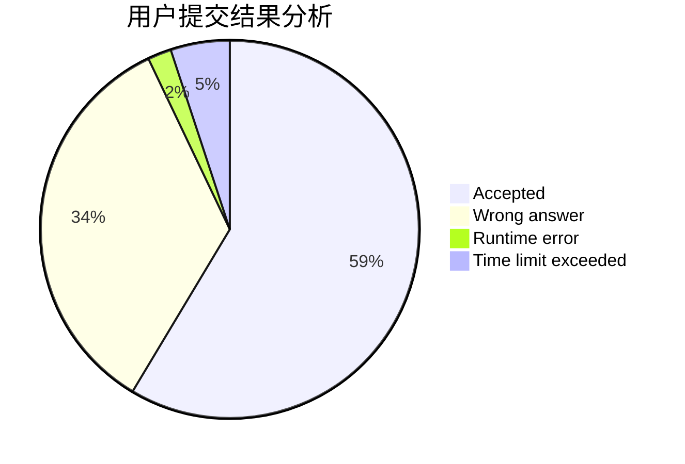

# 2020loveme
<!-- tabs:start -->
#### **用户提交结果分析**

#### **用户做题类型偏好分析**

#### **用户错题知识点分析**

<!-- tabs:end -->
# 推荐题目
[Prefix Enlightenment](https://codeforces.com/contest/1291/problem/E)		dfs and similar,
                        dsu,
                        graphs		  
[Integer Sequence Dividing](http://codeforces.com/problemset/problem/1102/A)		math		  
[Delete a Segment](http://codeforces.com/problemset/problem/1285/E)		brute force,
                        constructive algorithms,
                        data structures,
                        dp,
                        graphs,
                        sortings,
                        trees,
                        two pointers		  
[Yet Another Meme Problem](http://codeforces.com/problemset/problem/1288/B)		math		  
[Beautiful Matrix](http://codeforces.com/problemset/problem/1085/G)		combinatorics,
                        data structures,
                        dp		  
[Making Shapes](http://codeforces.com/problemset/problem/1290/F)		dp		  
[Rin and The Unknown Flower](http://codeforces.com/problemset/problem/1292/E)		constructive algorithms,
                        greedy,
                        interactive,
                        math		  
[Triple Flips](https://codeforces.com/contest/1071/problem/C)		constructive algorithms		  
[Vasya and Good Sequences](http://codeforces.com/problemset/problem/1030/E)		bitmasks,
                        dp		  
<!-- tabs:start -->
#### **data structures**
[Delete a Segment](http://codeforces.com/problemset/problem/1285/E)		brute force,
                        constructive algorithms,
                        data structures,
                        dp,
                        graphs,
                        sortings,
                        trees,
                        two pointers		  
[Beautiful Matrix](http://codeforces.com/problemset/problem/1085/G)		combinatorics,
                        data structures,
                        dp		  
[LCC](http://codeforces.com/problemset/problem/1286/D)		data structures,
                        math,
                        matrices,
                        probabilities		  
[Hot is Cold](http://codeforces.com/problemset/problem/1146/E)		bitmasks,
                        data structures,
                        divide and conquer,
                        implementation		  
[Irreducible Anagrams](http://codeforces.com/problemset/problem/1290/B)		binary search,
                        constructive algorithms,
                        data structures,
                        strings,
                        two pointers		  
[Numbers on Tree](http://codeforces.com/problemset/problem/1286/B)		constructive algorithms,
                        data structures,
                        dfs and similar,
                        graphs,
                        greedy,
                        trees		  
[Cartesian Tree](http://codeforces.com/problemset/problem/1290/E)		data structures		  
[Mind Control](http://codeforces.com/problemset/problem/1290/A)		brute force,
                        data structures,
                        implementation		  
[Messenger Simulator](http://codeforces.com/problemset/problem/1288/E)		data structures		  
[Fedya the Potter Strikes Back](http://codeforces.com/problemset/problem/1286/E)		data structures,
                        strings		  
#### **binary search**
[Minimax Problem](http://codeforces.com/problemset/problem/1288/D)		binary search,
                        bitmasks,
                        dp		  
[Classical?](http://codeforces.com/problemset/problem/1285/F)		binary search,
                        combinatorics,
                        number theory		  
[Irreducible Anagrams](http://codeforces.com/problemset/problem/1290/B)		binary search,
                        constructive algorithms,
                        data structures,
                        strings,
                        two pointers		  
[Deadline](http://codeforces.com/problemset/problem/1288/A)		binary search,
                        brute force,
                        math,
                        ternary search		  
[ConneR and the A.R.C. Markland-N](http://codeforces.com/problemset/problem/1293/A)		binary search,
                        brute force,
                        implementation		  
[Maximum width](http://codeforces.com/problemset/problem/1492/C)		binary search,
                        data structures,
                        dp,
                        greedy,
                        two pointers		  
[Pairs](http://codeforces.com/problemset/problem/1463/D)		binary search,
                        constructive algorithms,
                        greedy,
                        two pointers		  
[Old Floppy Drive](http://codeforces.com/problemset/problem/1490/G)		binary search,
                        data structures,
                        math		  
[Odd Mineral Resource](http://codeforces.com/problemset/problem/1479/D)		binary search,
                        bitmasks,
                        brute force,
                        data structures,
                        probabilities,
                        trees		  
[Complicated Computations](http://codeforces.com/problemset/problem/1436/E)		binary search,
                        data structures,
                        two pointers		  
#### **dp**
[Delete a Segment](http://codeforces.com/problemset/problem/1285/E)		brute force,
                        constructive algorithms,
                        data structures,
                        dp,
                        graphs,
                        sortings,
                        trees,
                        two pointers		  
[Beautiful Matrix](http://codeforces.com/problemset/problem/1085/G)		combinatorics,
                        data structures,
                        dp		  
[Making Shapes](http://codeforces.com/problemset/problem/1290/F)		dp		  
[Vasya and Good Sequences](http://codeforces.com/problemset/problem/1030/E)		bitmasks,
                        dp		  
[Garland](https://codeforces.com/contest/1287/problem/C)		dp,
                        greedy,
                        sortings		  
[Two Arrays](http://codeforces.com/problemset/problem/1288/C)		combinatorics,
                        dp		  
[Minimax Problem](http://codeforces.com/problemset/problem/1288/D)		binary search,
                        bitmasks,
                        dp		  
[Chaotic V.](http://codeforces.com/problemset/problem/1292/D)		dp,
                        graphs,
                        greedy,
                        math,
                        number theory,
                        trees		  
[Xenon's Attack on the Gangs](http://codeforces.com/problemset/problem/1292/C)		combinatorics,
                        dfs and similar,
                        dp,
                        greedy,
                        trees		  
[Dr. Evil Underscores](http://codeforces.com/problemset/problem/1285/D)		bitmasks,
                        brute force,
                        dfs and similar,
                        divide and conquer,
                        dp,
                        greedy,
                        strings,
                        trees		  
#### **graph**
[Prefix Enlightenment](https://codeforces.com/contest/1291/problem/E)		dfs and similar,
                        dsu,
                        graphs		  
[Delete a Segment](http://codeforces.com/problemset/problem/1285/E)		brute force,
                        constructive algorithms,
                        data structures,
                        dp,
                        graphs,
                        sortings,
                        trees,
                        two pointers		  
[Chaotic V.](http://codeforces.com/problemset/problem/1292/D)		dp,
                        graphs,
                        greedy,
                        math,
                        number theory,
                        trees		  
[Coffee Varieties (easy version)](http://codeforces.com/problemset/problem/1291/F)		graphs,
                        interactive		  
[Numbers on Tree](http://codeforces.com/problemset/problem/1286/B)		constructive algorithms,
                        data structures,
                        dfs and similar,
                        graphs,
                        greedy,
                        trees		  
[Coffee Varieties (hard version)](http://codeforces.com/problemset/problem/1290/D)		constructive algorithms,
                        graphs,
                        interactive		  
[Minimum Ties](http://codeforces.com/problemset/problem/1487/C)		brute force,
                        constructive algorithms,
                        dfs and similar,
                        graphs,
                        greedy,
                        implementation,
                        math		  
[Chef Monocarp](http://codeforces.com/problemset/problem/1437/C)		dp,
                        flows,
                        graph matchings,
                        greedy,
                        math,
                        sortings		  
[Strange Housing](http://codeforces.com/problemset/problem/1470/D)		constructive algorithms,
                        dfs and similar,
                        graph matchings,
                        graphs,
                        greedy		  
[Longest Simple Cycle](http://codeforces.com/problemset/problem/1476/C)		dp,
                        graphs,
                        greedy		  
#### **trees**
[Delete a Segment](http://codeforces.com/problemset/problem/1285/E)		brute force,
                        constructive algorithms,
                        data structures,
                        dp,
                        graphs,
                        sortings,
                        trees,
                        two pointers		  
[Chaotic V.](http://codeforces.com/problemset/problem/1292/D)		dp,
                        graphs,
                        greedy,
                        math,
                        number theory,
                        trees		  
[Xenon's Attack on the Gangs](http://codeforces.com/problemset/problem/1292/C)		combinatorics,
                        dfs and similar,
                        dp,
                        greedy,
                        trees		  
[Dr. Evil Underscores](http://codeforces.com/problemset/problem/1285/D)		bitmasks,
                        brute force,
                        dfs and similar,
                        divide and conquer,
                        dp,
                        greedy,
                        strings,
                        trees		  
[Numbers on Tree](http://codeforces.com/problemset/problem/1286/B)		constructive algorithms,
                        data structures,
                        dfs and similar,
                        graphs,
                        greedy,
                        trees		  
[Odd Mineral Resource](http://codeforces.com/problemset/problem/1479/D)		binary search,
                        bitmasks,
                        brute force,
                        data structures,
                        probabilities,
                        trees		  
[Yet Another Card Deck](http://codeforces.com/problemset/problem/1511/C)		brute force,
                        data structures,
                        implementation,
                        trees		  
[Diameter Cuts](http://codeforces.com/problemset/problem/1499/F)		combinatorics,
                        dfs and similar,
                        dp,
                        trees		  
[Fib-tree](http://codeforces.com/problemset/problem/1491/E)		brute force,
                        dfs and similar,
                        divide and conquer,
                        number theory,
                        trees		  
[13th Labour of Heracles](http://codeforces.com/problemset/problem/1466/D)		data structures,
                        greedy,
                        sortings,
                        trees		  
#### **divide and conquer**
[Dr. Evil Underscores](http://codeforces.com/problemset/problem/1285/D)		bitmasks,
                        brute force,
                        dfs and similar,
                        divide and conquer,
                        dp,
                        greedy,
                        strings,
                        trees		  
[Hot is Cold](http://codeforces.com/problemset/problem/1146/E)		bitmasks,
                        data structures,
                        divide and conquer,
                        implementation		  
[Divide and Summarize](http://codeforces.com/problemset/problem/1461/D)		binary search,
                        brute force,
                        data structures,
                        divide and conquer,
                        implementation,
                        sortings		  
[Song of the Sirens](http://codeforces.com/problemset/problem/1466/G)		combinatorics,
                        divide and conquer,
                        hashing,
                        math,
                        string suffix structures,
                        strings		  
[Permutation Transformation](http://codeforces.com/problemset/problem/1490/D)		dfs and similar,
                        divide and conquer,
                        implementation		  
[Skyline Photo](https://codeforces.com/contest/1483/problem/C)		data structures,
                        divide and conquer,
                        dp		  
[Fib-tree](http://codeforces.com/problemset/problem/1491/E)		brute force,
                        dfs and similar,
                        divide and conquer,
                        number theory,
                        trees		  
[Sum of Prefix Sums](http://codeforces.com/problemset/problem/1303/G)		data structures,
                        divide and conquer,
                        geometry,
                        trees		  
[Dogeforces](http://codeforces.com/problemset/problem/1494/D)		constructive algorithms,
                        data structures,
                        dfs and similar,
                        divide and conquer,
                        dsu,
                        greedy,
                        sortings,
                        trees		  
[Logistical Questions](http://codeforces.com/problemset/problem/566/C)		dfs and similar,
                        divide and conquer,
                        trees		  
#### **greedy**
[Rin and The Unknown Flower](http://codeforces.com/problemset/problem/1292/E)		constructive algorithms,
                        greedy,
                        interactive,
                        math		  
[Garland](https://codeforces.com/contest/1287/problem/C)		dp,
                        greedy,
                        sortings		  
[Chaotic V.](http://codeforces.com/problemset/problem/1292/D)		dp,
                        graphs,
                        greedy,
                        math,
                        number theory,
                        trees		  
[Xenon's Attack on the Gangs](http://codeforces.com/problemset/problem/1292/C)		combinatorics,
                        dfs and similar,
                        dp,
                        greedy,
                        trees		  
[Angry Students](http://codeforces.com/problemset/problem/1287/A)		greedy,
                        implementation		  
[Dr. Evil Underscores](http://codeforces.com/problemset/problem/1285/D)		bitmasks,
                        brute force,
                        dfs and similar,
                        divide and conquer,
                        dp,
                        greedy,
                        strings,
                        trees		  
[Domino for Young](https://codeforces.com/contest/1269/problem/D)		dp,
                        greedy,
                        math		  
[Numbers on Tree](http://codeforces.com/problemset/problem/1286/B)		constructive algorithms,
                        data structures,
                        dfs and similar,
                        graphs,
                        greedy,
                        trees		  
[Even But Not Even](http://codeforces.com/problemset/problem/1291/A)		greedy,
                        math,
                        strings		  
[Just Arrange the Icons](http://codeforces.com/problemset/problem/1267/J)		greedy,
                        implementation,
                        math		  
#### **constructive algorithms**
[Delete a Segment](http://codeforces.com/problemset/problem/1285/E)		brute force,
                        constructive algorithms,
                        data structures,
                        dp,
                        graphs,
                        sortings,
                        trees,
                        two pointers		  
[Rin and The Unknown Flower](http://codeforces.com/problemset/problem/1292/E)		constructive algorithms,
                        greedy,
                        interactive,
                        math		  
[Triple Flips](https://codeforces.com/contest/1071/problem/C)		constructive algorithms		  
[Madhouse (Easy version)](http://codeforces.com/problemset/problem/1286/C1)		brute force,
                        constructive algorithms,
                        interactive,
                        math		  
[Madhouse (Hard version)](http://codeforces.com/problemset/problem/1286/C2)		brute force,
                        constructive algorithms,
                        hashing,
                        interactive,
                        math		  
[Irreducible Anagrams](http://codeforces.com/problemset/problem/1290/B)		binary search,
                        constructive algorithms,
                        data structures,
                        strings,
                        two pointers		  
[Numbers on Tree](http://codeforces.com/problemset/problem/1286/B)		constructive algorithms,
                        data structures,
                        dfs and similar,
                        graphs,
                        greedy,
                        trees		  
[Coffee Varieties (hard version)](http://codeforces.com/problemset/problem/1290/D)		constructive algorithms,
                        graphs,
                        interactive		  
[Harry The Potter](http://codeforces.com/problemset/problem/1286/F)		brute force,
                        constructive algorithms,
                        dp,
                        fft,
                        implementation,
                        math		  
[Red-Blue Graph](http://codeforces.com/problemset/problem/1288/F)		constructive algorithms,
                        flows		  
#### **sortings**
[Delete a Segment](http://codeforces.com/problemset/problem/1285/E)		brute force,
                        constructive algorithms,
                        data structures,
                        dp,
                        graphs,
                        sortings,
                        trees,
                        two pointers		  
[Garland](https://codeforces.com/contest/1287/problem/C)		dp,
                        greedy,
                        sortings		  
[Diamond Miner](https://codeforces.com/contest/1496/problem/C)		geometry,
                        greedy,
                        math,
                        sortings		  
[Meximization](http://codeforces.com/problemset/problem/1497/A)		brute force,
                        data structures,
                        greedy,
                        sortings		  
[Avoiding Zero](http://codeforces.com/problemset/problem/1427/A)		math,
                        sortings		  
[Divide and Summarize](http://codeforces.com/problemset/problem/1461/D)		binary search,
                        brute force,
                        data structures,
                        divide and conquer,
                        implementation,
                        sortings		  
[Chef Monocarp](http://codeforces.com/problemset/problem/1437/C)		dp,
                        flows,
                        graph matchings,
                        greedy,
                        math,
                        sortings		  
[Replacing Elements](http://codeforces.com/problemset/problem/1473/A)		greedy,
                        implementation,
                        math,
                        sortings		  
[Eastern Exhibition](http://codeforces.com/problemset/problem/1486/B)		binary search,
                        geometry,
                        shortest paths,
                        sortings		  
[The Great Hero](http://codeforces.com/problemset/problem/1480/B)		greedy,
                        implementation,
                        sortings		  
<!-- tabs:end -->
