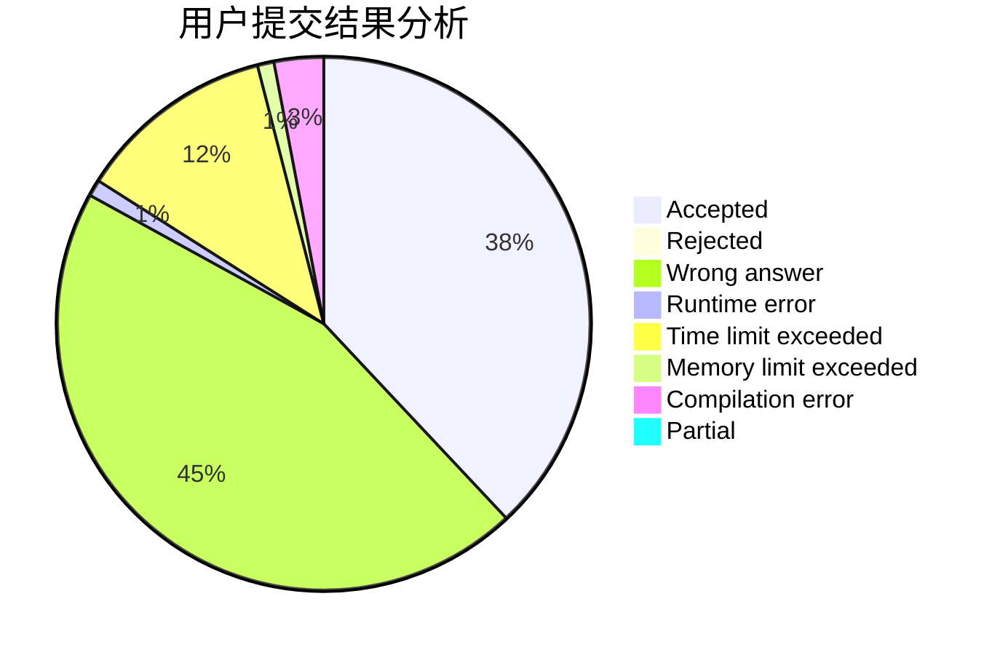
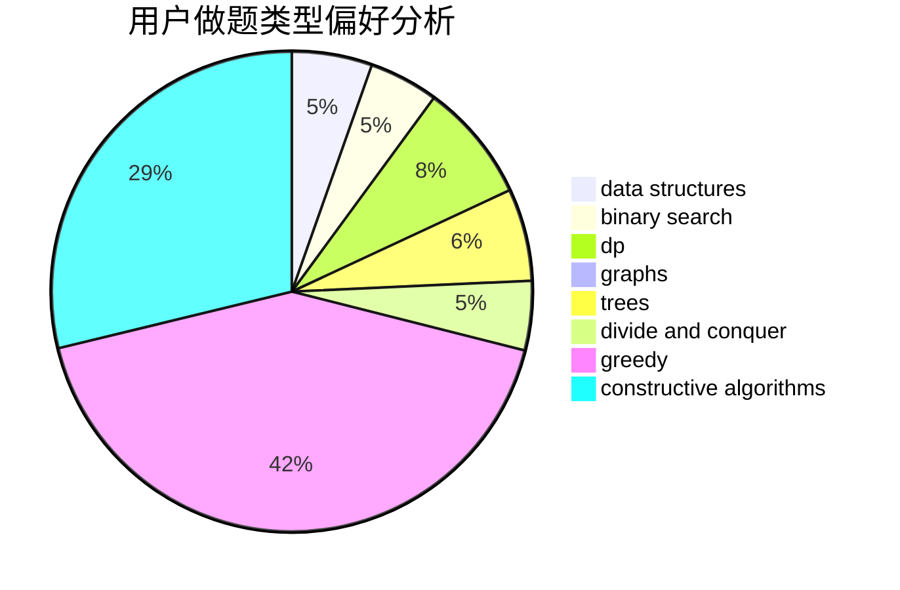
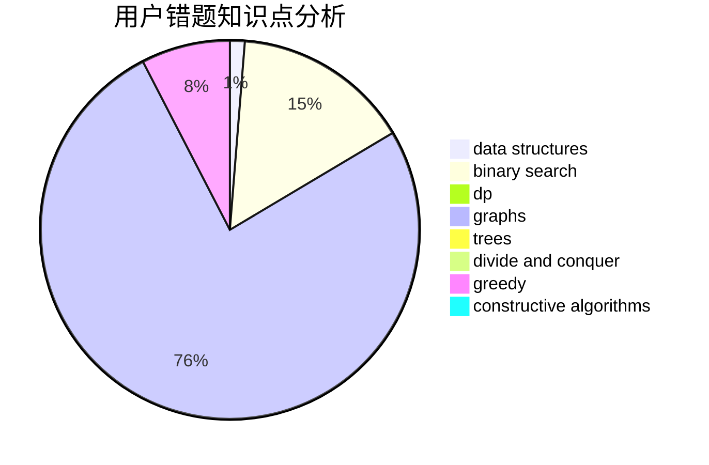

# GreyKa

<!-- tabs:start -->

#### **用户提交结果分析**

#### **用户做题类型偏好分析**

#### **用户错题知识点分析**

<!-- tabs:end -->
# 推荐题目
[911A](https://codeforces.com/contest/911/problem/A)		implementation		  
[555C](https://codeforces.com/contest/555/problem/C)		data structures		  
[1294F](https://codeforces.com/contest/1294/problem/F)		dfs and similar,
                        dp,
                        greedy,
                        trees		  
[263A](https://codeforces.com/contest/263/problem/A)		implementation		  
[339A](https://codeforces.com/contest/339/problem/A)		greedy,
                        implementation,
                        sortings,
                        strings		  
[1093G](https://codeforces.com/contest/1093/problem/G)		bitmasks,
                        data structures		  
[1071A](https://codeforces.com/contest/1071/problem/A)		dsu,graphs,sortings,trees		  
[1279F](https://codeforces.com/contest/1279/problem/F)		binary search,
                        dp		  
[488B](https://codeforces.com/contest/488/problem/B)		brute force,
                        constructive algorithms,
                        math		  
[910A](https://codeforces.com/contest/910/problem/A)		dfs and similar,
                        dp,
                        greedy,
                        implementation		  
