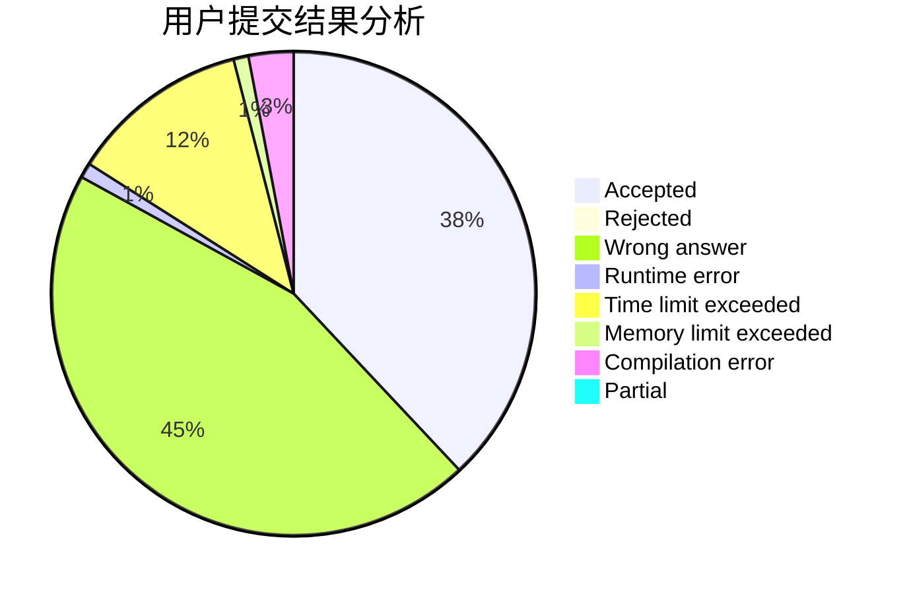
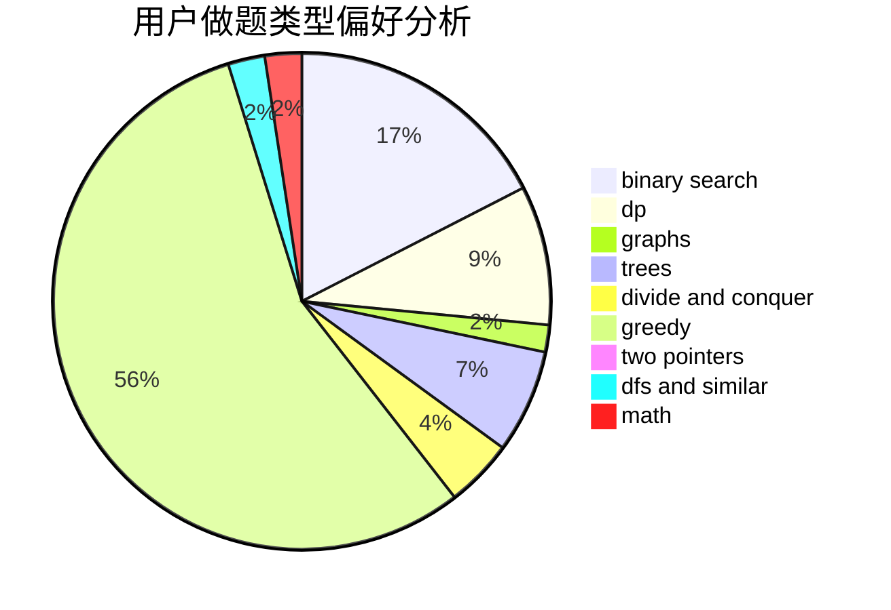

# GreyKa

<!-- tabs:start -->

#### **用户提交结果分析**

#### **用户做题类型偏好分析**

<!-- tabs:end -->
# 推荐题目
[911A](https://codeforces.com/contest/911/problem/A)
[555C](https://codeforces.com/contest/555/problem/C)
[1294F](https://codeforces.com/contest/1294/problem/F)
[263A](https://codeforces.com/contest/263/problem/A)
[339A](https://codeforces.com/contest/339/problem/A)
[1093G](https://codeforces.com/contest/1093/problem/G)
[1071A](https://codeforces.com/contest/1071/problem/A)
[1279F](https://codeforces.com/contest/1279/problem/F)
[488B](https://codeforces.com/contest/488/problem/B)
[910A](https://codeforces.com/contest/910/problem/A)
