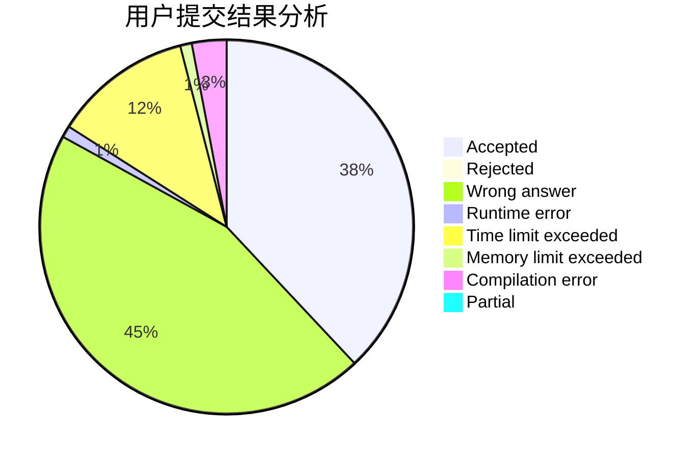
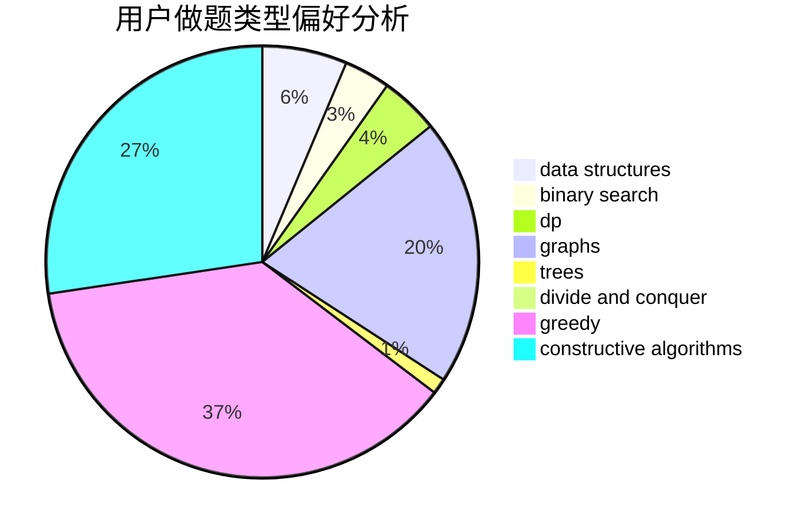
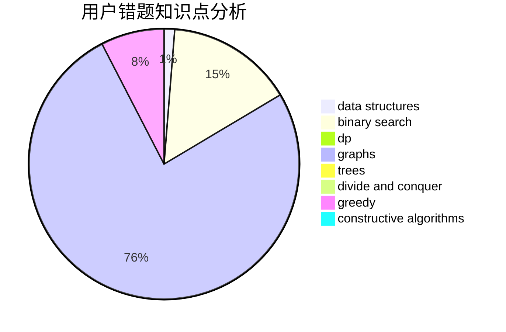

# GreyKa

<!-- tabs:start -->

#### **用户提交结果分析**

#### **用户做题类型偏好分析**

#### **用户错题知识点分析**

<!-- tabs:end -->
# 推荐题目
[893A](https://codeforces.com/contest/893/problem/A)		implementation		  
[533E](https://codeforces.com/contest/533/problem/E)		constructive algorithms,
                        dp,
                        greedy,
                        hashing,
                        strings,
                        two pointers		  
[1287C](https://codeforces.com/contest/1287/problem/C)		dsu,graphs,sortings,trees		  
[241D](https://codeforces.com/contest/241/problem/D)		nan		  
[314B](https://codeforces.com/contest/314/problem/B)		binary search,
                        dfs and similar,
                        strings		  
[1093D](https://codeforces.com/contest/1093/problem/D)		dfs and similar,
                        graphs		  
[1070K](https://codeforces.com/contest/1070/problem/K)		implementation		  
[1270F](https://codeforces.com/contest/1270/problem/F)		math,
                        strings		  
[468D](https://codeforces.com/contest/468/problem/D)		graph matchings		  
[891E](https://codeforces.com/contest/891/problem/E)		combinatorics,
                        math,
                        matrices		  
