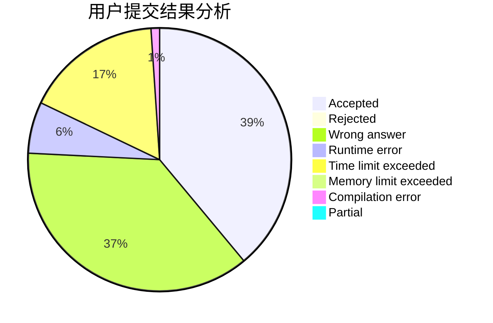
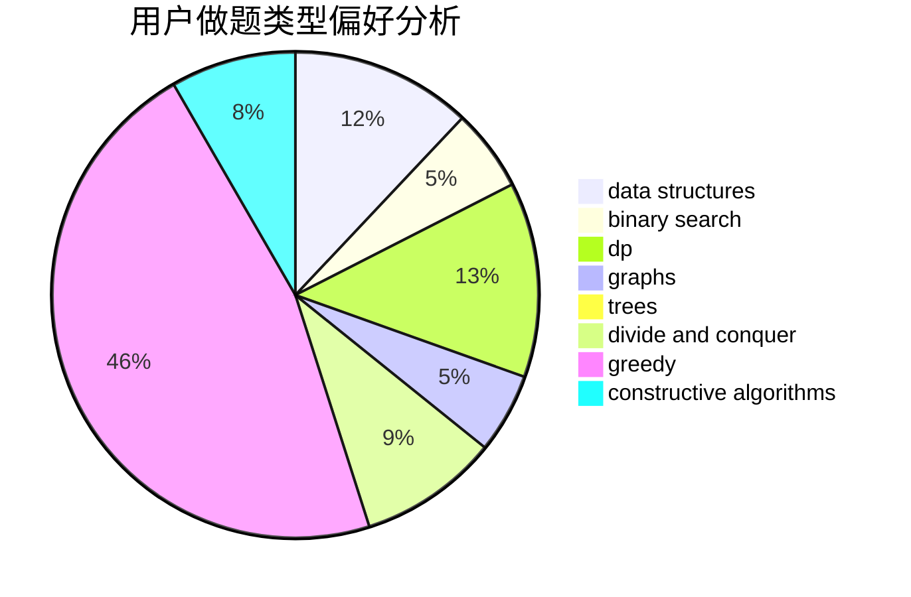

# Grice

<!-- tabs:start -->

#### **用户提交结果分析**

#### **用户做题类型偏好分析**

#### **用户错题知识点分析**

<!-- tabs:end -->
# 推荐题目
[1270C](https://codeforces.com/contest/1270/problem/C)		bitmasks,
                        constructive algorithms,
                        math		  
[1113C](https://codeforces.com/contest/1113/problem/C)		dsu,graphs,sortings,trees		  
[835E](https://codeforces.com/contest/835/problem/E)		binary search,
                        constructive algorithms,
                        interactive		  
[431D](https://codeforces.com/contest/431/problem/D)		binary search,
                        bitmasks,
                        combinatorics,
                        dp,
                        math		  
[1101A](https://codeforces.com/contest/1101/problem/A)		math		  
[566C](https://codeforces.com/contest/566/problem/C)		dfs and similar,
                        divide and conquer,
                        trees		  
[1146C](https://codeforces.com/contest/1146/problem/C)		bitmasks,
                        graphs,
                        interactive		  
[13D](https://codeforces.com/contest/13/problem/D)		dp,
                        geometry		  
[827E](https://codeforces.com/contest/827/problem/E)		fft,
                        math,
                        strings		  
[704D](https://codeforces.com/contest/704/problem/D)		flows,
                        greedy		  
