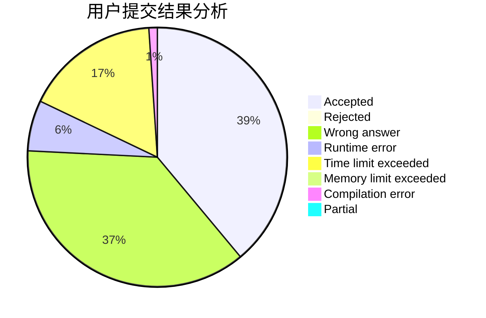
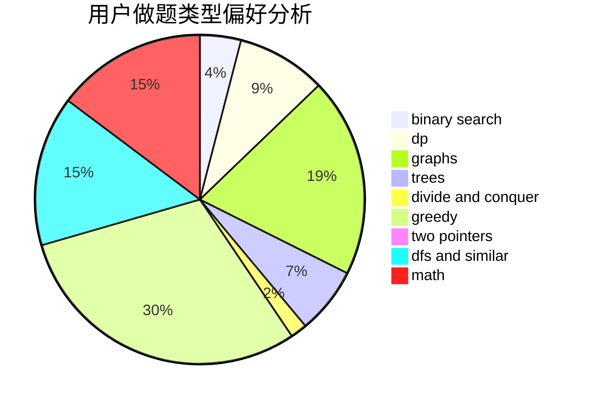

# Grice

<!-- tabs:start -->

#### **用户提交结果分析**

#### **用户做题类型偏好分析**

<!-- tabs:end -->
# 推荐题目
[1279C](https://codeforces.com/contest/1279/problem/C)
[1114A](https://codeforces.com/contest/1114/problem/A)
[853C](https://codeforces.com/contest/853/problem/C)
[453B](https://codeforces.com/contest/453/problem/B)
[1101D](https://codeforces.com/contest/1101/problem/D)
[585B](https://codeforces.com/contest/585/problem/B)
[1148C](https://codeforces.com/contest/1148/problem/C)
[1409D](https://codeforces.com/contest/1409/problem/D)
[846A](https://codeforces.com/contest/846/problem/A)
[723D](https://codeforces.com/contest/723/problem/D)
