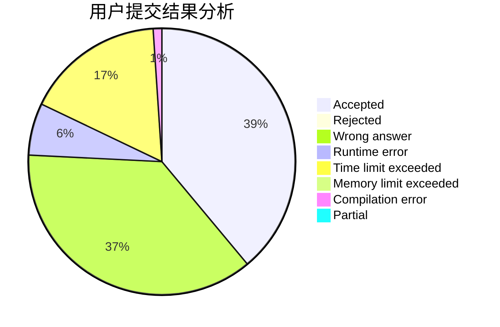
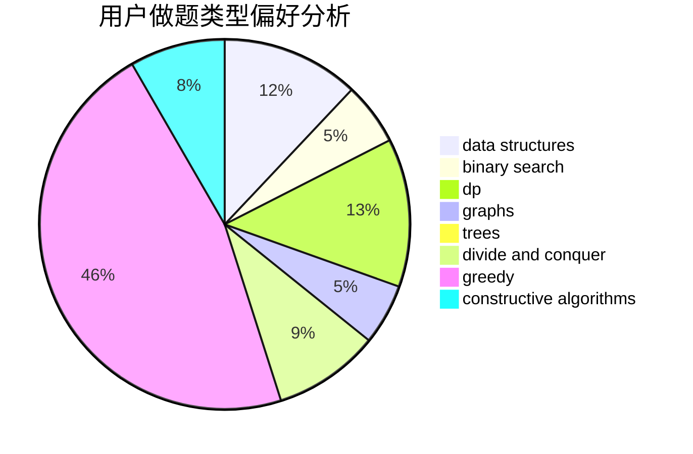

# Grice
<!-- tabs:start -->
#### **用户提交结果分析**

#### **用户做题类型偏好分析**

#### **用户错题知识点分析**

<!-- tabs:end -->
# 推荐题目
[Captain America](http://codeforces.com/problemset/problem/704/D)		flows,
                        greedy		  
[Logistical Questions](http://codeforces.com/problemset/problem/566/C)		dfs and similar,
                        divide and conquer,
                        trees		  
[Vasya and Arrays](http://codeforces.com/problemset/problem/1036/D)		greedy,
                        two pointers		  
[Rusty String](http://codeforces.com/problemset/problem/827/E)		fft,
                        math,
                        strings		  
[The penguin's game](http://codeforces.com/problemset/problem/835/E)		binary search,
                        constructive algorithms,
                        interactive		  
[Moving Points](http://codeforces.com/problemset/problem/1311/F)		data structures,
                        divide and conquer,
                        implementation,
                        sortings		  
[Weights Distributing](http://codeforces.com/problemset/problem/1343/E)		brute force,
                        graphs,
                        greedy,
                        shortest paths,
                        sortings		  
[Tetris revisited](http://codeforces.com/problemset/problem/86/B)		constructive algorithms,
                        graph matchings,
                        greedy,
                        math		  
[Did you mean...](http://codeforces.com/problemset/problem/858/C)		dp,
                        greedy,
                        implementation		  
[Broken Keyboard](http://codeforces.com/problemset/problem/1251/A)		brute force,
                        strings,
                        two pointers		  
<!-- tabs:start -->
#### **data structures**
[Captain America](http://codeforces.com/problemset/problem/1311/F)		data structures,
                        divide and conquer,
                        implementation,
                        sortings		  
[Logistical Questions](http://codeforces.com/problemset/problem/69/E)		data structures,
                        implementation		  
[Vasya and Arrays](http://codeforces.com/problemset/problem/877/D)		data structures,
                        dfs and similar,
                        graphs,
                        shortest paths		  
[Rusty String](http://codeforces.com/problemset/problem/777/C)		binary search,
                        data structures,
                        dp,
                        greedy,
                        implementation,
                        two pointers		  
[The penguin's game](http://codeforces.com/problemset/problem/1220/F)		binary search,
                        data structures		  
[Moving Points](http://codeforces.com/problemset/problem/720/D)		data structures,
                        dp,
                        sortings		  
[Weights Distributing](http://codeforces.com/problemset/problem/1039/E)		data structures		  
[Tetris revisited](http://codeforces.com/problemset/problem/1473/D)		data structures,
                        dp,
                        implementation,
                        strings		  
[Did you mean...](http://codeforces.com/problemset/problem/348/C)		brute force,
                        data structures		  
[Broken Keyboard](http://codeforces.com/problemset/problem/1491/C)		brute force,
                        data structures,
                        dp,
                        greedy,
                        implementation		  
#### **binary search**
[Captain America](http://codeforces.com/problemset/problem/835/E)		binary search,
                        constructive algorithms,
                        interactive		  
[Logistical Questions](http://codeforces.com/problemset/problem/431/D)		binary search,
                        bitmasks,
                        combinatorics,
                        dp,
                        math		  
[Vasya and Arrays](http://codeforces.com/problemset/problem/777/C)		binary search,
                        data structures,
                        dp,
                        greedy,
                        implementation,
                        two pointers		  
[Rusty String](https://codeforces.com/contest/831/problem/D)		binary search,
                        brute force,
                        dp,
                        greedy,
                        sortings		  
[The penguin's game](http://codeforces.com/problemset/problem/1220/F)		binary search,
                        data structures		  
[Moving Points](http://codeforces.com/problemset/problem/1355/C)		binary search,
                        implementation,
                        math,
                        two pointers		  
[Weights Distributing](http://codeforces.com/problemset/problem/1474/B)		binary search,
                        constructive algorithms,
                        greedy,
                        math,
                        number theory		  
[Tetris revisited](http://codeforces.com/problemset/problem/1492/C)		binary search,
                        data structures,
                        dp,
                        greedy,
                        two pointers		  
[Did you mean...](http://codeforces.com/problemset/problem/1463/D)		binary search,
                        constructive algorithms,
                        greedy,
                        two pointers		  
[Broken Keyboard](http://codeforces.com/problemset/problem/1490/G)		binary search,
                        data structures,
                        math		  
#### **dp**
[Captain America](http://codeforces.com/problemset/problem/858/C)		dp,
                        greedy,
                        implementation		  
[Logistical Questions](http://codeforces.com/problemset/problem/431/D)		binary search,
                        bitmasks,
                        combinatorics,
                        dp,
                        math		  
[Vasya and Arrays](http://codeforces.com/problemset/problem/13/D)		dp,
                        geometry		  
[Rusty String](http://codeforces.com/problemset/problem/534/B)		dp,
                        greedy,
                        math		  
[The penguin's game](https://codeforces.com/contest/1113/problem/C)		dp,
                        implementation		  
[Moving Points](http://codeforces.com/problemset/problem/757/E)		brute force,
                        combinatorics,
                        dp,
                        number theory		  
[Weights Distributing](http://codeforces.com/problemset/problem/777/C)		binary search,
                        data structures,
                        dp,
                        greedy,
                        implementation,
                        two pointers		  
[Tetris revisited](https://codeforces.com/contest/831/problem/D)		binary search,
                        brute force,
                        dp,
                        greedy,
                        sortings		  
[Did you mean...](http://codeforces.com/problemset/problem/809/C)		combinatorics,
                        divide and conquer,
                        dp		  
[Broken Keyboard](http://codeforces.com/problemset/problem/1268/E)		dp		  
#### **graph**
[Captain America](http://codeforces.com/problemset/problem/1343/E)		brute force,
                        graphs,
                        greedy,
                        shortest paths,
                        sortings		  
[Logistical Questions](http://codeforces.com/problemset/problem/86/B)		constructive algorithms,
                        graph matchings,
                        greedy,
                        math		  
[Vasya and Arrays](http://codeforces.com/problemset/problem/316/C2)		flows,
                        graph matchings		  
[Rusty String](http://codeforces.com/problemset/problem/877/D)		data structures,
                        dfs and similar,
                        graphs,
                        shortest paths		  
[The penguin's game](http://codeforces.com/problemset/problem/1146/C)		bitmasks,
                        graphs,
                        interactive		  
[Moving Points](http://codeforces.com/problemset/problem/1062/D)		dfs and similar,
                        graphs,
                        implementation,
                        math		  
[Weights Distributing](https://codeforces.com/contest/1341/problem/D)		bitmasks,
                        dp,
                        graphs,
                        greedy		  
[Tetris revisited](http://codeforces.com/problemset/problem/1487/C)		brute force,
                        constructive algorithms,
                        dfs and similar,
                        graphs,
                        greedy,
                        implementation,
                        math		  
[Did you mean...](http://codeforces.com/problemset/problem/1437/C)		dp,
                        flows,
                        graph matchings,
                        greedy,
                        math,
                        sortings		  
[Broken Keyboard](http://codeforces.com/problemset/problem/1470/D)		constructive algorithms,
                        dfs and similar,
                        graph matchings,
                        graphs,
                        greedy		  
#### **trees**
[Captain America](http://codeforces.com/problemset/problem/566/C)		dfs and similar,
                        divide and conquer,
                        trees		  
[Logistical Questions](http://codeforces.com/problemset/problem/1188/A1)		trees		  
[Vasya and Arrays](http://codeforces.com/problemset/problem/1479/D)		binary search,
                        bitmasks,
                        brute force,
                        data structures,
                        probabilities,
                        trees		  
[Rusty String](http://codeforces.com/problemset/problem/1511/C)		brute force,
                        data structures,
                        implementation,
                        trees		  
[The penguin's game](http://codeforces.com/problemset/problem/1499/F)		combinatorics,
                        dfs and similar,
                        dp,
                        trees		  
[Moving Points](http://codeforces.com/problemset/problem/1491/E)		brute force,
                        dfs and similar,
                        divide and conquer,
                        number theory,
                        trees		  
[Weights Distributing](http://codeforces.com/problemset/problem/1466/D)		data structures,
                        greedy,
                        sortings,
                        trees		  
[Tetris revisited](http://codeforces.com/problemset/problem/1495/D)		combinatorics,
                        dfs and similar,
                        graphs,
                        math,
                        shortest paths,
                        trees		  
[Did you mean...](http://codeforces.com/problemset/problem/1303/G)		data structures,
                        divide and conquer,
                        geometry,
                        trees		  
[Broken Keyboard](http://codeforces.com/problemset/problem/1454/E)		combinatorics,
                        dfs and similar,
                        graphs,
                        trees		  
#### **divide and conquer**
[Captain America](http://codeforces.com/problemset/problem/566/C)		dfs and similar,
                        divide and conquer,
                        trees		  
[Logistical Questions](http://codeforces.com/problemset/problem/1311/F)		data structures,
                        divide and conquer,
                        implementation,
                        sortings		  
[Vasya and Arrays](http://codeforces.com/problemset/problem/809/C)		combinatorics,
                        divide and conquer,
                        dp		  
[Rusty String](http://codeforces.com/problemset/problem/1461/D)		binary search,
                        brute force,
                        data structures,
                        divide and conquer,
                        implementation,
                        sortings		  
[The penguin's game](http://codeforces.com/problemset/problem/1466/G)		combinatorics,
                        divide and conquer,
                        hashing,
                        math,
                        string suffix structures,
                        strings		  
[Moving Points](http://codeforces.com/problemset/problem/1490/D)		dfs and similar,
                        divide and conquer,
                        implementation		  
[Weights Distributing](https://codeforces.com/contest/1483/problem/C)		data structures,
                        divide and conquer,
                        dp		  
[Tetris revisited](http://codeforces.com/problemset/problem/1491/E)		brute force,
                        dfs and similar,
                        divide and conquer,
                        number theory,
                        trees		  
[Did you mean...](http://codeforces.com/problemset/problem/1303/G)		data structures,
                        divide and conquer,
                        geometry,
                        trees		  
[Broken Keyboard](http://codeforces.com/problemset/problem/1494/D)		constructive algorithms,
                        data structures,
                        dfs and similar,
                        divide and conquer,
                        dsu,
                        greedy,
                        sortings,
                        trees		  
#### **greedy**
[Captain America](http://codeforces.com/problemset/problem/704/D)		flows,
                        greedy		  
[Logistical Questions](http://codeforces.com/problemset/problem/1036/D)		greedy,
                        two pointers		  
[Vasya and Arrays](http://codeforces.com/problemset/problem/1343/E)		brute force,
                        graphs,
                        greedy,
                        shortest paths,
                        sortings		  
[Rusty String](http://codeforces.com/problemset/problem/86/B)		constructive algorithms,
                        graph matchings,
                        greedy,
                        math		  
[The penguin's game](http://codeforces.com/problemset/problem/858/C)		dp,
                        greedy,
                        implementation		  
[Moving Points](http://codeforces.com/problemset/problem/534/B)		dp,
                        greedy,
                        math		  
[Weights Distributing](http://codeforces.com/problemset/problem/735/B)		greedy,
                        number theory,
                        sortings		  
[Tetris revisited](http://codeforces.com/problemset/problem/777/C)		binary search,
                        data structures,
                        dp,
                        greedy,
                        implementation,
                        two pointers		  
[Did you mean...](https://codeforces.com/contest/831/problem/D)		binary search,
                        brute force,
                        dp,
                        greedy,
                        sortings		  
[Broken Keyboard](http://codeforces.com/problemset/problem/468/A)		constructive algorithms,
                        greedy,
                        math		  
#### **constructive algorithms**
[Captain America](http://codeforces.com/problemset/problem/835/E)		binary search,
                        constructive algorithms,
                        interactive		  
[Logistical Questions](http://codeforces.com/problemset/problem/86/B)		constructive algorithms,
                        graph matchings,
                        greedy,
                        math		  
[Vasya and Arrays](http://codeforces.com/problemset/problem/1415/D)		bitmasks,
                        brute force,
                        constructive algorithms		  
[Rusty String](https://codeforces.com/contest/497/problem/A)		brute force,
                        constructive algorithms,
                        implementation		  
[The penguin's game](http://codeforces.com/problemset/problem/468/A)		constructive algorithms,
                        greedy,
                        math		  
[Moving Points](http://codeforces.com/problemset/problem/1474/E)		constructive algorithms,
                        greedy		  
[Weights Distributing](http://codeforces.com/problemset/problem/720/C)		constructive algorithms		  
[Tetris revisited](http://codeforces.com/problemset/problem/746/C)		constructive algorithms,
                        implementation,
                        math		  
[Did you mean...](http://codeforces.com/problemset/problem/1270/C)		bitmasks,
                        constructive algorithms,
                        math		  
[Broken Keyboard](http://codeforces.com/problemset/problem/1474/B)		binary search,
                        constructive algorithms,
                        greedy,
                        math,
                        number theory		  
#### **sortings**
[Captain America](http://codeforces.com/problemset/problem/1311/F)		data structures,
                        divide and conquer,
                        implementation,
                        sortings		  
[Logistical Questions](http://codeforces.com/problemset/problem/1343/E)		brute force,
                        graphs,
                        greedy,
                        shortest paths,
                        sortings		  
[Vasya and Arrays](http://codeforces.com/problemset/problem/735/B)		greedy,
                        number theory,
                        sortings		  
[Rusty String](https://codeforces.com/contest/831/problem/D)		binary search,
                        brute force,
                        dp,
                        greedy,
                        sortings		  
[The penguin's game](http://codeforces.com/problemset/problem/720/D)		data structures,
                        dp,
                        sortings		  
[Moving Points](http://codeforces.com/problemset/problem/1174/B)		sortings		  
[Weights Distributing](https://codeforces.com/contest/1496/problem/C)		geometry,
                        greedy,
                        math,
                        sortings		  
[Tetris revisited](http://codeforces.com/problemset/problem/1495/A)		geometry,
                        greedy,
                        math,
                        sortings		  
[Did you mean...](http://codeforces.com/problemset/problem/1497/A)		brute force,
                        data structures,
                        greedy,
                        sortings		  
[Broken Keyboard](http://codeforces.com/problemset/problem/1427/A)		math,
                        sortings		  
<!-- tabs:end -->
