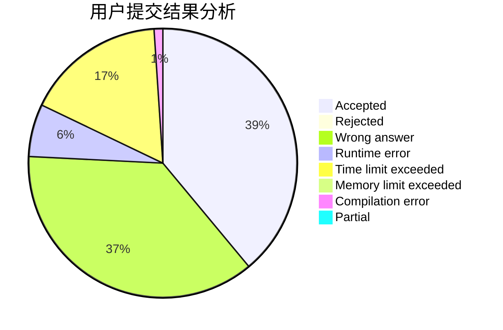
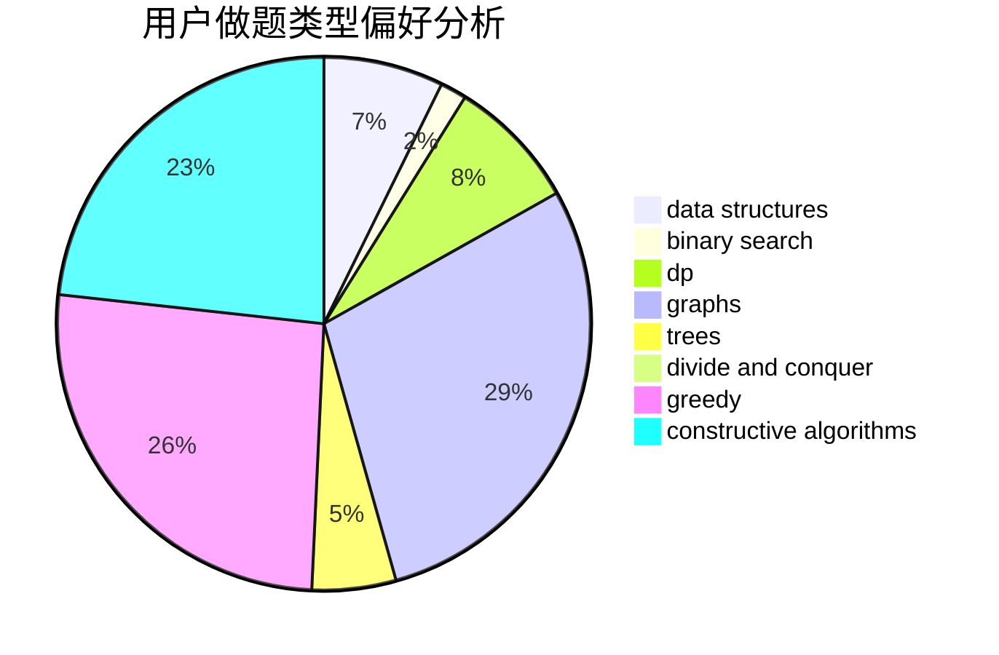
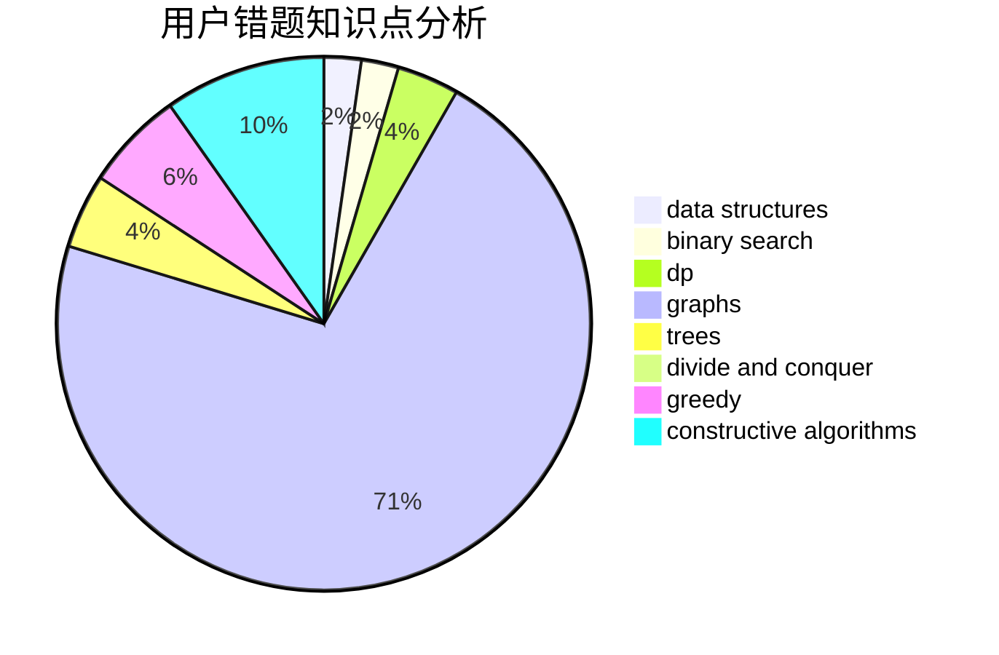

# Grice

<!-- tabs:start -->

#### **用户提交结果分析**

#### **用户做题类型偏好分析**

#### **用户错题知识点分析**

<!-- tabs:end -->
# 推荐题目
[1279C](https://codeforces.com/contest/1279/problem/C)		data structures,
                        implementation		  
[1114A](https://codeforces.com/contest/1114/problem/A)		brute force,
                        greedy,
                        implementation		  
[853C](https://codeforces.com/contest/853/problem/C)		data structures		  
[453B](https://codeforces.com/contest/453/problem/B)		bitmasks,
                        brute force,
                        dp		  
[1101D](https://codeforces.com/contest/1101/problem/D)		data structures,
                        dfs and similar,
                        dp,
                        number theory,
                        trees		  
[585B](https://codeforces.com/contest/585/problem/B)		dfs and similar,
                        graphs,
                        shortest paths		  
[1148C](https://codeforces.com/contest/1148/problem/C)		constructive algorithms,
                        sortings		  
[1409D](https://codeforces.com/contest/1409/problem/D)		greedy,
                        math		  
[846A](https://codeforces.com/contest/846/problem/A)		brute force,
                        implementation		  
[723D](https://codeforces.com/contest/723/problem/D)		dfs and similar,
                        dsu,
                        graphs,
                        greedy,
                        implementation		  
