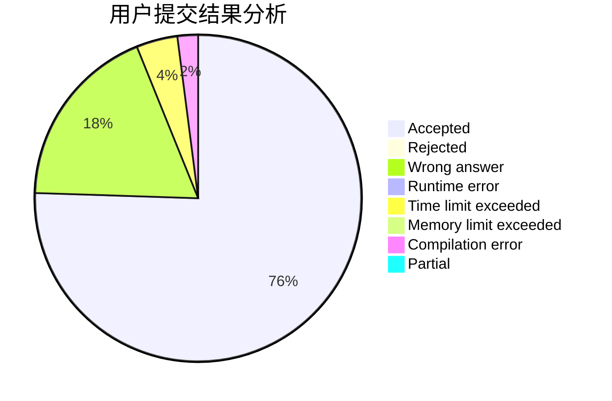
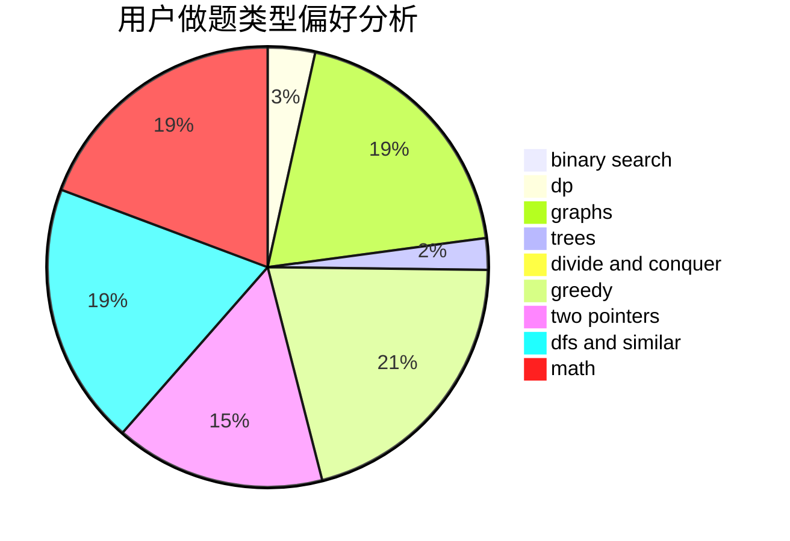

# GsBush23

<!-- tabs:start -->

#### **用户提交结果分析**

#### **用户做题类型偏好分析**

<!-- tabs:end -->
# 推荐题目
[911D](https://codeforces.com/contest/911/problem/D)
[911C](https://codeforces.com/contest/911/problem/C)
[1186D](https://codeforces.com/contest/1186/problem/D)
[1194F](https://codeforces.com/contest/1194/problem/F)
[736D](https://codeforces.com/contest/736/problem/D)
[14471](https://codeforces.com/contest/1447/problem/1)
[235D](https://codeforces.com/contest/235/problem/D)
[574B](https://codeforces.com/contest/574/problem/B)
[555B](https://codeforces.com/contest/555/problem/B)
[785A](https://codeforces.com/contest/785/problem/A)
