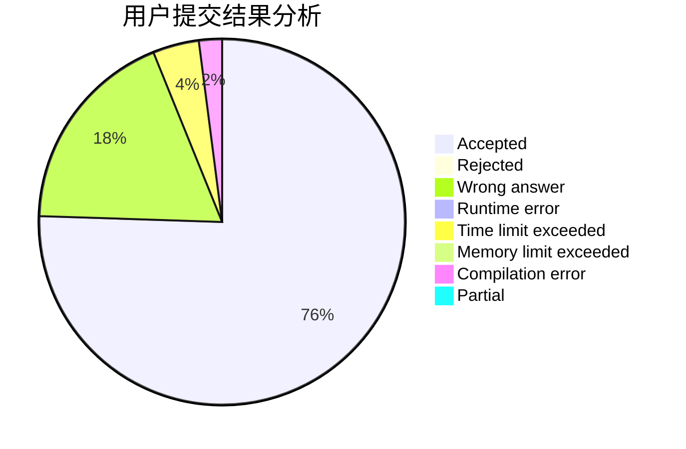
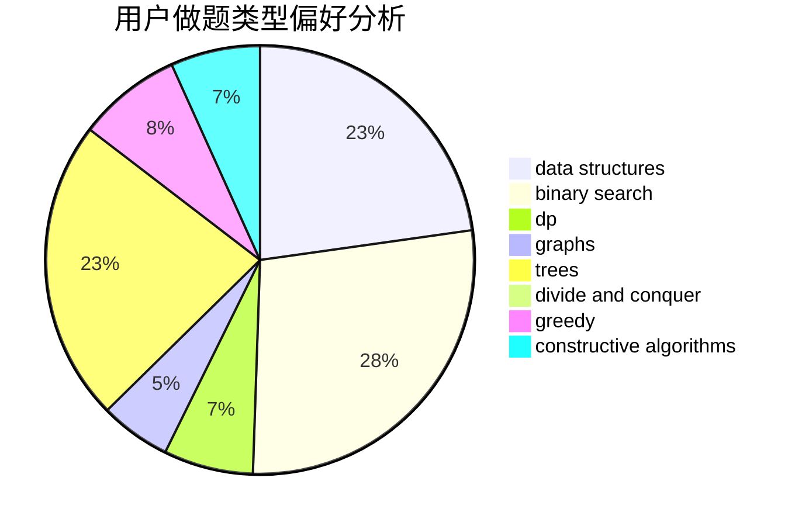
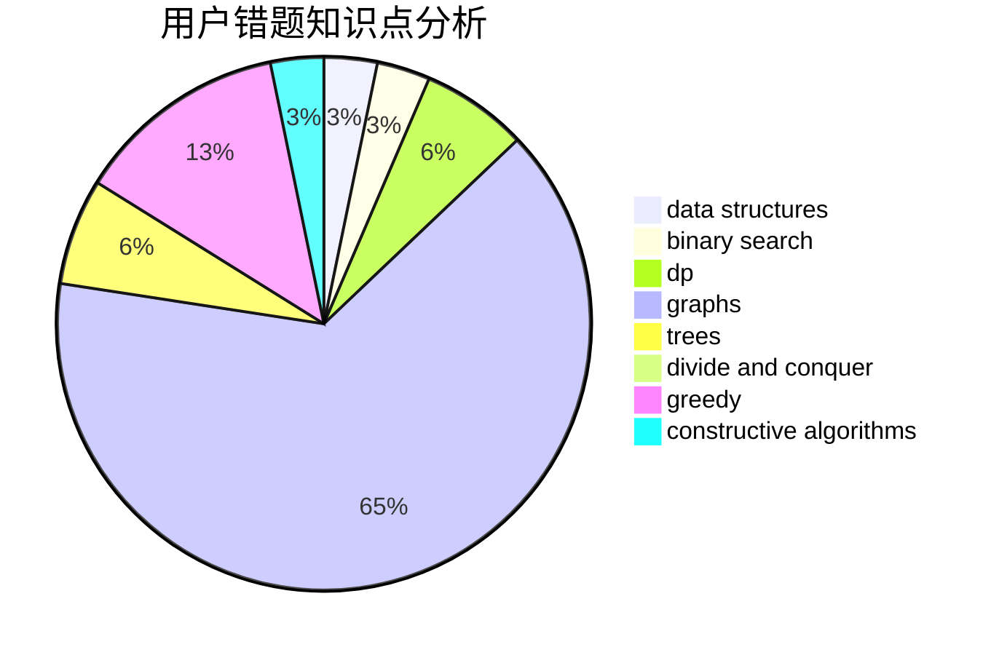

# GsBush23

<!-- tabs:start -->

#### **用户提交结果分析**

#### **用户做题类型偏好分析**

#### **用户错题知识点分析**

<!-- tabs:end -->
# 推荐题目
[893D](https://codeforces.com/contest/893/problem/D)		data structures,
                        dp,
                        greedy,
                        implementation		  
[893C](https://codeforces.com/contest/893/problem/C)		dfs and similar,
                        graphs,
                        greedy		  
[1183F](https://codeforces.com/contest/1183/problem/F)		brute force,
                        math,
                        sortings		  
[1189D1](https://codeforces.com/contest/1189D/problem/1)		dsu,graphs,sortings,trees		  
[719C](https://codeforces.com/contest/719/problem/C)		dsu,graphs,sortings,trees		  
[1437B](https://codeforces.com/contest/1437/problem/B)		constructive algorithms,
                        greedy		  
[216B](https://codeforces.com/contest/216/problem/B)		dfs and similar,
                        implementation		  
[549C](https://codeforces.com/contest/549/problem/C)		games		  
[533D](https://codeforces.com/contest/533/problem/D)		data structures,
                        dp		  
[765E](https://codeforces.com/contest/765/problem/E)		dfs and similar,
                        dp,
                        greedy,
                        implementation,
                        trees		  
