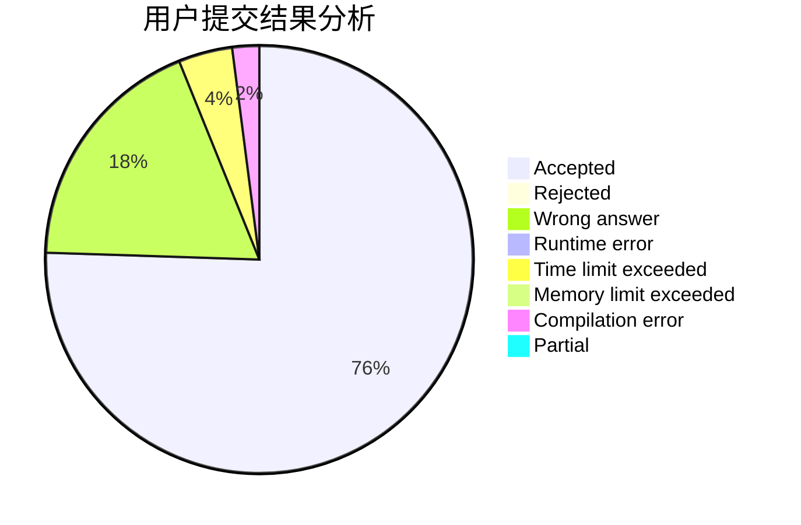
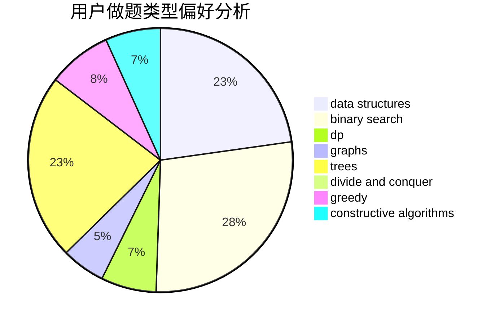
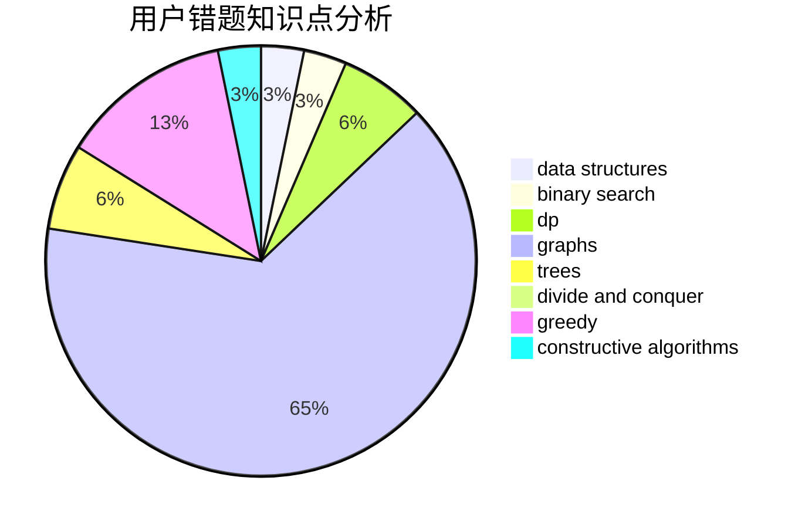

# GsBush23
<!-- tabs:start -->
#### **用户提交结果分析**

#### **用户做题类型偏好分析**

#### **用户错题知识点分析**

<!-- tabs:end -->
# 推荐题目
[Landmarks](http://codeforces.com/problemset/problem/533/D)		data structures,
                        dp		  
[The Game Of Parity](http://codeforces.com/problemset/problem/549/C)		games		  
[Topforces Strikes Back](http://codeforces.com/problemset/problem/1183/F)		brute force,
                        math,
                        sortings		  
[Sea and Islands](http://codeforces.com/problemset/problem/544/B)		constructive algorithms,
                        implementation		  
[Credit Card](http://codeforces.com/problemset/problem/893/D)		data structures,
                        dp,
                        greedy,
                        implementation		  
[Efim and Strange Grade](https://codeforces.com/contest/719/problem/C)		dp,
                        implementation,
                        math		  
[Image Preview](https://codeforces.com/contest/651/problem/D)		binary search,
                        brute force,
                        dp,
                        two pointers		  
[Tree Folding](http://codeforces.com/problemset/problem/765/E)		dfs and similar,
                        dp,
                        greedy,
                        implementation,
                        trees		  
[Colored Rectangles](http://codeforces.com/problemset/problem/1398/D)		dp,
                        greedy,
                        sortings		  
[Lucky Subsequence](http://codeforces.com/problemset/problem/145/C)		combinatorics,
                        dp,
                        math		  
<!-- tabs:start -->
#### **data structures**
[Landmarks](http://codeforces.com/problemset/problem/533/D)		data structures,
                        dp		  
[The Game Of Parity](http://codeforces.com/problemset/problem/893/D)		data structures,
                        dp,
                        greedy,
                        implementation		  
[Topforces Strikes Back](https://codeforces.com/contest/1501/problem/F)		data structures,
                        sortings,
                        two pointers		  
[Sea and Islands](http://codeforces.com/problemset/problem/1492/C)		binary search,
                        data structures,
                        dp,
                        greedy,
                        two pointers		  
[Credit Card](http://codeforces.com/problemset/problem/1490/G)		binary search,
                        data structures,
                        math		  
[Efim and Strange Grade](http://codeforces.com/problemset/problem/1479/D)		binary search,
                        bitmasks,
                        brute force,
                        data structures,
                        probabilities,
                        trees		  
[Image Preview](http://codeforces.com/problemset/problem/1497/A)		brute force,
                        data structures,
                        greedy,
                        sortings		  
[Tree Folding](http://codeforces.com/problemset/problem/1491/C)		brute force,
                        data structures,
                        dp,
                        greedy,
                        implementation		  
[Colored Rectangles](http://codeforces.com/problemset/problem/1492/B)		data structures,
                        greedy,
                        math		  
[Lucky Subsequence](http://codeforces.com/problemset/problem/1436/E)		binary search,
                        data structures,
                        two pointers		  
#### **binary search**
[Landmarks](https://codeforces.com/contest/651/problem/D)		binary search,
                        brute force,
                        dp,
                        two pointers		  
[The Game Of Parity](http://codeforces.com/problemset/problem/125/E)		binary search,
                        graphs		  
[Topforces Strikes Back](http://codeforces.com/problemset/problem/1492/C)		binary search,
                        data structures,
                        dp,
                        greedy,
                        two pointers		  
[Sea and Islands](http://codeforces.com/problemset/problem/1463/D)		binary search,
                        constructive algorithms,
                        greedy,
                        two pointers		  
[Credit Card](http://codeforces.com/problemset/problem/1490/G)		binary search,
                        data structures,
                        math		  
[Efim and Strange Grade](http://codeforces.com/problemset/problem/1479/D)		binary search,
                        bitmasks,
                        brute force,
                        data structures,
                        probabilities,
                        trees		  
[Image Preview](http://codeforces.com/problemset/problem/1436/E)		binary search,
                        data structures,
                        two pointers		  
[Tree Folding](http://codeforces.com/problemset/problem/1461/D)		binary search,
                        brute force,
                        data structures,
                        divide and conquer,
                        implementation,
                        sortings		  
[Colored Rectangles](http://codeforces.com/problemset/problem/1493/C)		binary search,
                        brute force,
                        constructive algorithms,
                        greedy,
                        strings		  
[Lucky Subsequence](http://codeforces.com/problemset/problem/1487/D)		binary search,
                        brute force,
                        math,
                        number theory		  
#### **dp**
[Landmarks](http://codeforces.com/problemset/problem/533/D)		data structures,
                        dp		  
[The Game Of Parity](http://codeforces.com/problemset/problem/893/D)		data structures,
                        dp,
                        greedy,
                        implementation		  
[Topforces Strikes Back](https://codeforces.com/contest/719/problem/C)		dp,
                        implementation,
                        math		  
[Sea and Islands](https://codeforces.com/contest/651/problem/D)		binary search,
                        brute force,
                        dp,
                        two pointers		  
[Credit Card](http://codeforces.com/problemset/problem/765/E)		dfs and similar,
                        dp,
                        greedy,
                        implementation,
                        trees		  
[Efim and Strange Grade](http://codeforces.com/problemset/problem/1398/D)		dp,
                        greedy,
                        sortings		  
[Image Preview](http://codeforces.com/problemset/problem/145/C)		combinatorics,
                        dp,
                        math		  
[Tree Folding](http://codeforces.com/problemset/problem/295/D)		combinatorics,
                        dp		  
[Colored Rectangles](http://codeforces.com/problemset/problem/1005/D)		dp,
                        greedy,
                        number theory		  
[Lucky Subsequence](http://codeforces.com/problemset/problem/1492/C)		binary search,
                        data structures,
                        dp,
                        greedy,
                        two pointers		  
#### **graph**
[Landmarks](http://codeforces.com/problemset/problem/125/E)		binary search,
                        graphs		  
[The Game Of Parity](http://codeforces.com/problemset/problem/1485/D)		constructive algorithms,
                        graphs,
                        math,
                        number theory		  
[Topforces Strikes Back](http://codeforces.com/problemset/problem/893/C)		dfs and similar,
                        graphs,
                        greedy		  
[Sea and Islands](http://codeforces.com/problemset/problem/1487/C)		brute force,
                        constructive algorithms,
                        dfs and similar,
                        graphs,
                        greedy,
                        implementation,
                        math		  
[Credit Card](http://codeforces.com/problemset/problem/1437/C)		dp,
                        flows,
                        graph matchings,
                        greedy,
                        math,
                        sortings		  
[Efim and Strange Grade](http://codeforces.com/problemset/problem/1470/D)		constructive algorithms,
                        dfs and similar,
                        graph matchings,
                        graphs,
                        greedy		  
[Image Preview](http://codeforces.com/problemset/problem/1476/C)		dp,
                        graphs,
                        greedy		  
[Tree Folding](http://codeforces.com/problemset/problem/1304/D)		constructive algorithms,
                        graphs,
                        greedy,
                        two pointers		  
[Colored Rectangles](http://codeforces.com/problemset/problem/1475/C)		combinatorics,
                        graphs,
                        math		  
[Lucky Subsequence](http://codeforces.com/problemset/problem/553/E)		dp,
                        fft,
                        graphs,
                        math,
                        probabilities		  
#### **trees**
[Landmarks](http://codeforces.com/problemset/problem/765/E)		dfs and similar,
                        dp,
                        greedy,
                        implementation,
                        trees		  
[The Game Of Parity](https://codeforces.com/contest/1189/problem/D1)		trees		  
[Topforces Strikes Back](http://codeforces.com/problemset/problem/1479/D)		binary search,
                        bitmasks,
                        brute force,
                        data structures,
                        probabilities,
                        trees		  
[Sea and Islands](http://codeforces.com/problemset/problem/1511/C)		brute force,
                        data structures,
                        implementation,
                        trees		  
[Credit Card](http://codeforces.com/problemset/problem/1499/F)		combinatorics,
                        dfs and similar,
                        dp,
                        trees		  
[Efim and Strange Grade](http://codeforces.com/problemset/problem/1491/E)		brute force,
                        dfs and similar,
                        divide and conquer,
                        number theory,
                        trees		  
[Image Preview](http://codeforces.com/problemset/problem/1466/D)		data structures,
                        greedy,
                        sortings,
                        trees		  
[Tree Folding](http://codeforces.com/problemset/problem/1495/D)		combinatorics,
                        dfs and similar,
                        graphs,
                        math,
                        shortest paths,
                        trees		  
[Colored Rectangles](http://codeforces.com/problemset/problem/1303/G)		data structures,
                        divide and conquer,
                        geometry,
                        trees		  
[Lucky Subsequence](http://codeforces.com/problemset/problem/1454/E)		combinatorics,
                        dfs and similar,
                        graphs,
                        trees		  
#### **divide and conquer**
[Landmarks](http://codeforces.com/problemset/problem/1461/D)		binary search,
                        brute force,
                        data structures,
                        divide and conquer,
                        implementation,
                        sortings		  
[The Game Of Parity](http://codeforces.com/problemset/problem/1466/G)		combinatorics,
                        divide and conquer,
                        hashing,
                        math,
                        string suffix structures,
                        strings		  
[Topforces Strikes Back](http://codeforces.com/problemset/problem/1490/D)		dfs and similar,
                        divide and conquer,
                        implementation		  
[Sea and Islands](https://codeforces.com/contest/1483/problem/C)		data structures,
                        divide and conquer,
                        dp		  
[Credit Card](http://codeforces.com/problemset/problem/1491/E)		brute force,
                        dfs and similar,
                        divide and conquer,
                        number theory,
                        trees		  
[Efim and Strange Grade](http://codeforces.com/problemset/problem/1303/G)		data structures,
                        divide and conquer,
                        geometry,
                        trees		  
[Image Preview](http://codeforces.com/problemset/problem/1494/D)		constructive algorithms,
                        data structures,
                        dfs and similar,
                        divide and conquer,
                        dsu,
                        greedy,
                        sortings,
                        trees		  
[Tree Folding](http://codeforces.com/problemset/problem/1482/E)		data structures,
                        divide and conquer,
                        dp		  
[Colored Rectangles](http://codeforces.com/problemset/problem/566/C)		dfs and similar,
                        divide and conquer,
                        trees		  
[Lucky Subsequence](http://codeforces.com/problemset/problem/1428/F)		binary search,
                        data structures,
                        divide and conquer,
                        dp,
                        two pointers		  
#### **greedy**
[Landmarks](http://codeforces.com/problemset/problem/893/D)		data structures,
                        dp,
                        greedy,
                        implementation		  
[The Game Of Parity](http://codeforces.com/problemset/problem/765/E)		dfs and similar,
                        dp,
                        greedy,
                        implementation,
                        trees		  
[Topforces Strikes Back](http://codeforces.com/problemset/problem/1398/D)		dp,
                        greedy,
                        sortings		  
[Sea and Islands](http://codeforces.com/problemset/problem/1005/D)		dp,
                        greedy,
                        number theory		  
[Credit Card](http://codeforces.com/problemset/problem/893/C)		dfs and similar,
                        graphs,
                        greedy		  
[Efim and Strange Grade](http://codeforces.com/problemset/problem/1437/B)		constructive algorithms,
                        greedy		  
[Image Preview](http://codeforces.com/problemset/problem/1492/C)		binary search,
                        data structures,
                        dp,
                        greedy,
                        two pointers		  
[Tree Folding](https://codeforces.com/contest/1496/problem/C)		geometry,
                        greedy,
                        math,
                        sortings		  
[Colored Rectangles](http://codeforces.com/problemset/problem/1493/A)		constructive algorithms,
                        greedy		  
[Lucky Subsequence](http://codeforces.com/problemset/problem/1463/D)		binary search,
                        constructive algorithms,
                        greedy,
                        two pointers		  
#### **constructive algorithms**
[Landmarks](http://codeforces.com/problemset/problem/544/B)		constructive algorithms,
                        implementation		  
[The Game Of Parity](http://codeforces.com/problemset/problem/1485/D)		constructive algorithms,
                        graphs,
                        math,
                        number theory		  
[Topforces Strikes Back](http://codeforces.com/problemset/problem/1437/B)		constructive algorithms,
                        greedy		  
[Sea and Islands](http://codeforces.com/problemset/problem/1493/A)		constructive algorithms,
                        greedy		  
[Credit Card](http://codeforces.com/problemset/problem/1463/D)		binary search,
                        constructive algorithms,
                        greedy,
                        two pointers		  
[Efim and Strange Grade](https://codeforces.com/contest/1456/problem/B)		bitmasks,
                        brute force,
                        constructive algorithms		  
[Image Preview](http://codeforces.com/problemset/problem/1492/D)		bitmasks,
                        constructive algorithms,
                        greedy,
                        math		  
[Tree Folding](https://codeforces.com/contest/1504/problem/D)		constructive algorithms,
                        games,
                        interactive		  
[Colored Rectangles](https://codeforces.com/contest/1483/problem/A)		brute force,
                        constructive algorithms,
                        greedy,
                        implementation		  
[Lucky Subsequence](https://codeforces.com/contest/1457/problem/D)		bitmasks,
                        brute force,
                        constructive algorithms		  
#### **sortings**
[Landmarks](http://codeforces.com/problemset/problem/1183/F)		brute force,
                        math,
                        sortings		  
[The Game Of Parity](http://codeforces.com/problemset/problem/1398/D)		dp,
                        greedy,
                        sortings		  
[Topforces Strikes Back](https://codeforces.com/contest/1501/problem/F)		data structures,
                        sortings,
                        two pointers		  
[Sea and Islands](https://codeforces.com/contest/1496/problem/C)		geometry,
                        greedy,
                        math,
                        sortings		  
[Credit Card](http://codeforces.com/problemset/problem/1495/A)		geometry,
                        greedy,
                        math,
                        sortings		  
[Efim and Strange Grade](http://codeforces.com/problemset/problem/1497/A)		brute force,
                        data structures,
                        greedy,
                        sortings		  
[Image Preview](http://codeforces.com/problemset/problem/1427/A)		math,
                        sortings		  
[Tree Folding](http://codeforces.com/problemset/problem/1461/D)		binary search,
                        brute force,
                        data structures,
                        divide and conquer,
                        implementation,
                        sortings		  
[Colored Rectangles](http://codeforces.com/problemset/problem/1437/C)		dp,
                        flows,
                        graph matchings,
                        greedy,
                        math,
                        sortings		  
[Lucky Subsequence](http://codeforces.com/problemset/problem/1473/A)		greedy,
                        implementation,
                        math,
                        sortings		  
<!-- tabs:end -->
