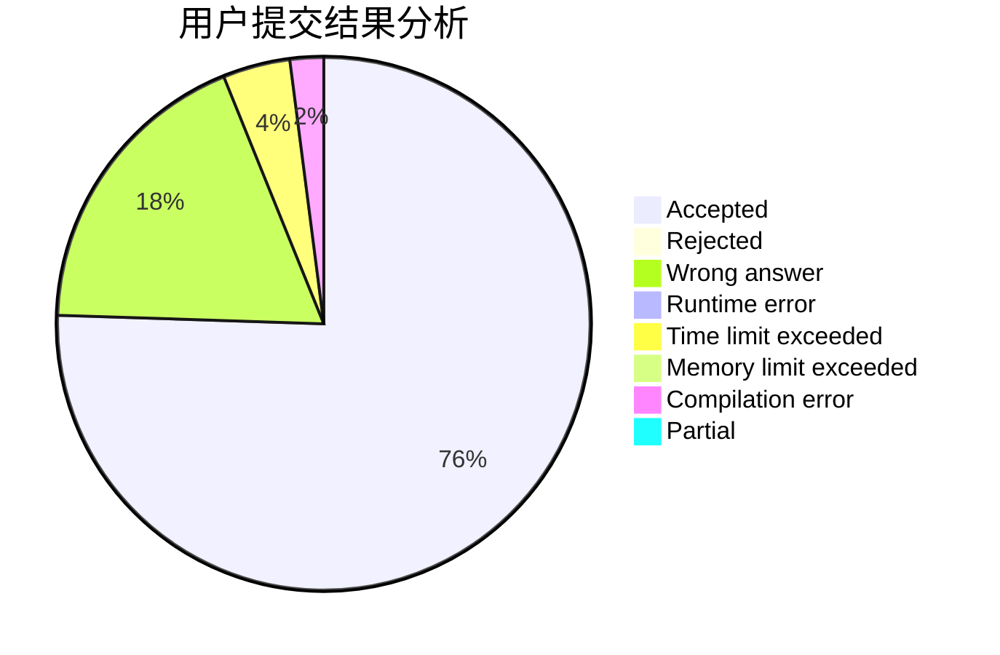
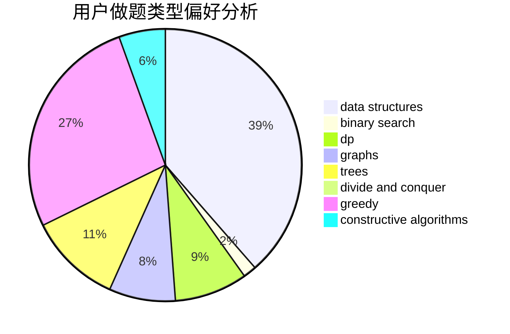
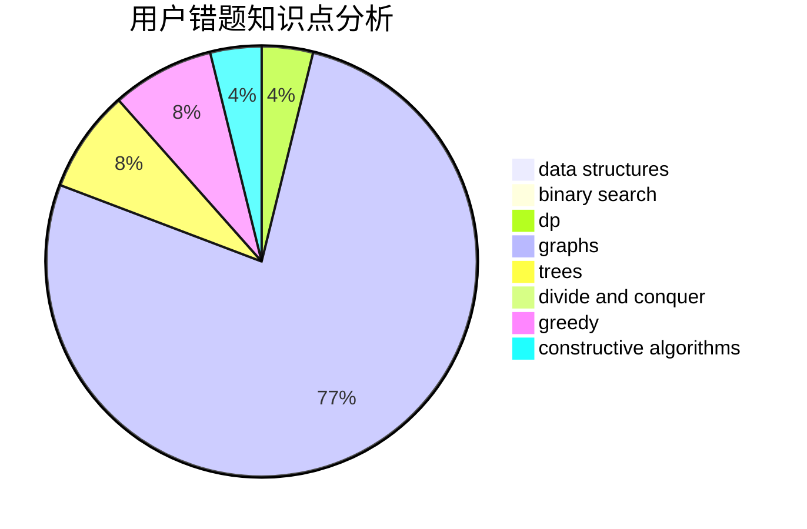

# GsBush23

<!-- tabs:start -->

#### **用户提交结果分析**

#### **用户做题类型偏好分析**

#### **用户错题知识点分析**

<!-- tabs:end -->
# 推荐题目
[911D](https://codeforces.com/contest/911/problem/D)		brute force,
                        math		  
[911C](https://codeforces.com/contest/911/problem/C)		brute force,
                        constructive algorithms		  
[1186D](https://codeforces.com/contest/1186/problem/D)		constructive algorithms,
                        greedy,
                        math		  
[1194F](https://codeforces.com/contest/1194/problem/F)		combinatorics,
                        dp,
                        number theory,
                        probabilities,
                        two pointers		  
[736D](https://codeforces.com/contest/736/problem/D)		math,
                        matrices		  
[14471](https://codeforces.com/contest/1447/problem/1)		dsu,graphs,sortings,trees		  
[235D](https://codeforces.com/contest/235/problem/D)		graphs		  
[574B](https://codeforces.com/contest/574/problem/B)		brute force,
                        dfs and similar,
                        graphs,
                        hashing		  
[555B](https://codeforces.com/contest/555/problem/B)		data structures,
                        greedy,
                        sortings		  
[785A](https://codeforces.com/contest/785/problem/A)		implementation,
                        strings		  
