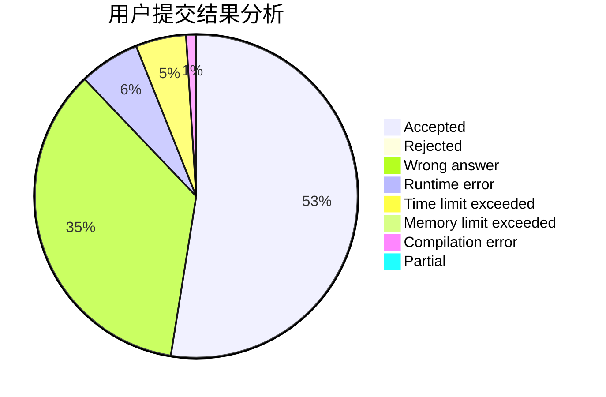
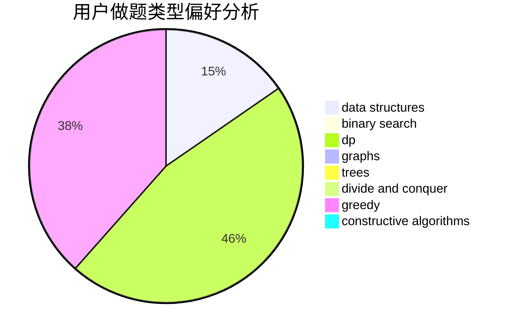
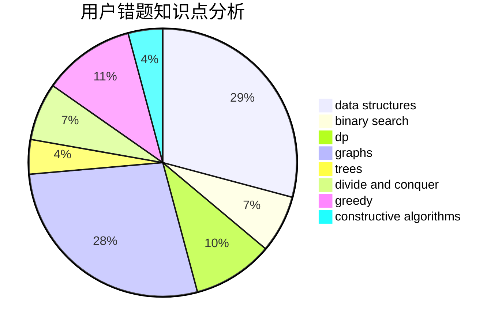

# GsjzTle

<!-- tabs:start -->

#### **用户提交结果分析**

#### **用户做题类型偏好分析**

#### **用户错题知识点分析**

<!-- tabs:end -->
# 推荐题目
[627C](https://codeforces.com/contest/627/problem/C)		data structures,
                        divide and conquer,
                        greedy		  
[180D](https://codeforces.com/contest/180/problem/D)		greedy,
                        strings		  
[1316D](https://codeforces.com/contest/1316/problem/D)		constructive algorithms,
                        dfs and similar,
                        graphs,
                        implementation		  
[1487A](https://codeforces.com/contest/1487/problem/A)		implementation,
                        sortings		  
[1248A](https://codeforces.com/contest/1248/problem/A)		geometry,
                        math		  
[1477C](https://codeforces.com/contest/1477/problem/C)		constructive algorithms,
                        geometry,
                        greedy,
                        math,
                        sortings		  
[14A](https://codeforces.com/contest/14/problem/A)		implementation		  
[1482E](https://codeforces.com/contest/1482/problem/E)		data structures,
                        divide and conquer,
                        dp		  
[1489D](https://codeforces.com/contest/1489/problem/D)		dsu,graphs,sortings,trees		  
[1483E](https://codeforces.com/contest/1483/problem/E)		dsu,graphs,sortings,trees		  
