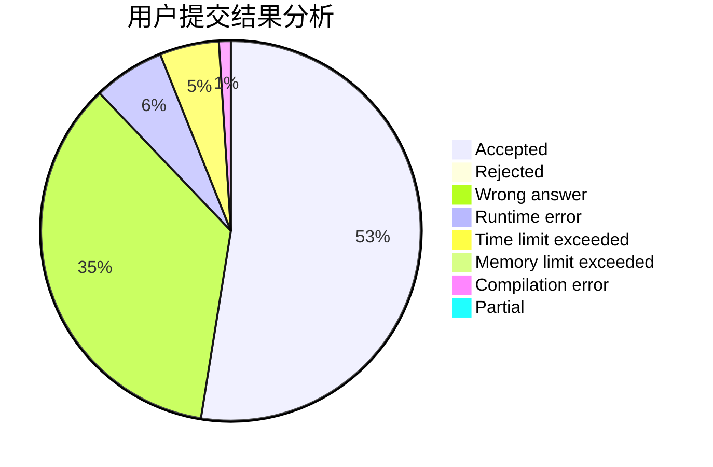
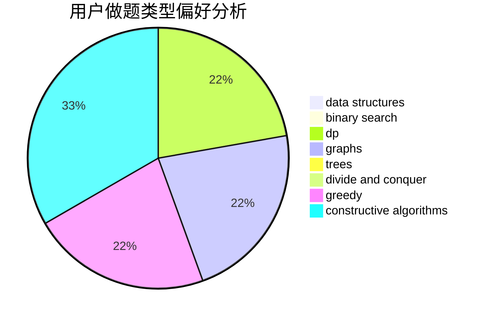
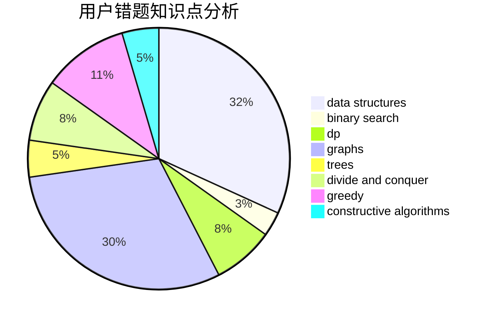

# GsjzTle

<!-- tabs:start -->

#### **用户提交结果分析**

#### **用户做题类型偏好分析**

#### **用户错题知识点分析**

<!-- tabs:end -->
# 推荐题目
[653C](https://codeforces.com/contest/653/problem/C)		brute force,
                        implementation		  
[208A](https://codeforces.com/contest/208/problem/A)		strings		  
[13262](https://codeforces.com/contest/1326/problem/2)		dsu,graphs,sortings,trees		  
[1494D](https://codeforces.com/contest/1494/problem/D)		constructive algorithms,
                        data structures,
                        dfs and similar,
                        divide and conquer,
                        dsu,
                        greedy,
                        sortings,
                        trees		  
[1252A](https://codeforces.com/contest/1252/problem/A)		nan		  
[14862](https://codeforces.com/contest/1486/problem/2)		dsu,graphs,sortings,trees		  
[1510B](https://codeforces.com/contest/1510/problem/B)		flows,
                        graph matchings,
                        graphs		  
[1490C](https://codeforces.com/contest/1490/problem/C)		binary search,
                        brute force,
                        brute force,
                        math		  
[1497B](https://codeforces.com/contest/1497/problem/B)		constructive algorithms,
                        greedy,
                        math		  
[1491C](https://codeforces.com/contest/1491/problem/C)		brute force,
                        data structures,
                        dp,
                        greedy,
                        implementation		  
