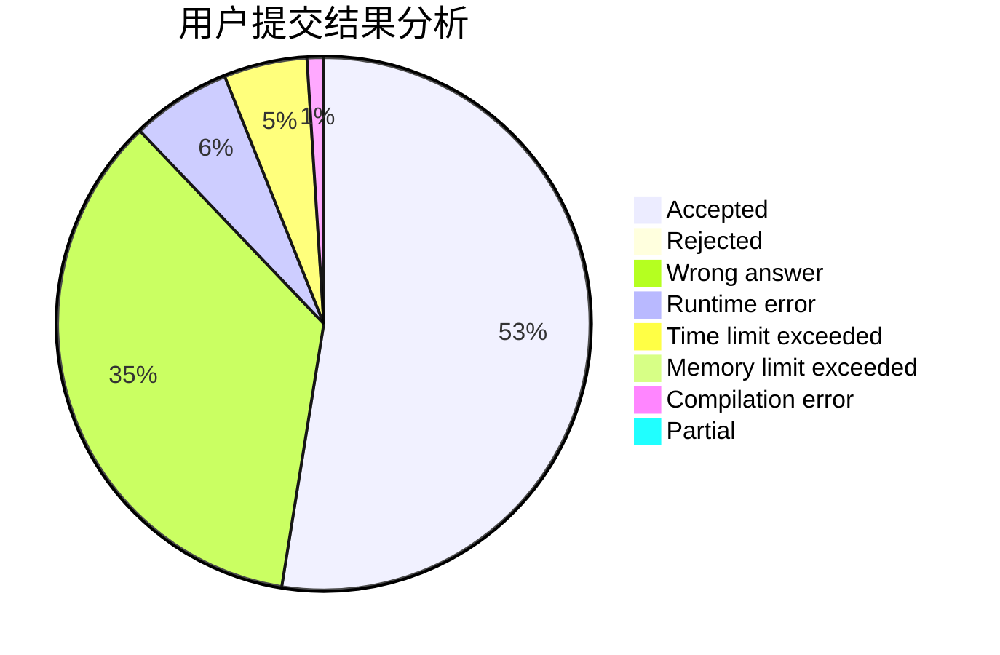
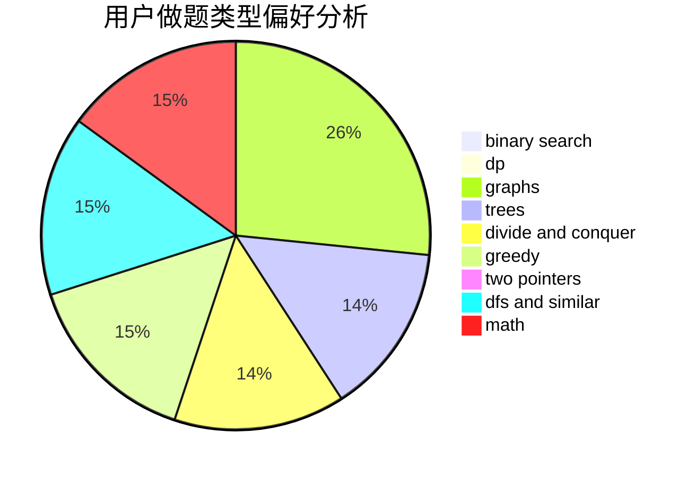

# GsjzTle

<!-- tabs:start -->

#### **用户提交结果分析**

#### **用户做题类型偏好分析**

<!-- tabs:end -->
# 推荐题目
[653C](https://codeforces.com/contest/653/problem/C)
[208A](https://codeforces.com/contest/208/problem/A)
[13262](https://codeforces.com/contest/1326/problem/2)
[1494D](https://codeforces.com/contest/1494/problem/D)
[1252A](https://codeforces.com/contest/1252/problem/A)
[14862](https://codeforces.com/contest/1486/problem/2)
[1510B](https://codeforces.com/contest/1510/problem/B)
[1490C](https://codeforces.com/contest/1490/problem/C)
[1497B](https://codeforces.com/contest/1497/problem/B)
[1491C](https://codeforces.com/contest/1491/problem/C)
