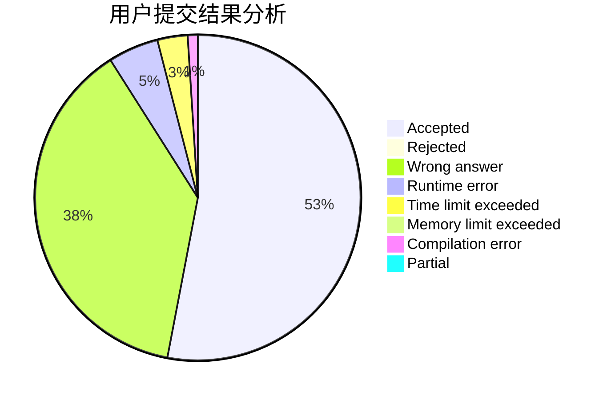
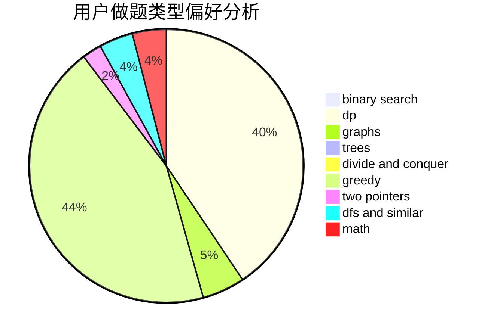

# Guaguapi

<!-- tabs:start -->

#### **用户提交结果分析**

#### **用户做题类型偏好分析**

<!-- tabs:end -->
# 推荐题目
[132C](https://codeforces.com/contest/132/problem/C)
[870A](https://codeforces.com/contest/870/problem/A)
[878C](https://codeforces.com/contest/878/problem/C)
[50D](https://codeforces.com/contest/50/problem/D)
[711D](https://codeforces.com/contest/711/problem/D)
[1070E](https://codeforces.com/contest/1070/problem/E)
[1001I](https://codeforces.com/contest/1001/problem/I)
[375C](https://codeforces.com/contest/375/problem/C)
[120J](https://codeforces.com/contest/120/problem/J)
[787D](https://codeforces.com/contest/787/problem/D)
