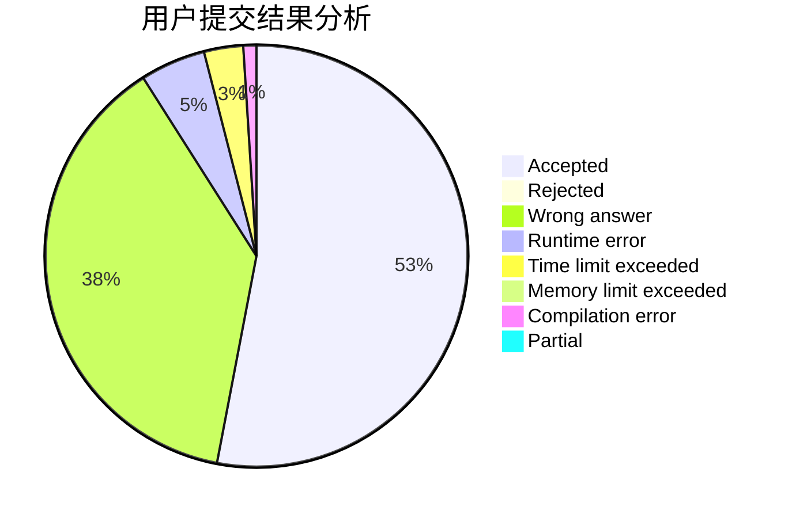
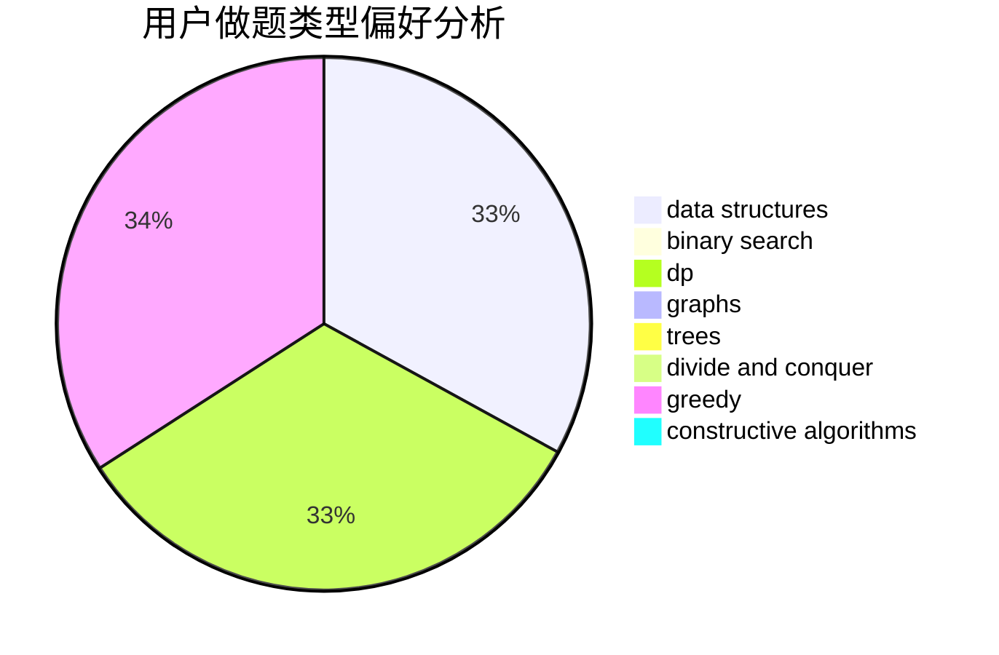
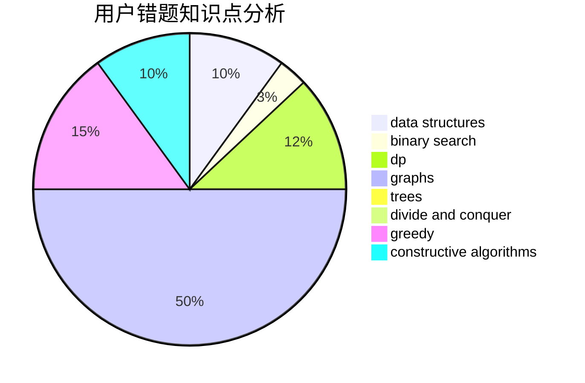

# Guaguapi

<!-- tabs:start -->

#### **用户提交结果分析**

#### **用户做题类型偏好分析**

#### **用户错题知识点分析**

<!-- tabs:end -->
# 推荐题目
[132C](https://codeforces.com/contest/132/problem/C)		dp		  
[870A](https://codeforces.com/contest/870/problem/A)		brute force,
                        implementation		  
[878C](https://codeforces.com/contest/878/problem/C)		data structures,
                        graphs		  
[50D](https://codeforces.com/contest/50/problem/D)		binary search,
                        dp,
                        probabilities		  
[711D](https://codeforces.com/contest/711/problem/D)		combinatorics,
                        dfs and similar,
                        graphs,
                        math		  
[1070E](https://codeforces.com/contest/1070/problem/E)		binary search,
                        data structures		  
[1001I](https://codeforces.com/contest/1001/problem/I)		*special problem		  
[375C](https://codeforces.com/contest/375/problem/C)		bitmasks,
                        shortest paths		  
[120J](https://codeforces.com/contest/120/problem/J)		divide and conquer,
                        geometry,
                        sortings		  
[787D](https://codeforces.com/contest/787/problem/D)		dsu,graphs,sortings,trees		  
