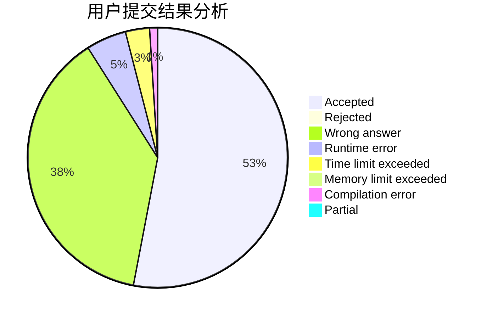
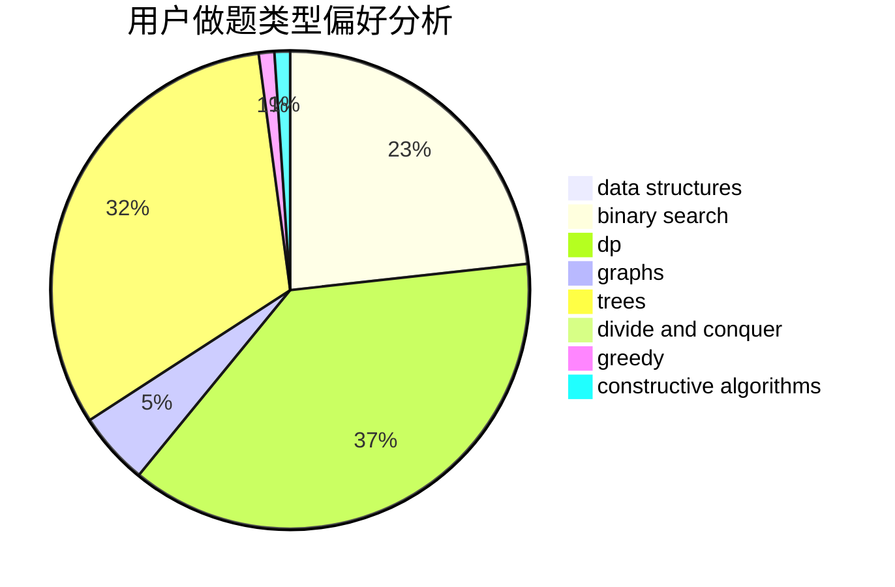
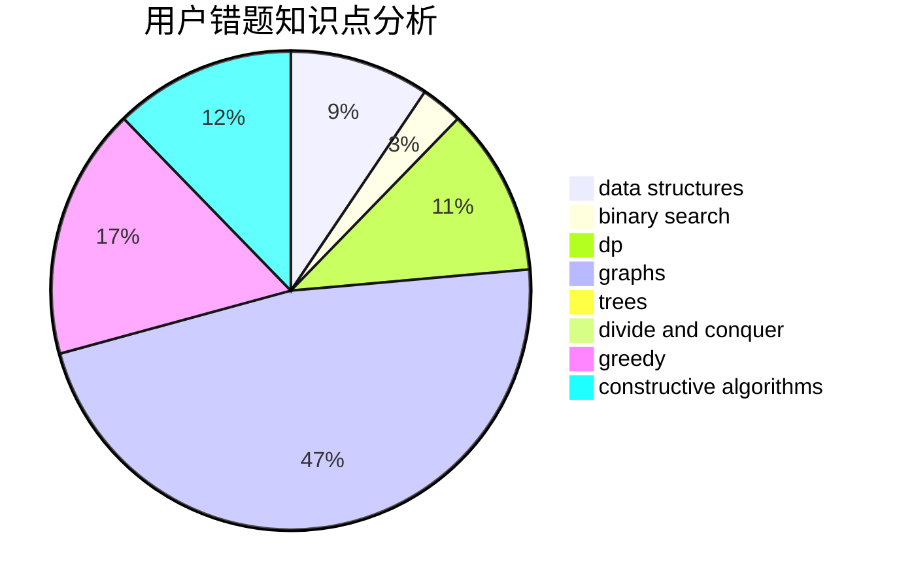

# Guaguapi

<!-- tabs:start -->

#### **用户提交结果分析**

#### **用户做题类型偏好分析**

#### **用户错题知识点分析**

<!-- tabs:end -->
# 推荐题目
[1323A](https://codeforces.com/contest/1323/problem/A)		brute force,
                        dp,
                        greedy,
                        implementation		  
[851D](https://codeforces.com/contest/851/problem/D)		dsu,graphs,sortings,trees		  
[860C](https://codeforces.com/contest/860/problem/C)		dsu,graphs,sortings,trees		  
[489F](https://codeforces.com/contest/489/problem/F)		combinatorics,
                        dp		  
[691F](https://codeforces.com/contest/691/problem/F)		brute force,
                        dp,
                        number theory		  
[1070B](https://codeforces.com/contest/1070/problem/B)		data structures,
                        greedy		  
[1001I](https://codeforces.com/contest/1001/problem/I)		*special problem		  
[348C](https://codeforces.com/contest/348/problem/C)		brute force,
                        data structures		  
[1205F](https://codeforces.com/contest/1205/problem/F)		constructive algorithms,
                        math		  
[768A](https://codeforces.com/contest/768/problem/A)		constructive algorithms,
                        sortings		  
