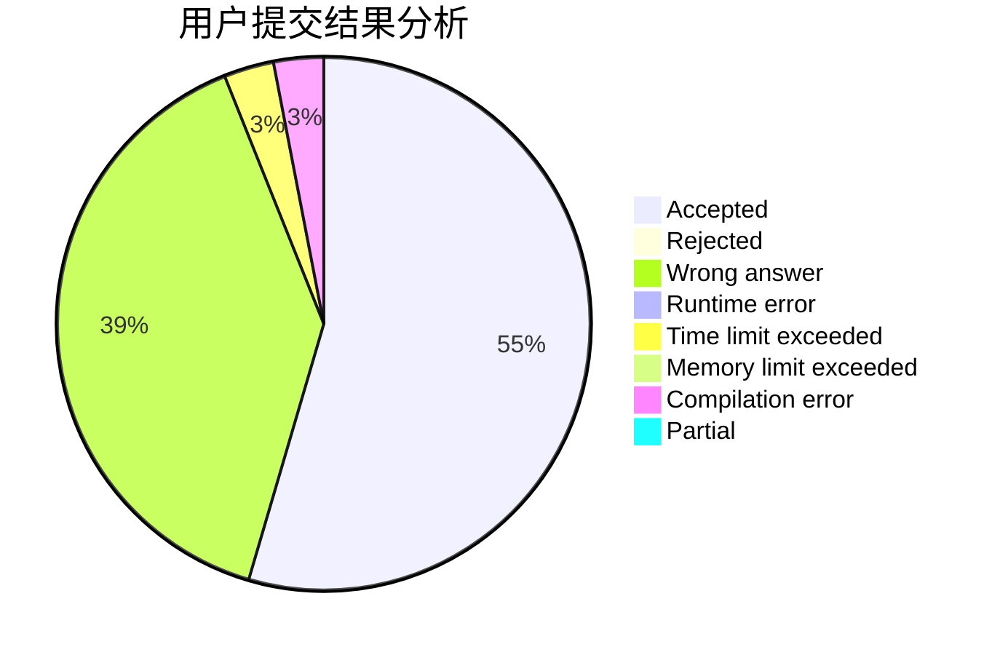
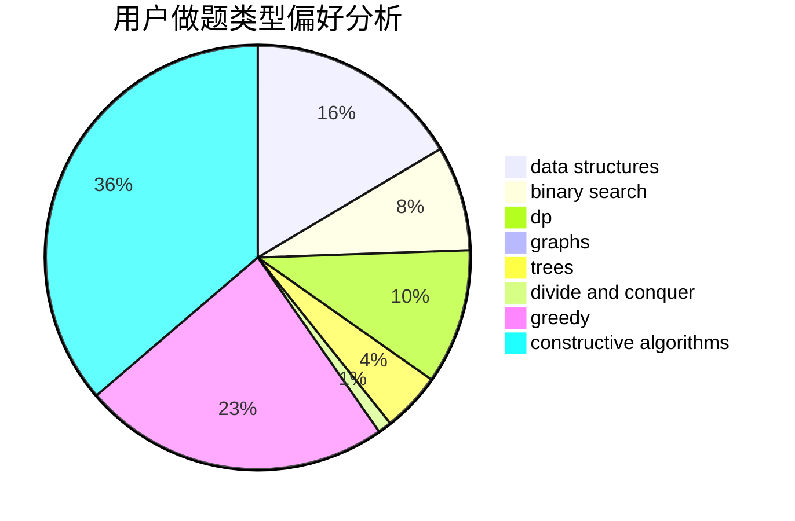
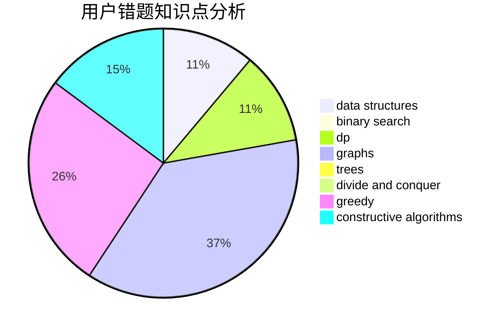

# GuanZhuangBingDu

<!-- tabs:start -->

#### **用户提交结果分析**

#### **用户做题类型偏好分析**

#### **用户错题知识点分析**

<!-- tabs:end -->
# 推荐题目
[321A](https://codeforces.com/contest/321/problem/A)		binary search,
                        implementation,
                        math		  
[356D](https://codeforces.com/contest/356/problem/D)		bitmasks,
                        constructive algorithms,
                        dp,
                        greedy		  
[2A](https://codeforces.com/contest/2/problem/A)		hashing,
                        implementation		  
[1220D](https://codeforces.com/contest/1220/problem/D)		bitmasks,
                        math,
                        number theory		  
[1238E](https://codeforces.com/contest/1238/problem/E)		bitmasks,
                        dp		  
[76D](https://codeforces.com/contest/76/problem/D)		dp,
                        greedy,
                        math		  
[789B](https://codeforces.com/contest/789/problem/B)		brute force,
                        implementation,
                        math		  
[41A](https://codeforces.com/contest/41/problem/A)		implementation,
                        strings		  
[311B](https://codeforces.com/contest/311/problem/B)		data structures,
                        dp		  
[656F](https://codeforces.com/contest/656/problem/F)		*special problem		  
