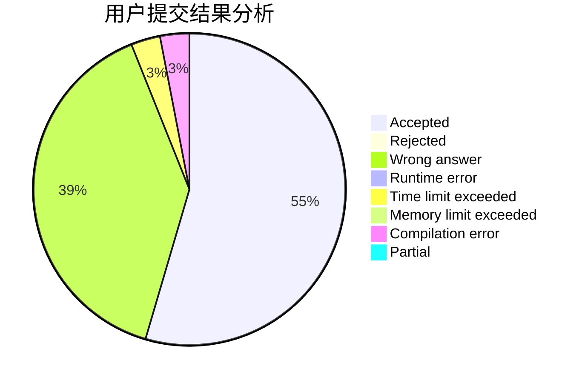
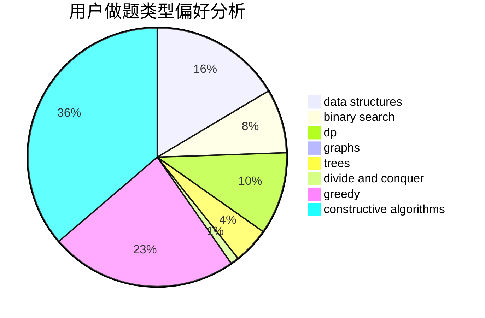
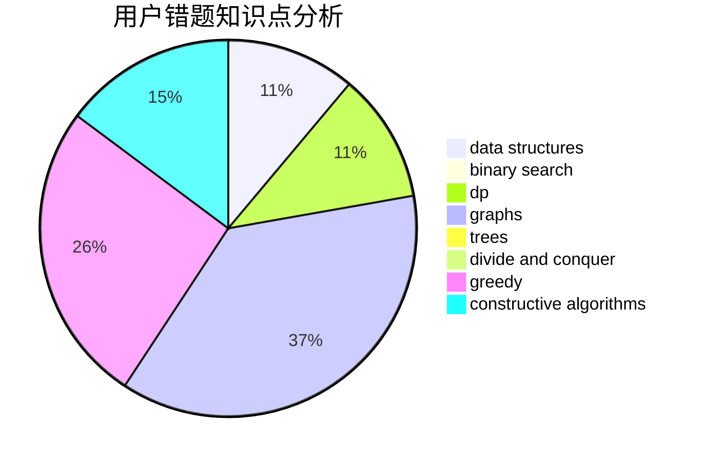

# GuanZhuangBingDu
<!-- tabs:start -->
#### **用户提交结果分析**

#### **用户做题类型偏好分析**

#### **用户错题知识点分析**

<!-- tabs:end -->
# 推荐题目
[Bags and Coins](http://codeforces.com/problemset/problem/356/D)		bitmasks,
                        constructive algorithms,
                        dp,
                        greedy		  
[Alex and Julian](http://codeforces.com/problemset/problem/1220/D)		bitmasks,
                        math,
                        number theory		  
[Ciel and Robot](http://codeforces.com/problemset/problem/321/A)		binary search,
                        implementation,
                        math		  
[Keyboard Purchase](http://codeforces.com/problemset/problem/1238/E)		bitmasks,
                        dp		  
[Inverse Coloring](http://codeforces.com/problemset/problem/1027/E)		combinatorics,
                        dp,
                        math		  
[Masha and geometric depression](http://codeforces.com/problemset/problem/789/B)		brute force,
                        implementation,
                        math		  
[Choose a Square](http://codeforces.com/problemset/problem/1221/F)		binary search,
                        data structures,
                        sortings		  
[Jeff and Furik](http://codeforces.com/problemset/problem/351/B)		combinatorics,
                        dp,
                        probabilities		  
[Ace It!](http://codeforces.com/problemset/problem/656/F)		*special problem		  
[Game With Sticks](http://codeforces.com/problemset/problem/451/A)		implementation		  
<!-- tabs:start -->
#### **data structures**
[Choose a Square](http://codeforces.com/problemset/problem/1221/F)		binary search,
                        data structures,
                        sortings		  
[Spring cleaning](http://codeforces.com/problemset/problem/1403/B)		*special problem,
                        data structures,
                        dfs and similar,
                        graphs,
                        trees		  
[Subtree Minimum Query](http://codeforces.com/problemset/problem/893/F)		data structures,
                        trees		  
[Cow and Fields](http://codeforces.com/problemset/problem/1307/D)		binary search,
                        data structures,
                        dfs and similar,
                        graphs,
                        greedy,
                        shortest paths,
                        sortings		  
[Mushroom Gnomes - 2](http://codeforces.com/problemset/problem/138/C)		binary search,
                        data structures,
                        probabilities,
                        sortings		  
[Cats Transport](http://codeforces.com/problemset/problem/311/B)		data structures,
                        dp		  
[Nim Shortcuts](http://codeforces.com/problemset/problem/1458/E)		data structures,
                        games		  
[Maximum width](http://codeforces.com/problemset/problem/1492/C)		binary search,
                        data structures,
                        dp,
                        greedy,
                        two pointers		  
[Old Floppy Drive](http://codeforces.com/problemset/problem/1490/G)		binary search,
                        data structures,
                        math		  
[Odd Mineral Resource](http://codeforces.com/problemset/problem/1479/D)		binary search,
                        bitmasks,
                        brute force,
                        data structures,
                        probabilities,
                        trees		  
#### **binary search**
[Ciel and Robot](http://codeforces.com/problemset/problem/321/A)		binary search,
                        implementation,
                        math		  
[Choose a Square](http://codeforces.com/problemset/problem/1221/F)		binary search,
                        data structures,
                        sortings		  
[Cow and Fields](http://codeforces.com/problemset/problem/1307/D)		binary search,
                        data structures,
                        dfs and similar,
                        graphs,
                        greedy,
                        shortest paths,
                        sortings		  
[Mushroom Gnomes - 2](http://codeforces.com/problemset/problem/138/C)		binary search,
                        data structures,
                        probabilities,
                        sortings		  
[Searching Local Minimum](https://codeforces.com/contest/1480/problem/C)		binary search,
                        interactive,
                        ternary search		  
[Maximum width](http://codeforces.com/problemset/problem/1492/C)		binary search,
                        data structures,
                        dp,
                        greedy,
                        two pointers		  
[Pairs](http://codeforces.com/problemset/problem/1463/D)		binary search,
                        constructive algorithms,
                        greedy,
                        two pointers		  
[Old Floppy Drive](http://codeforces.com/problemset/problem/1490/G)		binary search,
                        data structures,
                        math		  
[Odd Mineral Resource](http://codeforces.com/problemset/problem/1479/D)		binary search,
                        bitmasks,
                        brute force,
                        data structures,
                        probabilities,
                        trees		  
[Complicated Computations](http://codeforces.com/problemset/problem/1436/E)		binary search,
                        data structures,
                        two pointers		  
#### **dp**
[Bags and Coins](http://codeforces.com/problemset/problem/356/D)		bitmasks,
                        constructive algorithms,
                        dp,
                        greedy		  
[Keyboard Purchase](http://codeforces.com/problemset/problem/1238/E)		bitmasks,
                        dp		  
[Inverse Coloring](http://codeforces.com/problemset/problem/1027/E)		combinatorics,
                        dp,
                        math		  
[Jeff and Furik](http://codeforces.com/problemset/problem/351/B)		combinatorics,
                        dp,
                        probabilities		  
[Flipping Game](http://codeforces.com/problemset/problem/327/A)		brute force,
                        dp,
                        implementation		  
[Ayoub and Lost Array](http://codeforces.com/problemset/problem/1105/C)		combinatorics,
                        dp,
                        math		  
[Kaavi and Magic Spell](https://codeforces.com/contest/1337/problem/E)		dp,
                        strings		  
[Plus and xor](http://codeforces.com/problemset/problem/76/D)		dp,
                        greedy,
                        math		  
[Cats Transport](http://codeforces.com/problemset/problem/311/B)		data structures,
                        dp		  
[Maximum width](http://codeforces.com/problemset/problem/1492/C)		binary search,
                        data structures,
                        dp,
                        greedy,
                        two pointers		  
#### **graph**
[Spring cleaning](http://codeforces.com/problemset/problem/1403/B)		*special problem,
                        data structures,
                        dfs and similar,
                        graphs,
                        trees		  
[Cow and Fields](http://codeforces.com/problemset/problem/1307/D)		binary search,
                        data structures,
                        dfs and similar,
                        graphs,
                        greedy,
                        shortest paths,
                        sortings		  
[Minimum Ties](http://codeforces.com/problemset/problem/1487/C)		brute force,
                        constructive algorithms,
                        dfs and similar,
                        graphs,
                        greedy,
                        implementation,
                        math		  
[Chef Monocarp](http://codeforces.com/problemset/problem/1437/C)		dp,
                        flows,
                        graph matchings,
                        greedy,
                        math,
                        sortings		  
[Strange Housing](http://codeforces.com/problemset/problem/1470/D)		constructive algorithms,
                        dfs and similar,
                        graph matchings,
                        graphs,
                        greedy		  
[Longest Simple Cycle](http://codeforces.com/problemset/problem/1476/C)		dp,
                        graphs,
                        greedy		  
[Shortest and Longest LIS](http://codeforces.com/problemset/problem/1304/D)		constructive algorithms,
                        graphs,
                        greedy,
                        two pointers		  
[Ball in Berland](http://codeforces.com/problemset/problem/1475/C)		combinatorics,
                        graphs,
                        math		  
[Kyoya and Train](http://codeforces.com/problemset/problem/553/E)		dp,
                        fft,
                        graphs,
                        math,
                        probabilities		  
[Garden of the Sun](http://codeforces.com/problemset/problem/1495/C)		constructive algorithms,
                        graphs		  
#### **trees**
[Spring cleaning](http://codeforces.com/problemset/problem/1403/B)		*special problem,
                        data structures,
                        dfs and similar,
                        graphs,
                        trees		  
[Subtree Minimum Query](http://codeforces.com/problemset/problem/893/F)		data structures,
                        trees		  
[Odd Mineral Resource](http://codeforces.com/problemset/problem/1479/D)		binary search,
                        bitmasks,
                        brute force,
                        data structures,
                        probabilities,
                        trees		  
[Yet Another Card Deck](http://codeforces.com/problemset/problem/1511/C)		brute force,
                        data structures,
                        implementation,
                        trees		  
[Diameter Cuts](http://codeforces.com/problemset/problem/1499/F)		combinatorics,
                        dfs and similar,
                        dp,
                        trees		  
[Fib-tree](http://codeforces.com/problemset/problem/1491/E)		brute force,
                        dfs and similar,
                        divide and conquer,
                        number theory,
                        trees		  
[13th Labour of Heracles](http://codeforces.com/problemset/problem/1466/D)		data structures,
                        greedy,
                        sortings,
                        trees		  
[BFS Trees](http://codeforces.com/problemset/problem/1495/D)		combinatorics,
                        dfs and similar,
                        graphs,
                        math,
                        shortest paths,
                        trees		  
[Sum of Prefix Sums](http://codeforces.com/problemset/problem/1303/G)		data structures,
                        divide and conquer,
                        geometry,
                        trees		  
[Number of Simple Paths](http://codeforces.com/problemset/problem/1454/E)		combinatorics,
                        dfs and similar,
                        graphs,
                        trees		  
#### **divide and conquer**
[Divide and Summarize](http://codeforces.com/problemset/problem/1461/D)		binary search,
                        brute force,
                        data structures,
                        divide and conquer,
                        implementation,
                        sortings		  
[Song of the Sirens](http://codeforces.com/problemset/problem/1466/G)		combinatorics,
                        divide and conquer,
                        hashing,
                        math,
                        string suffix structures,
                        strings		  
[Permutation Transformation](http://codeforces.com/problemset/problem/1490/D)		dfs and similar,
                        divide and conquer,
                        implementation		  
[Skyline Photo](https://codeforces.com/contest/1483/problem/C)		data structures,
                        divide and conquer,
                        dp		  
[Fib-tree](http://codeforces.com/problemset/problem/1491/E)		brute force,
                        dfs and similar,
                        divide and conquer,
                        number theory,
                        trees		  
[Sum of Prefix Sums](http://codeforces.com/problemset/problem/1303/G)		data structures,
                        divide and conquer,
                        geometry,
                        trees		  
[Dogeforces](http://codeforces.com/problemset/problem/1494/D)		constructive algorithms,
                        data structures,
                        dfs and similar,
                        divide and conquer,
                        dsu,
                        greedy,
                        sortings,
                        trees		  
[Logistical Questions](http://codeforces.com/problemset/problem/566/C)		dfs and similar,
                        divide and conquer,
                        trees		  
[Fruit Sequences](http://codeforces.com/problemset/problem/1428/F)		binary search,
                        data structures,
                        divide and conquer,
                        dp,
                        two pointers		  
[Dr. Evil Underscores](http://codeforces.com/problemset/problem/1285/D)		bitmasks,
                        brute force,
                        dfs and similar,
                        divide and conquer,
                        dp,
                        greedy,
                        strings,
                        trees		  
#### **greedy**
[Bags and Coins](http://codeforces.com/problemset/problem/356/D)		bitmasks,
                        constructive algorithms,
                        dp,
                        greedy		  
[Plus and xor](http://codeforces.com/problemset/problem/76/D)		dp,
                        greedy,
                        math		  
[Cow and Fields](http://codeforces.com/problemset/problem/1307/D)		binary search,
                        data structures,
                        dfs and similar,
                        graphs,
                        greedy,
                        shortest paths,
                        sortings		  
[Ternary XOR](http://codeforces.com/problemset/problem/1328/C)		greedy,
                        implementation		  
[JOE is on TV!](http://codeforces.com/problemset/problem/1293/B)		combinatorics,
                        greedy,
                        math		  
[Maximum width](http://codeforces.com/problemset/problem/1492/C)		binary search,
                        data structures,
                        dp,
                        greedy,
                        two pointers		  
[Diamond Miner](https://codeforces.com/contest/1496/problem/C)		geometry,
                        greedy,
                        math,
                        sortings		  
[Anti-knapsack](http://codeforces.com/problemset/problem/1493/A)		constructive algorithms,
                        greedy		  
[Pairs](http://codeforces.com/problemset/problem/1463/D)		binary search,
                        constructive algorithms,
                        greedy,
                        two pointers		  
[Unique Number](http://codeforces.com/problemset/problem/1462/C)		brute force,
                        greedy,
                        math		  
#### **constructive algorithms**
[Bags and Coins](http://codeforces.com/problemset/problem/356/D)		bitmasks,
                        constructive algorithms,
                        dp,
                        greedy		  
[Continuous City](https://codeforces.com/contest/1480/problem/E)		bitmasks,
                        constructive algorithms		  
[Anti-knapsack](http://codeforces.com/problemset/problem/1493/A)		constructive algorithms,
                        greedy		  
[Pairs](http://codeforces.com/problemset/problem/1463/D)		binary search,
                        constructive algorithms,
                        greedy,
                        two pointers		  
[XOR-gun](https://codeforces.com/contest/1456/problem/B)		bitmasks,
                        brute force,
                        constructive algorithms		  
[Genius's Gambit](http://codeforces.com/problemset/problem/1492/D)		bitmasks,
                        constructive algorithms,
                        greedy,
                        math		  
[3-Coloring](https://codeforces.com/contest/1504/problem/D)		constructive algorithms,
                        games,
                        interactive		  
[Basic Diplomacy](https://codeforces.com/contest/1483/problem/A)		brute force,
                        constructive algorithms,
                        greedy,
                        implementation		  
[Array and Peaks](http://codeforces.com/problemset/problem/1513/A)		constructive algorithms,
                        implementation		  
[No More Inversions](http://codeforces.com/problemset/problem/1473/C)		constructive algorithms,
                        math		  
#### **sortings**
[Choose a Square](http://codeforces.com/problemset/problem/1221/F)		binary search,
                        data structures,
                        sortings		  
[Cow and Fields](http://codeforces.com/problemset/problem/1307/D)		binary search,
                        data structures,
                        dfs and similar,
                        graphs,
                        greedy,
                        shortest paths,
                        sortings		  
[Mushroom Gnomes - 2](http://codeforces.com/problemset/problem/138/C)		binary search,
                        data structures,
                        probabilities,
                        sortings		  
[Diamond Miner](https://codeforces.com/contest/1496/problem/C)		geometry,
                        greedy,
                        math,
                        sortings		  
[Meximization](http://codeforces.com/problemset/problem/1497/A)		brute force,
                        data structures,
                        greedy,
                        sortings		  
[Avoiding Zero](http://codeforces.com/problemset/problem/1427/A)		math,
                        sortings		  
[Divide and Summarize](http://codeforces.com/problemset/problem/1461/D)		binary search,
                        brute force,
                        data structures,
                        divide and conquer,
                        implementation,
                        sortings		  
[Chef Monocarp](http://codeforces.com/problemset/problem/1437/C)		dp,
                        flows,
                        graph matchings,
                        greedy,
                        math,
                        sortings		  
[Replacing Elements](http://codeforces.com/problemset/problem/1473/A)		greedy,
                        implementation,
                        math,
                        sortings		  
[Eastern Exhibition](http://codeforces.com/problemset/problem/1486/B)		binary search,
                        geometry,
                        shortest paths,
                        sortings		  
<!-- tabs:end -->
