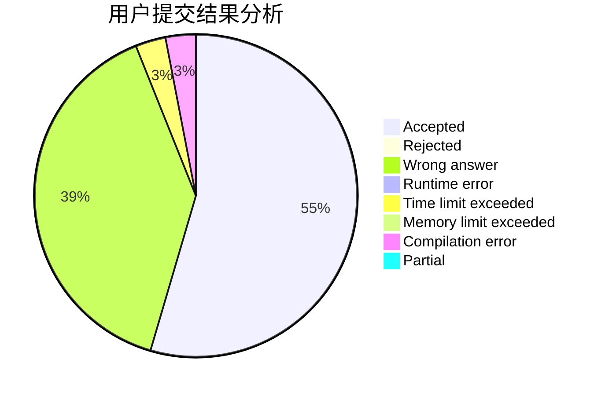
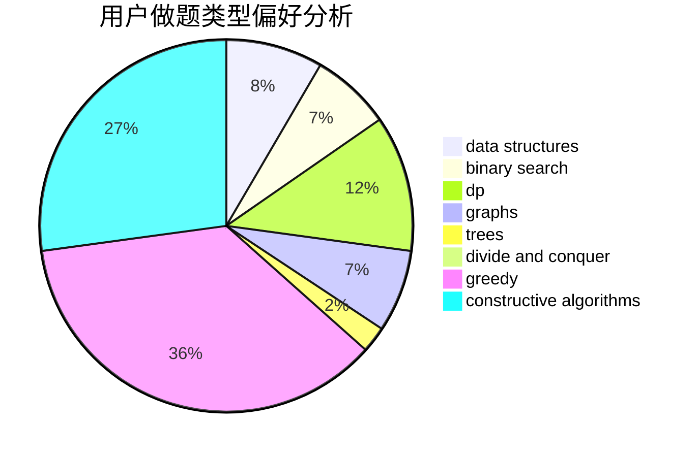
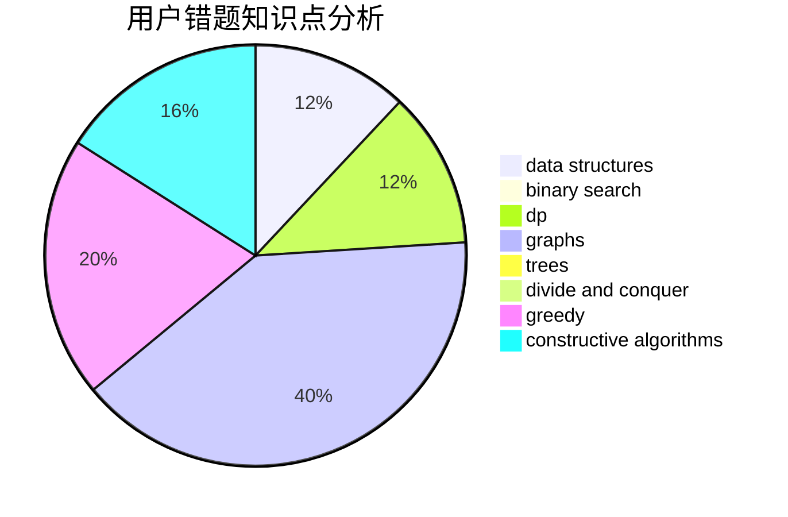

# GuanZhuangBingDu

<!-- tabs:start -->

#### **用户提交结果分析**

#### **用户做题类型偏好分析**

#### **用户错题知识点分析**

<!-- tabs:end -->
# 推荐题目
[351E](https://codeforces.com/contest/351/problem/E)		greedy		  
[382E](https://codeforces.com/contest/382/problem/E)		combinatorics,
                        dp		  
[317E](https://codeforces.com/contest/317/problem/E)		constructive algorithms,
                        shortest paths		  
[1228D](https://codeforces.com/contest/1228/problem/D)		brute force,
                        constructive algorithms,
                        graphs,
                        hashing,
                        implementation		  
[1243E](https://codeforces.com/contest/1243/problem/E)		dsu,graphs,sortings,trees		  
[78C](https://codeforces.com/contest/78/problem/C)		dp,
                        games,
                        number theory		  
[804D](https://codeforces.com/contest/804/problem/D)		binary search,
                        brute force,
                        dfs and similar,
                        dp,
                        sortings,
                        trees		  
[444E](https://codeforces.com/contest/444/problem/E)		binary search,
                        dsu,
                        trees		  
[334B](https://codeforces.com/contest/334/problem/B)		sortings		  
[678F](https://codeforces.com/contest/678/problem/F)		data structures,
                        divide and conquer,
                        geometry		  
