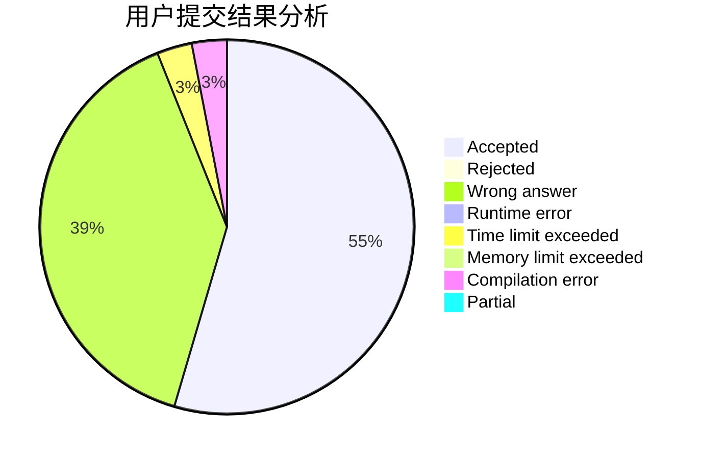
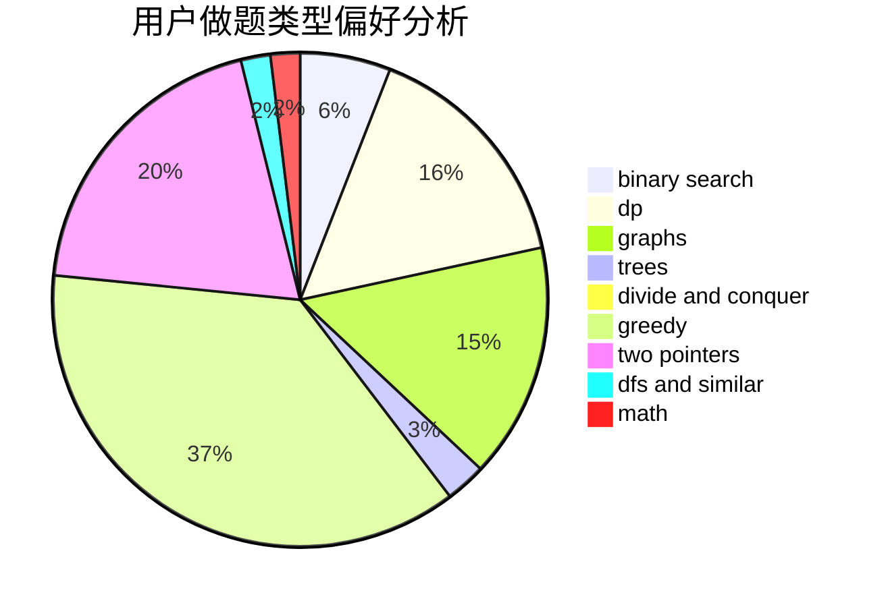

# GuanZhuangBingDu

<!-- tabs:start -->

#### **用户提交结果分析**

#### **用户做题类型偏好分析**

<!-- tabs:end -->
# 推荐题目
[351E](https://codeforces.com/contest/351/problem/E)
[382E](https://codeforces.com/contest/382/problem/E)
[317E](https://codeforces.com/contest/317/problem/E)
[1228D](https://codeforces.com/contest/1228/problem/D)
[1243E](https://codeforces.com/contest/1243/problem/E)
[78C](https://codeforces.com/contest/78/problem/C)
[804D](https://codeforces.com/contest/804/problem/D)
[444E](https://codeforces.com/contest/444/problem/E)
[334B](https://codeforces.com/contest/334/problem/B)
[678F](https://codeforces.com/contest/678/problem/F)
