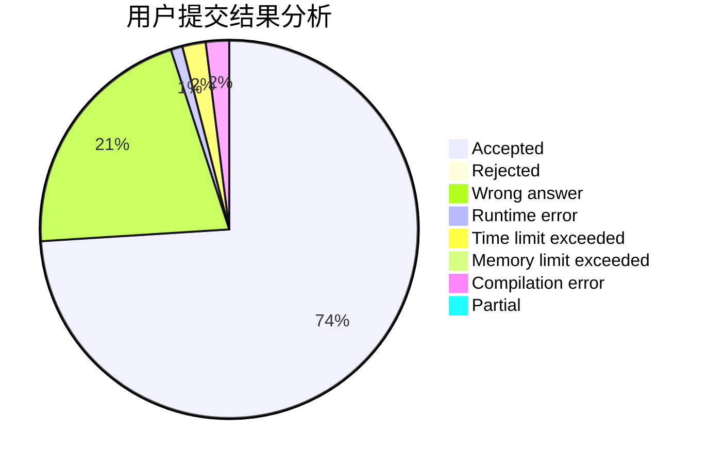
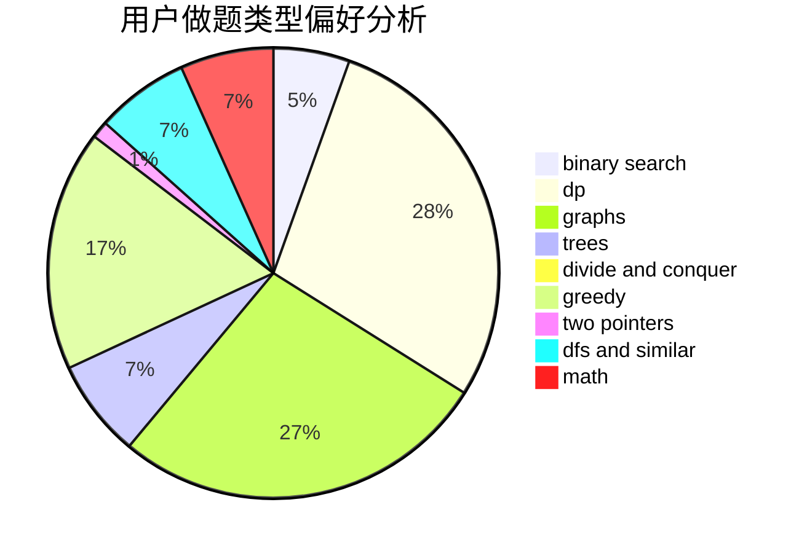

# Guangyaochenyu

<!-- tabs:start -->

#### **用户提交结果分析**

#### **用户做题类型偏好分析**

<!-- tabs:end -->
# 推荐题目
[1511B](https://codeforces.com/contest/1511/problem/B)
[912D](https://codeforces.com/contest/912/problem/D)
[1110A](https://codeforces.com/contest/1110/problem/A)
[1110H](https://codeforces.com/contest/1110/problem/H)
[590E](https://codeforces.com/contest/590/problem/E)
[1461F](https://codeforces.com/contest/1461/problem/F)
[1166B](https://codeforces.com/contest/1166/problem/B)
[1313D](https://codeforces.com/contest/1313/problem/D)
[591C](https://codeforces.com/contest/591/problem/C)
[622B](https://codeforces.com/contest/622/problem/B)
