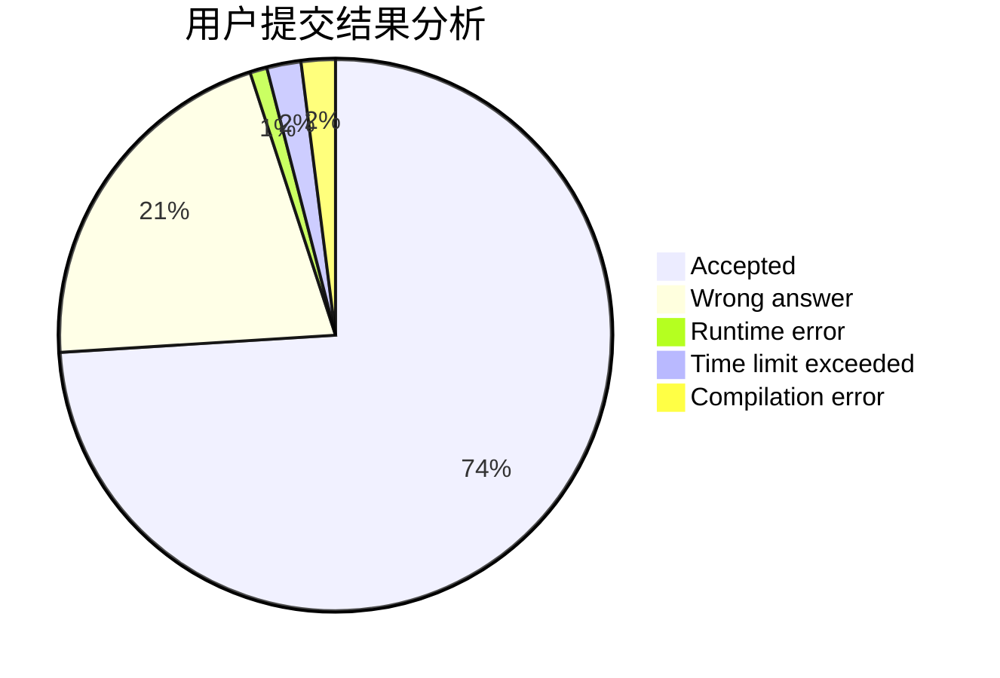
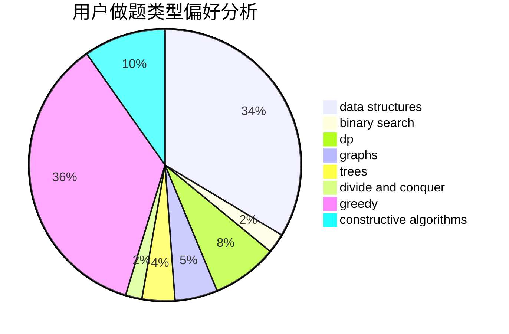
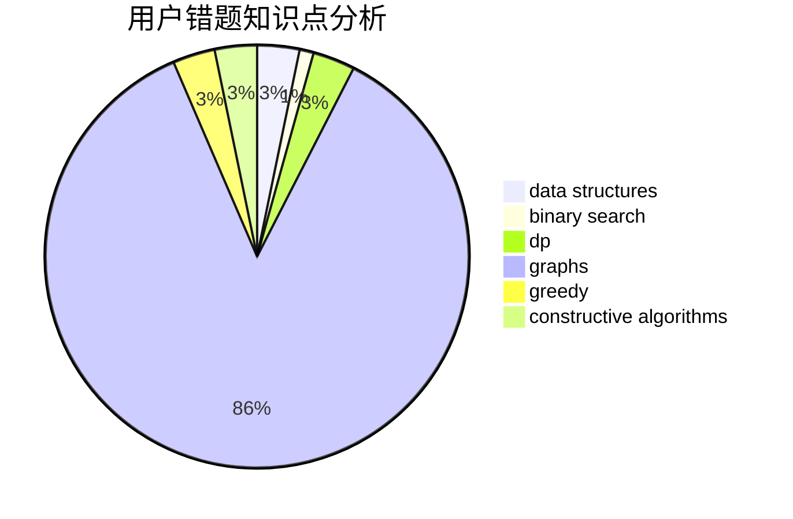

# Guangyaochenyu
<!-- tabs:start -->
#### **用户提交结果分析**

#### **用户做题类型偏好分析**

#### **用户错题知识点分析**

<!-- tabs:end -->
# 推荐题目
[Alexey and Train](http://codeforces.com/problemset/problem/1501/A)		implementation		  
[Nastya and Scoreboard](http://codeforces.com/problemset/problem/1340/B)		bitmasks,
                        dp,
                        graphs,
                        greedy		  
[Sasha and a Very Easy Test](http://codeforces.com/problemset/problem/1109/E)		data structures,
                        number theory		  
[Two Brackets](http://codeforces.com/problemset/problem/1452/C)		greedy		  
[Integer Game](http://codeforces.com/problemset/problem/1375/F)		constructive algorithms,
                        games,
                        interactive,
                        math		  
[Alex and Julian](http://codeforces.com/problemset/problem/1220/D)		bitmasks,
                        math,
                        number theory		  
[Ralph And His Tour in Binary Country](http://codeforces.com/problemset/problem/894/D)		brute force,
                        data structures,
                        trees		  
[Prefix Enlightenment](https://codeforces.com/contest/1291/problem/E)		dfs and similar,
                        dsu,
                        graphs		  
[Beautiful fountains rows](http://codeforces.com/problemset/problem/799/F)		data structures		  
[Multipliers](http://codeforces.com/problemset/problem/615/D)		math,
                        number theory		  
<!-- tabs:start -->
#### **data structures**
[Sasha and a Very Easy Test](http://codeforces.com/problemset/problem/1109/E)		data structures,
                        number theory		  
[Ralph And His Tour in Binary Country](http://codeforces.com/problemset/problem/894/D)		brute force,
                        data structures,
                        trees		  
[Beautiful fountains rows](http://codeforces.com/problemset/problem/799/F)		data structures		  
[Animal Observation (hard version)](http://codeforces.com/problemset/problem/1304/F2)		data structures,
                        dp,
                        greedy		  
[Replacement](http://codeforces.com/problemset/problem/570/C)		constructive algorithms,
                        data structures,
                        implementation		  
[Vitya and Strange Lesson](http://codeforces.com/problemset/problem/842/D)		binary search,
                        data structures		  
[Years](http://codeforces.com/problemset/problem/1424/G)		data structures,
                        sortings		  
[White Lines](http://codeforces.com/problemset/problem/1200/D)		brute force,
                        data structures,
                        dp,
                        implementation,
                        two pointers		  
[Flip and Reverse](https://codeforces.com/contest/1459/problem/F)		data structures,
                        graphs,
                        greedy		  
[Pastoral Oddities](http://codeforces.com/problemset/problem/603/E)		data structures,
                        divide and conquer,
                        dsu,
                        math,
                        trees		  
#### **binary search**
[Vitya and Strange Lesson](http://codeforces.com/problemset/problem/842/D)		binary search,
                        data structures		  
[String Game](https://codeforces.com/contest/779/problem/D)		binary search,
                        greedy,
                        strings		  
[Common Number](http://codeforces.com/problemset/problem/1271/E)		binary search,
                        combinatorics,
                        dp,
                        math		  
[Maximum width](http://codeforces.com/problemset/problem/1492/C)		binary search,
                        data structures,
                        dp,
                        greedy,
                        two pointers		  
[Pairs](http://codeforces.com/problemset/problem/1463/D)		binary search,
                        constructive algorithms,
                        greedy,
                        two pointers		  
[Old Floppy Drive](http://codeforces.com/problemset/problem/1490/G)		binary search,
                        data structures,
                        math		  
[Odd Mineral Resource](http://codeforces.com/problemset/problem/1479/D)		binary search,
                        bitmasks,
                        brute force,
                        data structures,
                        probabilities,
                        trees		  
[Complicated Computations](http://codeforces.com/problemset/problem/1436/E)		binary search,
                        data structures,
                        two pointers		  
[Divide and Summarize](http://codeforces.com/problemset/problem/1461/D)		binary search,
                        brute force,
                        data structures,
                        divide and conquer,
                        implementation,
                        sortings		  
[K-beautiful Strings](http://codeforces.com/problemset/problem/1493/C)		binary search,
                        brute force,
                        constructive algorithms,
                        greedy,
                        strings		  
#### **dp**
[Nastya and Scoreboard](http://codeforces.com/problemset/problem/1340/B)		bitmasks,
                        dp,
                        graphs,
                        greedy		  
[Animal Observation (hard version)](http://codeforces.com/problemset/problem/1304/F2)		data structures,
                        dp,
                        greedy		  
[White Lines](http://codeforces.com/problemset/problem/1200/D)		brute force,
                        data structures,
                        dp,
                        implementation,
                        two pointers		  
[QAQ](http://codeforces.com/problemset/problem/894/A)		brute force,
                        dp		  
[Ralph and Mushrooms](http://codeforces.com/problemset/problem/894/E)		dp,
                        graphs		  
[Common Number](http://codeforces.com/problemset/problem/1271/E)		binary search,
                        combinatorics,
                        dp,
                        math		  
[Mr. Kitayuta, the Treasure Hunter](https://codeforces.com/contest/506/problem/A)		dfs and similar,
                        dp,
                        two pointers		  
[Sorting Books](http://codeforces.com/problemset/problem/1481/E)		data structures,
                        dp,
                        greedy		  
[Maximum width](http://codeforces.com/problemset/problem/1492/C)		binary search,
                        data structures,
                        dp,
                        greedy,
                        two pointers		  
[Bouncing Ball](https://codeforces.com/contest/1457/problem/C)		brute force,
                        dp,
                        implementation		  
#### **graph**
[Nastya and Scoreboard](http://codeforces.com/problemset/problem/1340/B)		bitmasks,
                        dp,
                        graphs,
                        greedy		  
[Prefix Enlightenment](https://codeforces.com/contest/1291/problem/E)		dfs and similar,
                        dsu,
                        graphs		  
[Flip and Reverse](https://codeforces.com/contest/1459/problem/F)		data structures,
                        graphs,
                        greedy		  
[Arthur and Walls](http://codeforces.com/problemset/problem/525/D)		constructive algorithms,
                        data structures,
                        graphs,
                        greedy,
                        shortest paths		  
[Ralph and Mushrooms](http://codeforces.com/problemset/problem/894/E)		dp,
                        graphs		  
[Minimum Ties](http://codeforces.com/problemset/problem/1487/C)		brute force,
                        constructive algorithms,
                        dfs and similar,
                        graphs,
                        greedy,
                        implementation,
                        math		  
[Chef Monocarp](http://codeforces.com/problemset/problem/1437/C)		dp,
                        flows,
                        graph matchings,
                        greedy,
                        math,
                        sortings		  
[Strange Housing](http://codeforces.com/problemset/problem/1470/D)		constructive algorithms,
                        dfs and similar,
                        graph matchings,
                        graphs,
                        greedy		  
[Longest Simple Cycle](http://codeforces.com/problemset/problem/1476/C)		dp,
                        graphs,
                        greedy		  
[Shortest and Longest LIS](http://codeforces.com/problemset/problem/1304/D)		constructive algorithms,
                        graphs,
                        greedy,
                        two pointers		  
#### **trees**
[Ralph And His Tour in Binary Country](http://codeforces.com/problemset/problem/894/D)		brute force,
                        data structures,
                        trees		  
[Pastoral Oddities](http://codeforces.com/problemset/problem/603/E)		data structures,
                        divide and conquer,
                        dsu,
                        math,
                        trees		  
[Odd Mineral Resource](http://codeforces.com/problemset/problem/1479/D)		binary search,
                        bitmasks,
                        brute force,
                        data structures,
                        probabilities,
                        trees		  
[Yet Another Card Deck](http://codeforces.com/problemset/problem/1511/C)		brute force,
                        data structures,
                        implementation,
                        trees		  
[Diameter Cuts](http://codeforces.com/problemset/problem/1499/F)		combinatorics,
                        dfs and similar,
                        dp,
                        trees		  
[Fib-tree](http://codeforces.com/problemset/problem/1491/E)		brute force,
                        dfs and similar,
                        divide and conquer,
                        number theory,
                        trees		  
[13th Labour of Heracles](http://codeforces.com/problemset/problem/1466/D)		data structures,
                        greedy,
                        sortings,
                        trees		  
[BFS Trees](http://codeforces.com/problemset/problem/1495/D)		combinatorics,
                        dfs and similar,
                        graphs,
                        math,
                        shortest paths,
                        trees		  
[Sum of Prefix Sums](http://codeforces.com/problemset/problem/1303/G)		data structures,
                        divide and conquer,
                        geometry,
                        trees		  
[Number of Simple Paths](http://codeforces.com/problemset/problem/1454/E)		combinatorics,
                        dfs and similar,
                        graphs,
                        trees		  
#### **divide and conquer**
[Pastoral Oddities](http://codeforces.com/problemset/problem/603/E)		data structures,
                        divide and conquer,
                        dsu,
                        math,
                        trees		  
[Divide and Summarize](http://codeforces.com/problemset/problem/1461/D)		binary search,
                        brute force,
                        data structures,
                        divide and conquer,
                        implementation,
                        sortings		  
[Song of the Sirens](http://codeforces.com/problemset/problem/1466/G)		combinatorics,
                        divide and conquer,
                        hashing,
                        math,
                        string suffix structures,
                        strings		  
[Permutation Transformation](http://codeforces.com/problemset/problem/1490/D)		dfs and similar,
                        divide and conquer,
                        implementation		  
[Skyline Photo](https://codeforces.com/contest/1483/problem/C)		data structures,
                        divide and conquer,
                        dp		  
[Fib-tree](http://codeforces.com/problemset/problem/1491/E)		brute force,
                        dfs and similar,
                        divide and conquer,
                        number theory,
                        trees		  
[Sum of Prefix Sums](http://codeforces.com/problemset/problem/1303/G)		data structures,
                        divide and conquer,
                        geometry,
                        trees		  
[Dogeforces](http://codeforces.com/problemset/problem/1494/D)		constructive algorithms,
                        data structures,
                        dfs and similar,
                        divide and conquer,
                        dsu,
                        greedy,
                        sortings,
                        trees		  
[Logistical Questions](http://codeforces.com/problemset/problem/566/C)		dfs and similar,
                        divide and conquer,
                        trees		  
[Fruit Sequences](http://codeforces.com/problemset/problem/1428/F)		binary search,
                        data structures,
                        divide and conquer,
                        dp,
                        two pointers		  
#### **greedy**
[Nastya and Scoreboard](http://codeforces.com/problemset/problem/1340/B)		bitmasks,
                        dp,
                        graphs,
                        greedy		  
[Two Brackets](http://codeforces.com/problemset/problem/1452/C)		greedy		  
[Animal Observation (hard version)](http://codeforces.com/problemset/problem/1304/F2)		data structures,
                        dp,
                        greedy		  
[Anagram](http://codeforces.com/problemset/problem/254/C)		greedy,
                        strings		  
[Duff and Meat](http://codeforces.com/problemset/problem/588/A)		greedy		  
[String Game](https://codeforces.com/contest/779/problem/D)		binary search,
                        greedy,
                        strings		  
[Zmei Gorynich](http://codeforces.com/problemset/problem/1217/B)		greedy,
                        math		  
[Flip and Reverse](https://codeforces.com/contest/1459/problem/F)		data structures,
                        graphs,
                        greedy		  
[Chunga-Changa](http://codeforces.com/problemset/problem/1181/A)		greedy,
                        math		  
[Arthur and Walls](http://codeforces.com/problemset/problem/525/D)		constructive algorithms,
                        data structures,
                        graphs,
                        greedy,
                        shortest paths		  
#### **constructive algorithms**
[Integer Game](http://codeforces.com/problemset/problem/1375/F)		constructive algorithms,
                        games,
                        interactive,
                        math		  
[Replacement](http://codeforces.com/problemset/problem/570/C)		constructive algorithms,
                        data structures,
                        implementation		  
[Ralph And His Magic Field](http://codeforces.com/problemset/problem/894/B)		combinatorics,
                        constructive algorithms,
                        math,
                        number theory		  
[Arthur and Walls](http://codeforces.com/problemset/problem/525/D)		constructive algorithms,
                        data structures,
                        graphs,
                        greedy,
                        shortest paths		  
[Marco and GCD Sequence](http://codeforces.com/problemset/problem/894/C)		constructive algorithms,
                        math		  
[Three Horses](http://codeforces.com/problemset/problem/271/E)		constructive algorithms,
                        math,
                        number theory		  
[Magic Stones](http://codeforces.com/problemset/problem/1110/E)		constructive algorithms,
                        math,
                        sortings		  
[Anti-knapsack](http://codeforces.com/problemset/problem/1493/A)		constructive algorithms,
                        greedy		  
[Pairs](http://codeforces.com/problemset/problem/1463/D)		binary search,
                        constructive algorithms,
                        greedy,
                        two pointers		  
[XOR-gun](https://codeforces.com/contest/1456/problem/B)		bitmasks,
                        brute force,
                        constructive algorithms		  
#### **sortings**
[Years](http://codeforces.com/problemset/problem/1424/G)		data structures,
                        sortings		  
[Cartoons](http://codeforces.com/problemset/problem/1297/B)		*special problem,
                        implementation,
                        sortings		  
[Magic Stones](http://codeforces.com/problemset/problem/1110/E)		constructive algorithms,
                        math,
                        sortings		  
[Diamond Miner](https://codeforces.com/contest/1496/problem/C)		geometry,
                        greedy,
                        math,
                        sortings		  
[Meximization](http://codeforces.com/problemset/problem/1497/A)		brute force,
                        data structures,
                        greedy,
                        sortings		  
[Avoiding Zero](http://codeforces.com/problemset/problem/1427/A)		math,
                        sortings		  
[Divide and Summarize](http://codeforces.com/problemset/problem/1461/D)		binary search,
                        brute force,
                        data structures,
                        divide and conquer,
                        implementation,
                        sortings		  
[Chef Monocarp](http://codeforces.com/problemset/problem/1437/C)		dp,
                        flows,
                        graph matchings,
                        greedy,
                        math,
                        sortings		  
[Replacing Elements](http://codeforces.com/problemset/problem/1473/A)		greedy,
                        implementation,
                        math,
                        sortings		  
[Eastern Exhibition](http://codeforces.com/problemset/problem/1486/B)		binary search,
                        geometry,
                        shortest paths,
                        sortings		  
<!-- tabs:end -->
