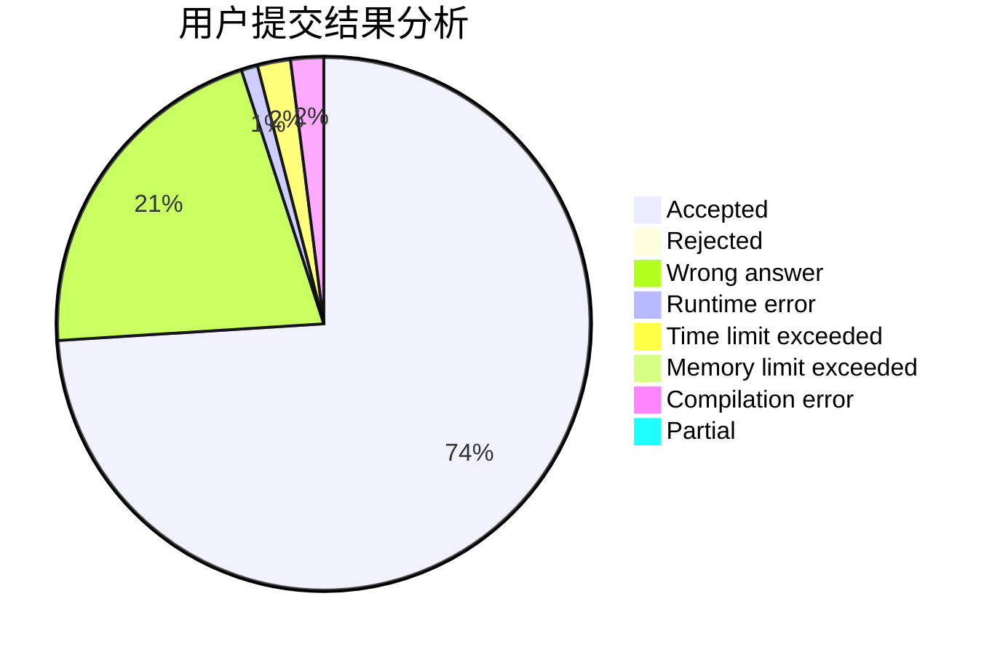
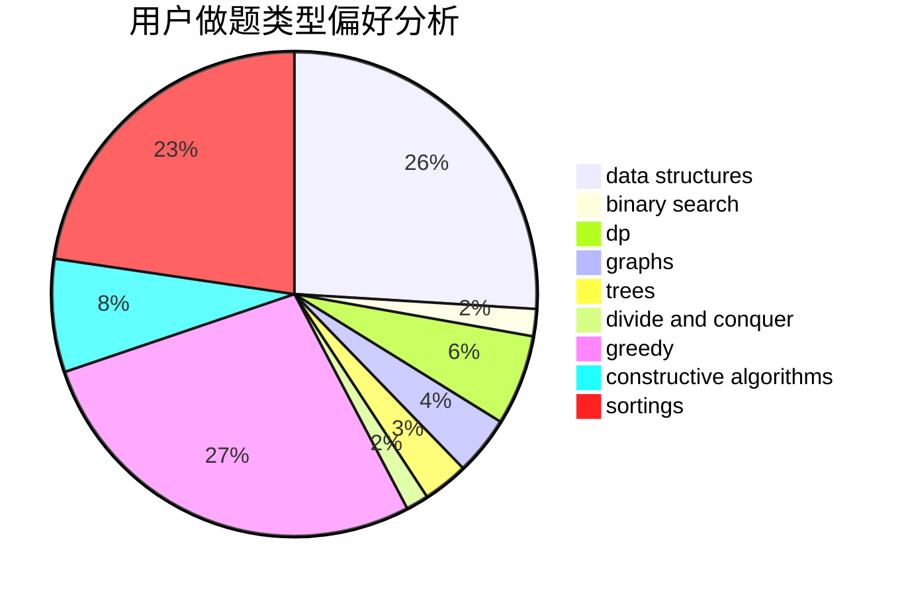
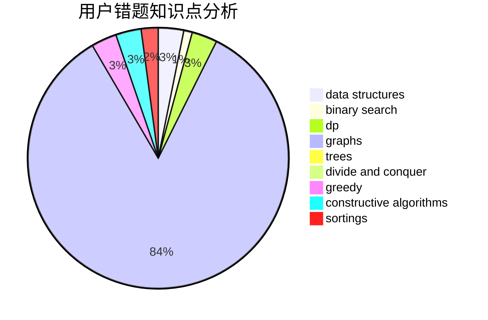

# Guangyaochenyu
<!-- tabs:start -->
#### **用户提交结果分析**

#### **用户做题类型偏好分析**

#### **用户错题知识点分析**

<!-- tabs:end -->
# 推荐题目
[1501A](http://codeforces.com/problemset/problem/1501/A)		implementation		  
[1340B](http://codeforces.com/problemset/problem/1340/B)		bitmasks,
                        dp,
                        graphs,
                        greedy		  
[1109E](http://codeforces.com/problemset/problem/1109/E)		data structures,
                        number theory		  
[1452C](http://codeforces.com/problemset/problem/1452/C)		greedy		  
[1375F](http://codeforces.com/problemset/problem/1375/F)		constructive algorithms,
                        games,
                        interactive,
                        math		  
[1220D](http://codeforces.com/problemset/problem/1220/D)		bitmasks,
                        math,
                        number theory		  
[894D](http://codeforces.com/problemset/problem/894/D)		brute force,
                        data structures,
                        trees		  
[1291E](https://codeforces.com/contest/1291/problem/E)		dfs and similar,
                        dsu,
                        graphs		  
[799F](http://codeforces.com/problemset/problem/799/F)		data structures		  
[615D](http://codeforces.com/problemset/problem/615/D)		math,
                        number theory		  
<!-- tabs:start -->
#### **data structures**
[1109E](http://codeforces.com/problemset/problem/1109/E)		data structures,
                        number theory		  
[894D](http://codeforces.com/problemset/problem/894/D)		brute force,
                        data structures,
                        trees		  
[799F](http://codeforces.com/problemset/problem/799/F)		data structures		  
[1304F2](http://codeforces.com/problemset/problem/1304/F2)		data structures,
                        dp,
                        greedy		  
[570C](http://codeforces.com/problemset/problem/570/C)		constructive algorithms,
                        data structures,
                        implementation		  
[842D](http://codeforces.com/problemset/problem/842/D)		binary search,
                        data structures		  
[1424G](http://codeforces.com/problemset/problem/1424/G)		data structures,
                        sortings		  
[1200D](http://codeforces.com/problemset/problem/1200/D)		brute force,
                        data structures,
                        dp,
                        implementation,
                        two pointers		  
[1459F](https://codeforces.com/contest/1459/problem/F)		data structures,
                        graphs,
                        greedy		  
[603E](http://codeforces.com/problemset/problem/603/E)		data structures,
                        divide and conquer,
                        dsu,
                        math,
                        trees		  
#### **binary search**
[842D](http://codeforces.com/problemset/problem/842/D)		binary search,
                        data structures		  
[779D](https://codeforces.com/contest/779/problem/D)		binary search,
                        greedy,
                        strings		  
[1271E](http://codeforces.com/problemset/problem/1271/E)		binary search,
                        combinatorics,
                        dp,
                        math		  
[1492C](http://codeforces.com/problemset/problem/1492/C)		binary search,
                        data structures,
                        dp,
                        greedy,
                        two pointers		  
[1463D](http://codeforces.com/problemset/problem/1463/D)		binary search,
                        constructive algorithms,
                        greedy,
                        two pointers		  
[1490G](http://codeforces.com/problemset/problem/1490/G)		binary search,
                        data structures,
                        math		  
[1479D](http://codeforces.com/problemset/problem/1479/D)		binary search,
                        bitmasks,
                        brute force,
                        data structures,
                        probabilities,
                        trees		  
[1436E](http://codeforces.com/problemset/problem/1436/E)		binary search,
                        data structures,
                        two pointers		  
[1461D](http://codeforces.com/problemset/problem/1461/D)		binary search,
                        brute force,
                        data structures,
                        divide and conquer,
                        implementation,
                        sortings		  
[1493C](http://codeforces.com/problemset/problem/1493/C)		binary search,
                        brute force,
                        constructive algorithms,
                        greedy,
                        strings		  
#### **dp**
[1340B](http://codeforces.com/problemset/problem/1340/B)		bitmasks,
                        dp,
                        graphs,
                        greedy		  
[1304F2](http://codeforces.com/problemset/problem/1304/F2)		data structures,
                        dp,
                        greedy		  
[1200D](http://codeforces.com/problemset/problem/1200/D)		brute force,
                        data structures,
                        dp,
                        implementation,
                        two pointers		  
[894A](http://codeforces.com/problemset/problem/894/A)		brute force,
                        dp		  
[894E](http://codeforces.com/problemset/problem/894/E)		dp,
                        graphs		  
[1271E](http://codeforces.com/problemset/problem/1271/E)		binary search,
                        combinatorics,
                        dp,
                        math		  
[506A](https://codeforces.com/contest/506/problem/A)		dfs and similar,
                        dp,
                        two pointers		  
[1481E](http://codeforces.com/problemset/problem/1481/E)		data structures,
                        dp,
                        greedy		  
[1492C](http://codeforces.com/problemset/problem/1492/C)		binary search,
                        data structures,
                        dp,
                        greedy,
                        two pointers		  
[1457C](https://codeforces.com/contest/1457/problem/C)		brute force,
                        dp,
                        implementation		  
#### **graph**
[1340B](http://codeforces.com/problemset/problem/1340/B)		bitmasks,
                        dp,
                        graphs,
                        greedy		  
[1291E](https://codeforces.com/contest/1291/problem/E)		dfs and similar,
                        dsu,
                        graphs		  
[1459F](https://codeforces.com/contest/1459/problem/F)		data structures,
                        graphs,
                        greedy		  
[525D](http://codeforces.com/problemset/problem/525/D)		constructive algorithms,
                        data structures,
                        graphs,
                        greedy,
                        shortest paths		  
[894E](http://codeforces.com/problemset/problem/894/E)		dp,
                        graphs		  
[1487C](http://codeforces.com/problemset/problem/1487/C)		brute force,
                        constructive algorithms,
                        dfs and similar,
                        graphs,
                        greedy,
                        implementation,
                        math		  
[1437C](http://codeforces.com/problemset/problem/1437/C)		dp,
                        flows,
                        graph matchings,
                        greedy,
                        math,
                        sortings		  
[1470D](http://codeforces.com/problemset/problem/1470/D)		constructive algorithms,
                        dfs and similar,
                        graph matchings,
                        graphs,
                        greedy		  
[1476C](http://codeforces.com/problemset/problem/1476/C)		dp,
                        graphs,
                        greedy		  
[1304D](http://codeforces.com/problemset/problem/1304/D)		constructive algorithms,
                        graphs,
                        greedy,
                        two pointers		  
#### **trees**
[894D](http://codeforces.com/problemset/problem/894/D)		brute force,
                        data structures,
                        trees		  
[603E](http://codeforces.com/problemset/problem/603/E)		data structures,
                        divide and conquer,
                        dsu,
                        math,
                        trees		  
[1479D](http://codeforces.com/problemset/problem/1479/D)		binary search,
                        bitmasks,
                        brute force,
                        data structures,
                        probabilities,
                        trees		  
[1511C](http://codeforces.com/problemset/problem/1511/C)		brute force,
                        data structures,
                        implementation,
                        trees		  
[1499F](http://codeforces.com/problemset/problem/1499/F)		combinatorics,
                        dfs and similar,
                        dp,
                        trees		  
[1491E](http://codeforces.com/problemset/problem/1491/E)		brute force,
                        dfs and similar,
                        divide and conquer,
                        number theory,
                        trees		  
[1466D](http://codeforces.com/problemset/problem/1466/D)		data structures,
                        greedy,
                        sortings,
                        trees		  
[1495D](http://codeforces.com/problemset/problem/1495/D)		combinatorics,
                        dfs and similar,
                        graphs,
                        math,
                        shortest paths,
                        trees		  
[1303G](http://codeforces.com/problemset/problem/1303/G)		data structures,
                        divide and conquer,
                        geometry,
                        trees		  
[1454E](http://codeforces.com/problemset/problem/1454/E)		combinatorics,
                        dfs and similar,
                        graphs,
                        trees		  
#### **divide and conquer**
[603E](http://codeforces.com/problemset/problem/603/E)		data structures,
                        divide and conquer,
                        dsu,
                        math,
                        trees		  
[1461D](http://codeforces.com/problemset/problem/1461/D)		binary search,
                        brute force,
                        data structures,
                        divide and conquer,
                        implementation,
                        sortings		  
[1466G](http://codeforces.com/problemset/problem/1466/G)		combinatorics,
                        divide and conquer,
                        hashing,
                        math,
                        string suffix structures,
                        strings		  
[1490D](http://codeforces.com/problemset/problem/1490/D)		dfs and similar,
                        divide and conquer,
                        implementation		  
[1483C](https://codeforces.com/contest/1483/problem/C)		data structures,
                        divide and conquer,
                        dp		  
[1491E](http://codeforces.com/problemset/problem/1491/E)		brute force,
                        dfs and similar,
                        divide and conquer,
                        number theory,
                        trees		  
[1303G](http://codeforces.com/problemset/problem/1303/G)		data structures,
                        divide and conquer,
                        geometry,
                        trees		  
[1494D](http://codeforces.com/problemset/problem/1494/D)		constructive algorithms,
                        data structures,
                        dfs and similar,
                        divide and conquer,
                        dsu,
                        greedy,
                        sortings,
                        trees		  
[1482E](http://codeforces.com/problemset/problem/1482/E)		data structures,
                        divide and conquer,
                        dp		  
[566C](http://codeforces.com/problemset/problem/566/C)		dfs and similar,
                        divide and conquer,
                        trees		  
#### **greedy**
[1340B](http://codeforces.com/problemset/problem/1340/B)		bitmasks,
                        dp,
                        graphs,
                        greedy		  
[1452C](http://codeforces.com/problemset/problem/1452/C)		greedy		  
[1304F2](http://codeforces.com/problemset/problem/1304/F2)		data structures,
                        dp,
                        greedy		  
[254C](http://codeforces.com/problemset/problem/254/C)		greedy,
                        strings		  
[588A](http://codeforces.com/problemset/problem/588/A)		greedy		  
[779D](https://codeforces.com/contest/779/problem/D)		binary search,
                        greedy,
                        strings		  
[1217B](http://codeforces.com/problemset/problem/1217/B)		greedy,
                        math		  
[1459F](https://codeforces.com/contest/1459/problem/F)		data structures,
                        graphs,
                        greedy		  
[1181A](http://codeforces.com/problemset/problem/1181/A)		greedy,
                        math		  
[525D](http://codeforces.com/problemset/problem/525/D)		constructive algorithms,
                        data structures,
                        graphs,
                        greedy,
                        shortest paths		  
#### **constructive algorithms**
[1375F](http://codeforces.com/problemset/problem/1375/F)		constructive algorithms,
                        games,
                        interactive,
                        math		  
[570C](http://codeforces.com/problemset/problem/570/C)		constructive algorithms,
                        data structures,
                        implementation		  
[894B](http://codeforces.com/problemset/problem/894/B)		combinatorics,
                        constructive algorithms,
                        math,
                        number theory		  
[525D](http://codeforces.com/problemset/problem/525/D)		constructive algorithms,
                        data structures,
                        graphs,
                        greedy,
                        shortest paths		  
[894C](http://codeforces.com/problemset/problem/894/C)		constructive algorithms,
                        math		  
[271E](http://codeforces.com/problemset/problem/271/E)		constructive algorithms,
                        math,
                        number theory		  
[1110E](http://codeforces.com/problemset/problem/1110/E)		constructive algorithms,
                        math,
                        sortings		  
[1493A](http://codeforces.com/problemset/problem/1493/A)		constructive algorithms,
                        greedy		  
[1463D](http://codeforces.com/problemset/problem/1463/D)		binary search,
                        constructive algorithms,
                        greedy,
                        two pointers		  
[1456B](https://codeforces.com/contest/1456/problem/B)		bitmasks,
                        brute force,
                        constructive algorithms		  
#### **sortings**
[1424G](http://codeforces.com/problemset/problem/1424/G)		data structures,
                        sortings		  
[1297B](http://codeforces.com/problemset/problem/1297/B)		*special problem,
                        implementation,
                        sortings		  
[1110E](http://codeforces.com/problemset/problem/1110/E)		constructive algorithms,
                        math,
                        sortings		  
[1496C](https://codeforces.com/contest/1496/problem/C)		geometry,
                        greedy,
                        math,
                        sortings		  
[1495A](http://codeforces.com/problemset/problem/1495/A)		geometry,
                        greedy,
                        math,
                        sortings		  
[1497A](http://codeforces.com/problemset/problem/1497/A)		brute force,
                        data structures,
                        greedy,
                        sortings		  
[1427A](http://codeforces.com/problemset/problem/1427/A)		math,
                        sortings		  
[1461D](http://codeforces.com/problemset/problem/1461/D)		binary search,
                        brute force,
                        data structures,
                        divide and conquer,
                        implementation,
                        sortings		  
[1437C](http://codeforces.com/problemset/problem/1437/C)		dp,
                        flows,
                        graph matchings,
                        greedy,
                        math,
                        sortings		  
[1473A](http://codeforces.com/problemset/problem/1473/A)		greedy,
                        implementation,
                        math,
                        sortings		  
<!-- tabs:end -->
