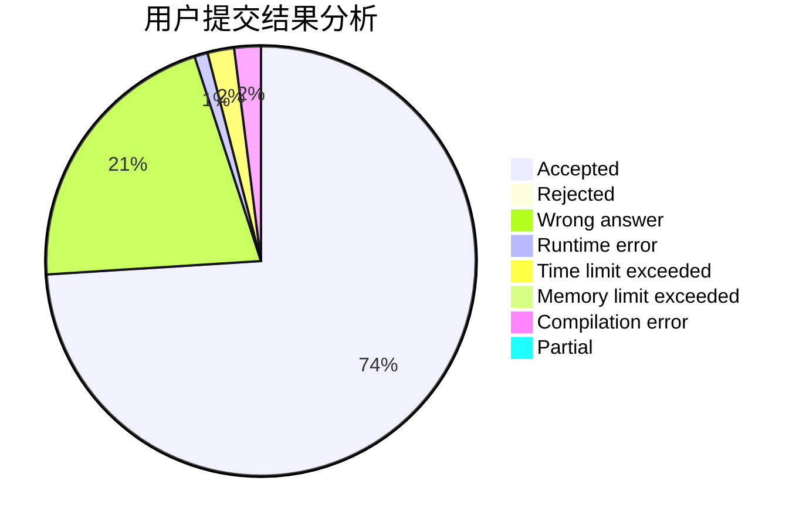
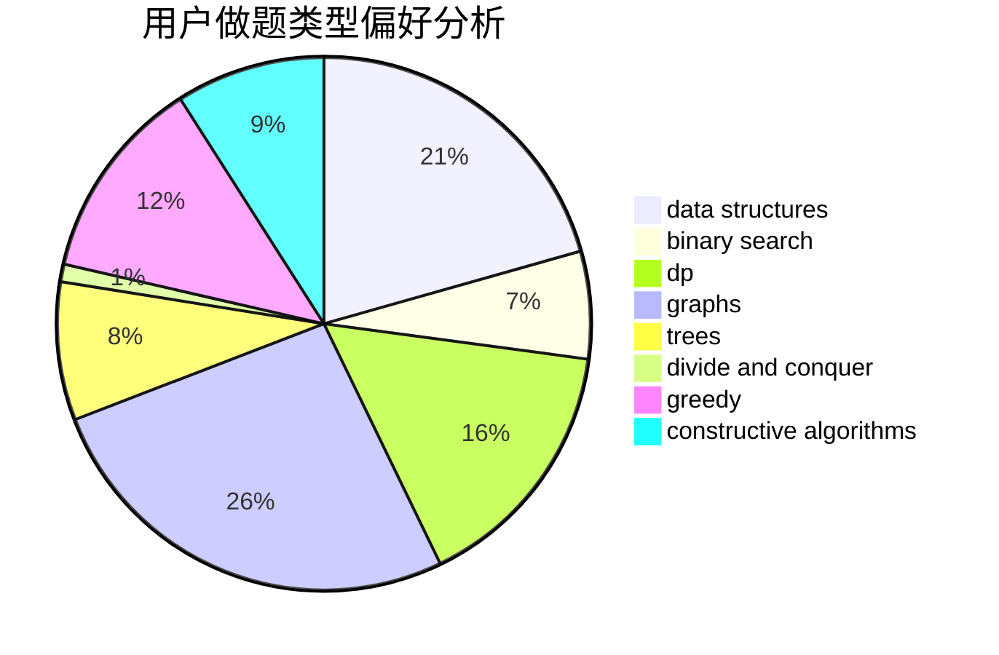
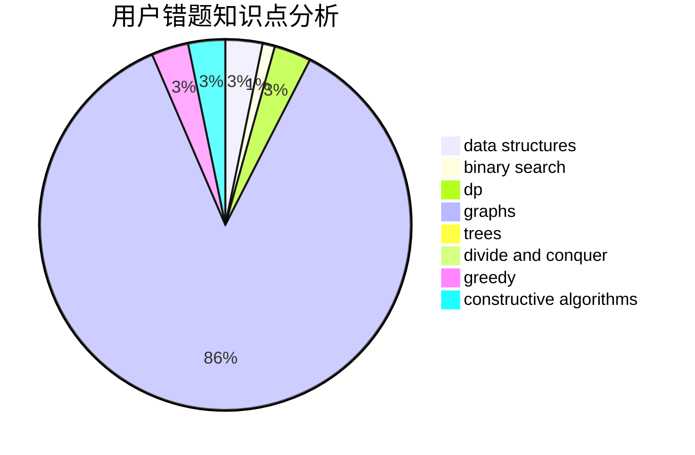

# Guangyaochenyu

<!-- tabs:start -->

#### **用户提交结果分析**

#### **用户做题类型偏好分析**

#### **用户错题知识点分析**

<!-- tabs:end -->
# 推荐题目
[1511B](https://codeforces.com/contest/1511/problem/B)		constructive algorithms,
                        math,
                        number theory		  
[912D](https://codeforces.com/contest/912/problem/D)		data structures,
                        graphs,
                        greedy,
                        probabilities,
                        shortest paths		  
[1110A](https://codeforces.com/contest/1110/problem/A)		math		  
[1110H](https://codeforces.com/contest/1110/problem/H)		dp,
                        strings		  
[590E](https://codeforces.com/contest/590/problem/E)		graph matchings,
                        strings		  
[1461F](https://codeforces.com/contest/1461/problem/F)		constructive algorithms,
                        dp,
                        greedy		  
[1166B](https://codeforces.com/contest/1166/problem/B)		constructive algorithms,
                        math,
                        number theory		  
[1313D](https://codeforces.com/contest/1313/problem/D)		bitmasks,
                        dp,
                        implementation		  
[591C](https://codeforces.com/contest/591/problem/C)		dsu,graphs,sortings,trees		  
[622B](https://codeforces.com/contest/622/problem/B)		implementation		  
