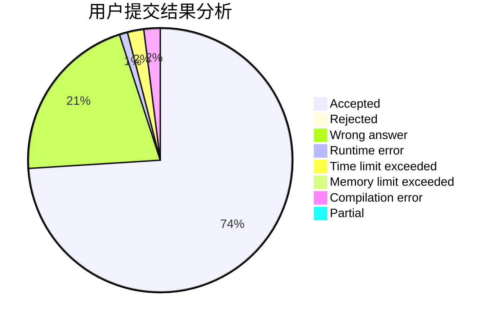
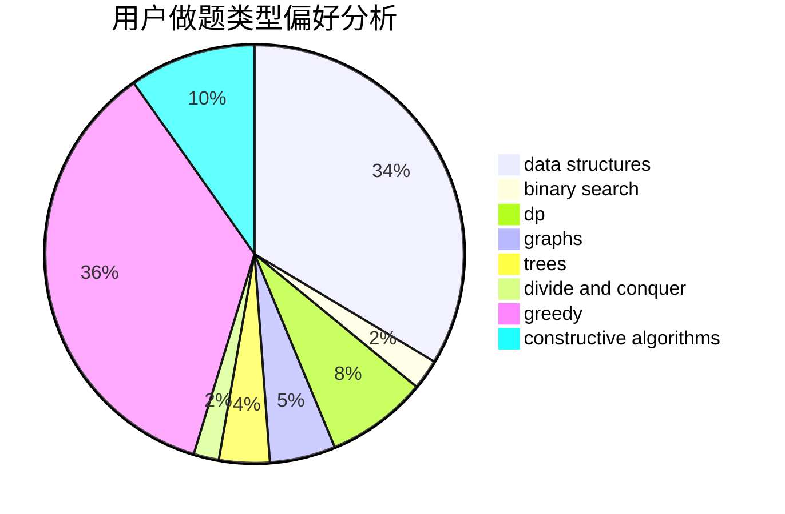
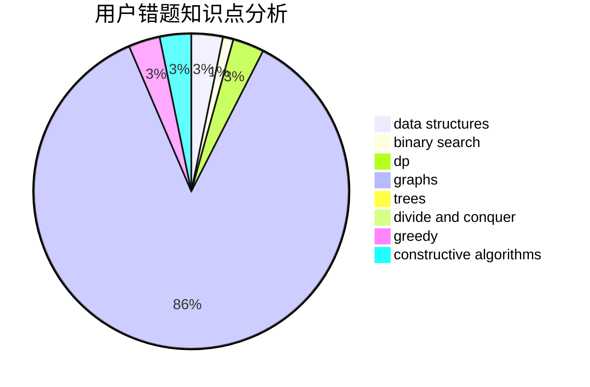

# Guangyaochenyu

<!-- tabs:start -->

#### **用户提交结果分析**

#### **用户做题类型偏好分析**

#### **用户错题知识点分析**

<!-- tabs:end -->
# 推荐题目
[1501A](https://codeforces.com/contest/1501/problem/A)		implementation		  
[894E](https://codeforces.com/contest/894/problem/E)		dp,
                        graphs		  
[1109E](https://codeforces.com/contest/1109/problem/E)		data structures,
                        number theory		  
[1110E](https://codeforces.com/contest/1110/problem/E)		constructive algorithms,
                        math,
                        sortings		  
[570C](https://codeforces.com/contest/570/problem/C)		constructive algorithms,
                        data structures,
                        implementation		  
[1452C](https://codeforces.com/contest/1452/problem/C)		greedy		  
[1164J](https://codeforces.com/contest/1164/problem/J)		dsu,graphs,sortings,trees		  
[1304F2](https://codeforces.com/contest/1304F/problem/2)		data structures,
                        dp,
                        greedy		  
[571A](https://codeforces.com/contest/571/problem/A)		combinatorics,
                        implementation,
                        math		  
[603E](https://codeforces.com/contest/603/problem/E)		data structures,
                        divide and conquer,
                        dsu,
                        math,
                        trees		  
