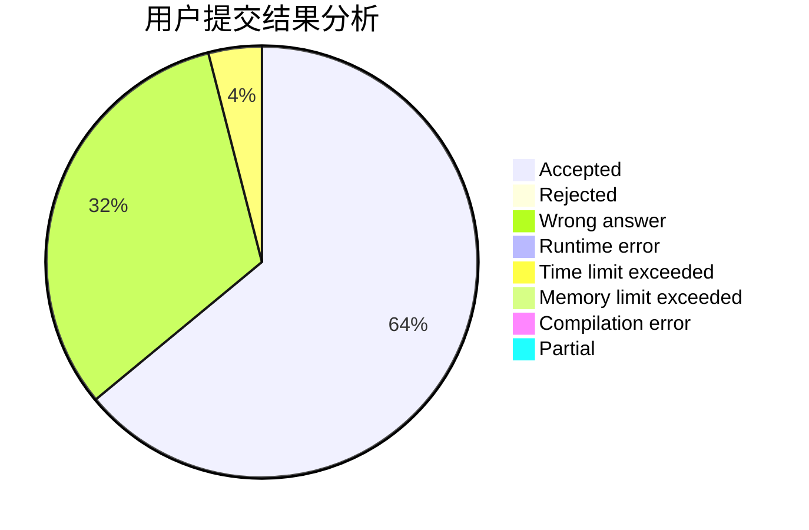
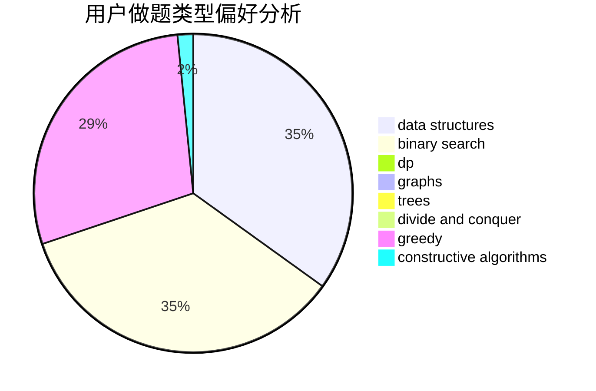

# Guess03

<!-- tabs:start -->

#### **用户提交结果分析**

#### **用户做题类型偏好分析**

#### **用户错题知识点分析**

<!-- tabs:end -->
# 推荐题目
[102A](https://codeforces.com/contest/102/problem/A)		brute force		  
[578F](https://codeforces.com/contest/578/problem/F)		matrices,
                        trees		  
[592A](https://codeforces.com/contest/592/problem/A)		implementation		  
[294B](https://codeforces.com/contest/294/problem/B)		dp,
                        greedy		  
[235E](https://codeforces.com/contest/235/problem/E)		combinatorics,
                        dp,
                        implementation,
                        math,
                        number theory		  
[1041B](https://codeforces.com/contest/1041/problem/B)		math		  
[1388D](https://codeforces.com/contest/1388/problem/D)		data structures,
                        dfs and similar,
                        graphs,
                        greedy,
                        implementation,
                        trees		  
[1468E](https://codeforces.com/contest/1468/problem/E)		greedy		  
[1290A](https://codeforces.com/contest/1290/problem/A)		brute force,
                        data structures,
                        implementation		  
[12A](https://codeforces.com/contest/12/problem/A)		implementation		  
