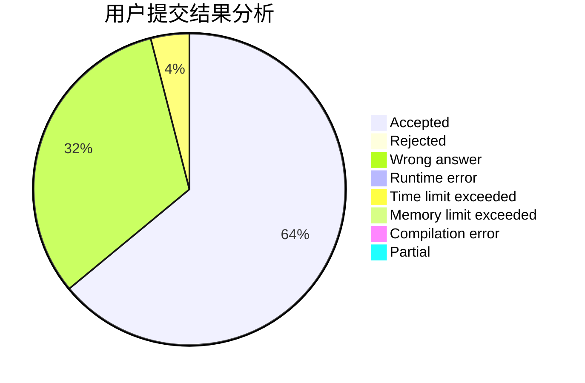
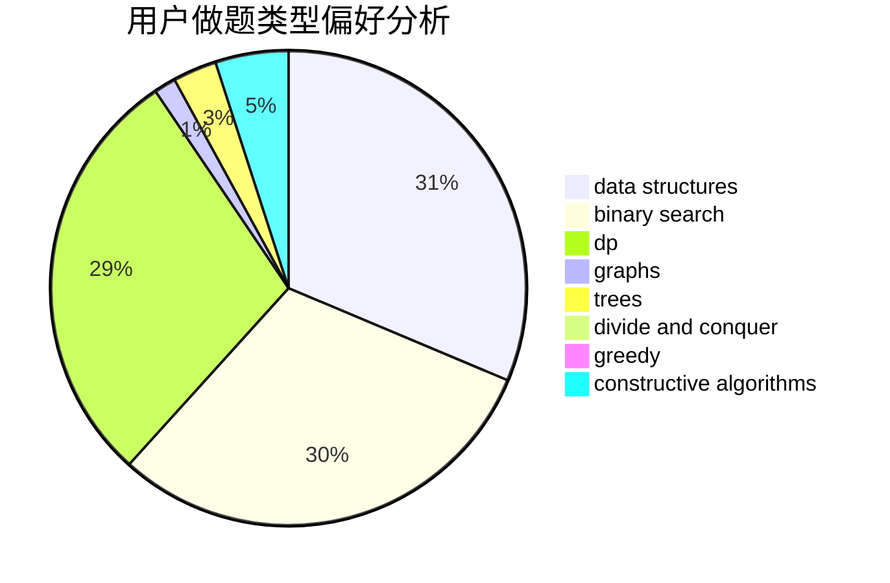

# Guess03

<!-- tabs:start -->

#### **用户提交结果分析**

#### **用户做题类型偏好分析**

#### **用户错题知识点分析**

<!-- tabs:end -->
# 推荐题目
[1030B](https://codeforces.com/contest/1030/problem/B)		geometry		  
[59E](https://codeforces.com/contest/59/problem/E)		graphs,
                        shortest paths		  
[611C](https://codeforces.com/contest/611/problem/C)		dp,
                        implementation		  
[30C](https://codeforces.com/contest/30/problem/C)		dp,
                        probabilities		  
[258D](https://codeforces.com/contest/258/problem/D)		dp,
                        math,
                        probabilities		  
[1041E](https://codeforces.com/contest/1041/problem/E)		constructive algorithms,
                        data structures,
                        graphs,
                        greedy		  
[1398B](https://codeforces.com/contest/1398/problem/B)		games,
                        greedy,
                        sortings		  
[1475F](https://codeforces.com/contest/1475/problem/F)		2-sat,
                        brute force,
                        constructive algorithms		  
[1296C](https://codeforces.com/contest/1296/problem/C)		data structures,
                        implementation		  
[1307B](https://codeforces.com/contest/1307/problem/B)		geometry,
                        greedy,
                        math		  
