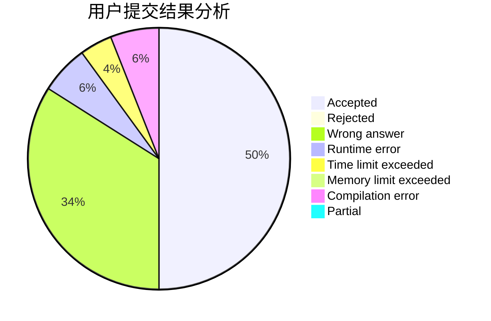
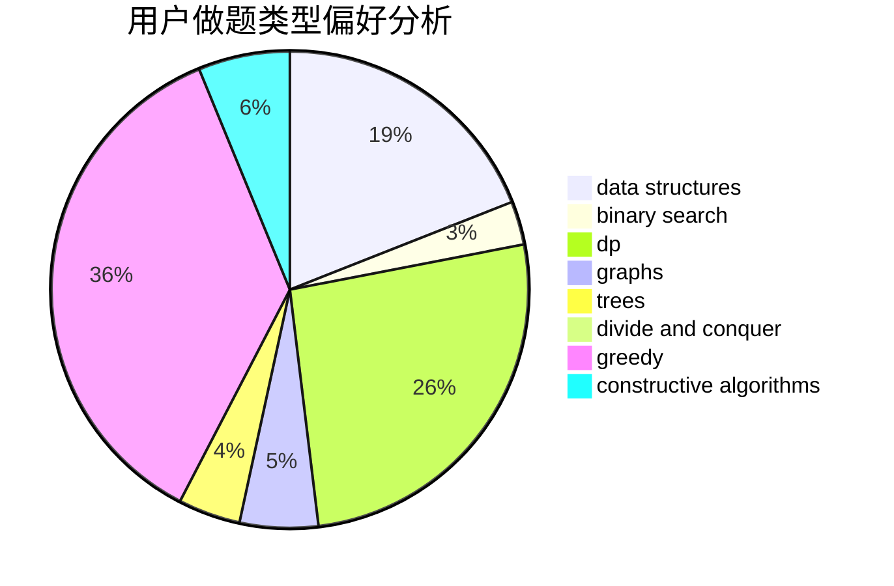

# H.A.R.D

<!-- tabs:start -->

#### **用户提交结果分析**

#### **用户做题类型偏好分析**

#### **用户错题知识点分析**

<!-- tabs:end -->
# 推荐题目
[1156D](https://codeforces.com/contest/1156/problem/D)		dfs and similar,
                        divide and conquer,
                        dp,
                        dsu,
                        trees		  
[653C](https://codeforces.com/contest/653/problem/C)		brute force,
                        implementation		  
[343A](https://codeforces.com/contest/343/problem/A)		math,
                        number theory		  
[796B](https://codeforces.com/contest/796/problem/B)		implementation		  
[429B](https://codeforces.com/contest/429/problem/B)		dp		  
[864A](https://codeforces.com/contest/864/problem/A)		implementation,
                        sortings		  
[1093D](https://codeforces.com/contest/1093/problem/D)		dfs and similar,
                        graphs		  
[1305G](https://codeforces.com/contest/1305/problem/G)		bitmasks,
                        brute force,
                        dp,
                        dsu,
                        graphs		  
[512A](https://codeforces.com/contest/512/problem/A)		dsu,graphs,sortings,trees		  
[817F](https://codeforces.com/contest/817/problem/F)		binary search,
                        data structures,
                        trees		  
