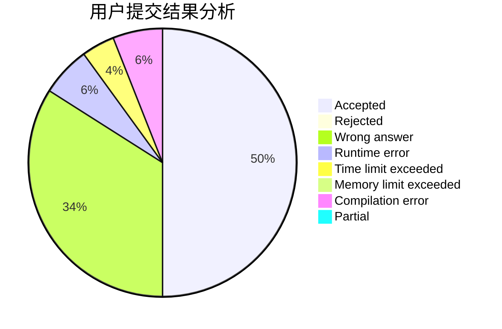
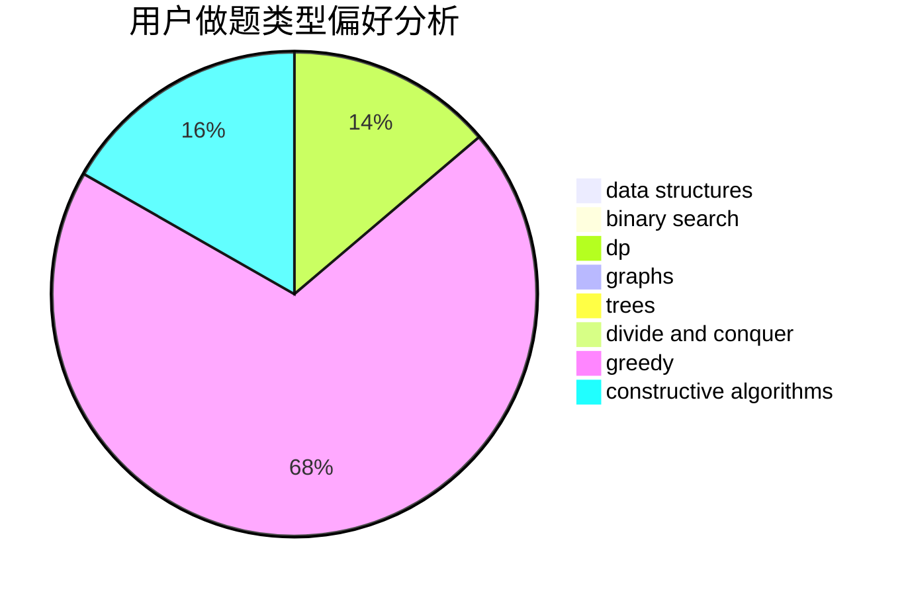

# H.A.R.D

<!-- tabs:start -->

#### **用户提交结果分析**

#### **用户做题类型偏好分析**

#### **用户错题知识点分析**

<!-- tabs:end -->
# 推荐题目
[1158B](https://codeforces.com/contest/1158/problem/B)		constructive algorithms,
                        math,
                        strings		  
[677C](https://codeforces.com/contest/677/problem/C)		bitmasks,
                        combinatorics,
                        implementation,
                        strings		  
[36B](https://codeforces.com/contest/36/problem/B)		implementation		  
[810C](https://codeforces.com/contest/810/problem/C)		dsu,graphs,sortings,trees		  
[44G](https://codeforces.com/contest/44/problem/G)		data structures,
                        implementation		  
[883I](https://codeforces.com/contest/883/problem/I)		binary search,
                        dp		  
[1093G](https://codeforces.com/contest/1093/problem/G)		bitmasks,
                        data structures		  
[1314F](https://codeforces.com/contest/1314/problem/F)		dsu,graphs,sortings,trees		  
[535A](https://codeforces.com/contest/535/problem/A)		brute force,
                        implementation		  
[837F](https://codeforces.com/contest/837/problem/F)		binary search,
                        brute force,
                        combinatorics,
                        math,
                        matrices		  
