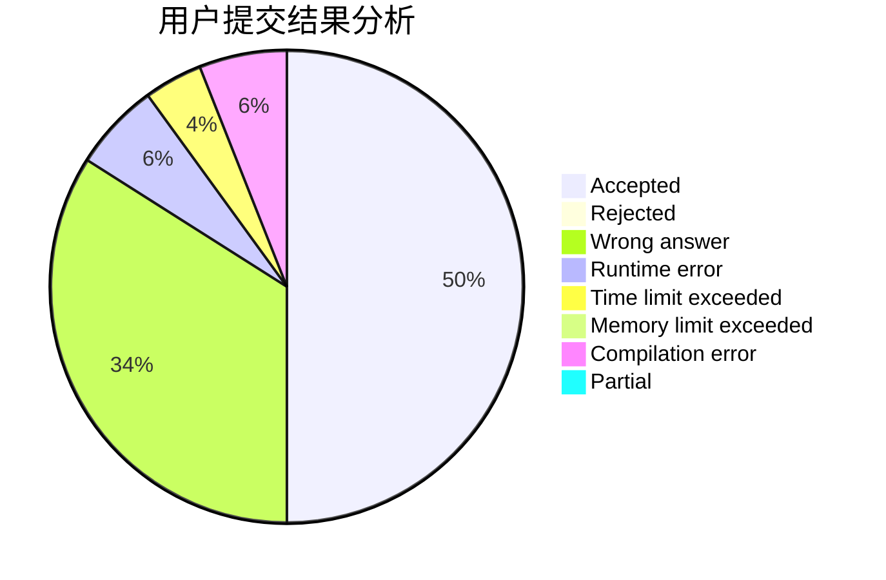
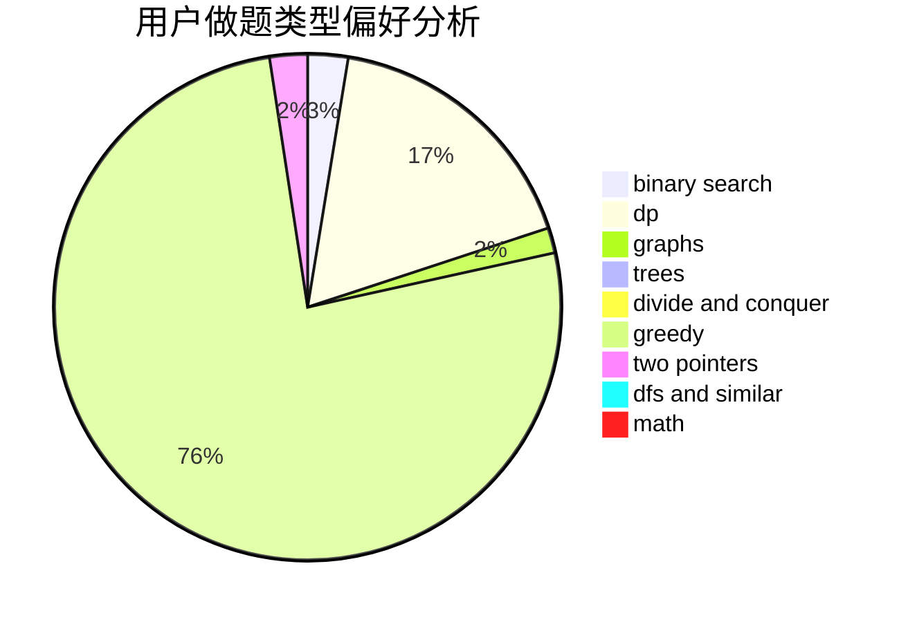

# H.A.R.D

<!-- tabs:start -->

#### **用户提交结果分析**

#### **用户做题类型偏好分析**

<!-- tabs:end -->
# 推荐题目
[1158B](https://codeforces.com/contest/1158/problem/B)
[677C](https://codeforces.com/contest/677/problem/C)
[36B](https://codeforces.com/contest/36/problem/B)
[810C](https://codeforces.com/contest/810/problem/C)
[44G](https://codeforces.com/contest/44/problem/G)
[883I](https://codeforces.com/contest/883/problem/I)
[1093G](https://codeforces.com/contest/1093/problem/G)
[1314F](https://codeforces.com/contest/1314/problem/F)
[535A](https://codeforces.com/contest/535/problem/A)
[837F](https://codeforces.com/contest/837/problem/F)
