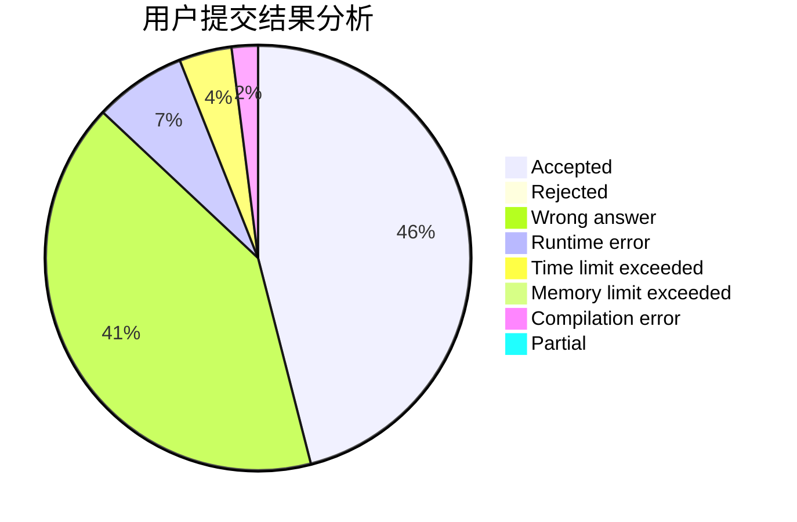
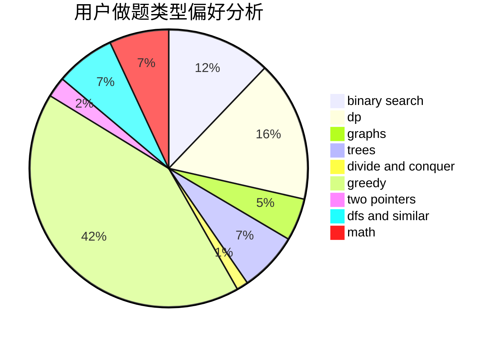

# HAUT_Xjl

<!-- tabs:start -->

#### **用户提交结果分析**

#### **用户做题类型偏好分析**

<!-- tabs:end -->
# 推荐题目
[1513E](https://codeforces.com/contest/1513/problem/E)
[1283D](https://codeforces.com/contest/1283/problem/D)
[912E](https://codeforces.com/contest/912/problem/E)
[347A](https://codeforces.com/contest/347/problem/A)
[317A](https://codeforces.com/contest/317/problem/A)
[1446B](https://codeforces.com/contest/1446/problem/B)
[1181B](https://codeforces.com/contest/1181/problem/B)
[1397E](https://codeforces.com/contest/1397/problem/E)
[890B](https://codeforces.com/contest/890/problem/B)
[1192B](https://codeforces.com/contest/1192/problem/B)
