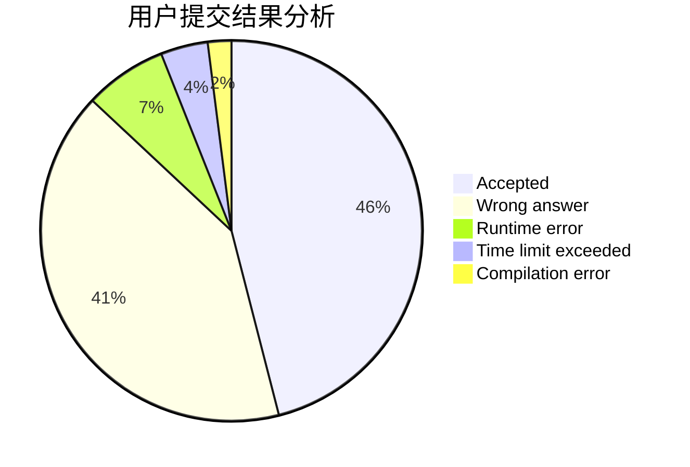
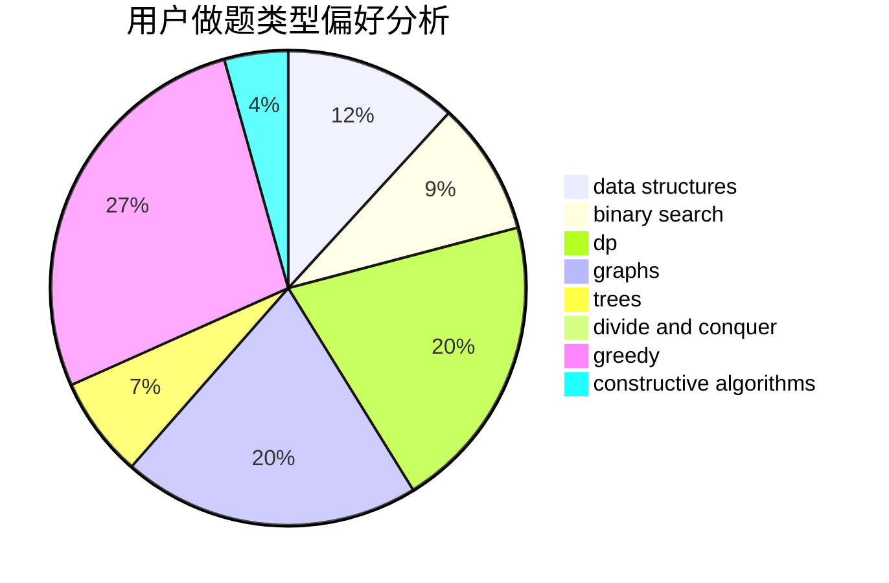
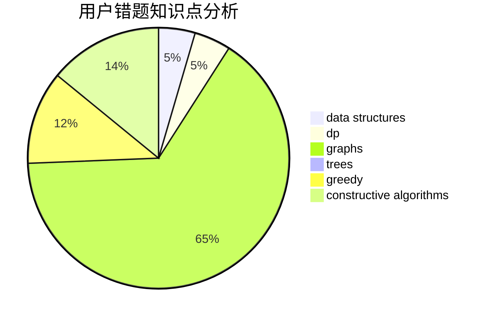

# HAUT_Xjl
<!-- tabs:start -->
#### **用户提交结果分析**

#### **用户做题类型偏好分析**

#### **用户错题知识点分析**

<!-- tabs:end -->
# 推荐题目
[Long Colorful Strip](http://codeforces.com/problemset/problem/1178/F2)		dp		  
[Traffic Lights](http://codeforces.com/problemset/problem/29/B)		implementation		  
[Make Them Odd](http://codeforces.com/problemset/problem/1277/B)		greedy,
                        number theory		  
[XK Segments](http://codeforces.com/problemset/problem/895/B)		binary search,
                        math,
                        sortings,
                        two pointers		  
[Parallelepiped](http://codeforces.com/problemset/problem/224/A)		brute force,
                        geometry,
                        math		  
[Game with Powers](http://codeforces.com/problemset/problem/317/D)		dp,
                        games		  
[Glad to see you!](https://codeforces.com/contest/810/problem/D)		binary search,
                        interactive		  
[Books](http://codeforces.com/problemset/problem/279/B)		binary search,
                        brute force,
                        implementation,
                        two pointers		  
[Search for Pretty Integers](http://codeforces.com/problemset/problem/870/A)		brute force,
                        implementation		  
[Restoring Painting](http://codeforces.com/problemset/problem/675/B)		brute force,
                        constructive algorithms,
                        math		  
<!-- tabs:start -->
#### **data structures**
[Buses](http://codeforces.com/problemset/problem/101/B)		binary search,
                        data structures,
                        dp		  
[Strange Function](http://codeforces.com/problemset/problem/1334/F)		binary search,
                        data structures,
                        dp,
                        greedy		  
[Little Elephant and Cards](https://codeforces.com/contest/205/problem/D)		binary search,
                        data structures		  
[Reverse and Swap](http://codeforces.com/problemset/problem/1401/F)		binary search,
                        bitmasks,
                        data structures		  
[Three Sequences](http://codeforces.com/problemset/problem/1406/D)		constructive algorithms,
                        data structures,
                        greedy,
                        math		  
[Berland Fair](http://codeforces.com/problemset/problem/1073/D)		binary search,
                        brute force,
                        data structures,
                        greedy		  
[GCD Counting](http://codeforces.com/problemset/problem/1101/D)		data structures,
                        dfs and similar,
                        dp,
                        number theory,
                        trees		  
[Camping Groups](http://codeforces.com/problemset/problem/173/E)		data structures,
                        sortings		  
[Moving Walkways](http://codeforces.com/problemset/problem/1209/H)		data structures,
                        greedy,
                        math		  
[Flip the Cards](https://codeforces.com/contest/1504/problem/F)		2-sat,
                        constructive algorithms,
                        data structures,
                        greedy,
                        sortings,
                        two pointers		  
#### **binary search**
[XK Segments](http://codeforces.com/problemset/problem/895/B)		binary search,
                        math,
                        sortings,
                        two pointers		  
[Glad to see you!](https://codeforces.com/contest/810/problem/D)		binary search,
                        interactive		  
[Books](http://codeforces.com/problemset/problem/279/B)		binary search,
                        brute force,
                        implementation,
                        two pointers		  
[Buses](http://codeforces.com/problemset/problem/101/B)		binary search,
                        data structures,
                        dp		  
[Strange Function](http://codeforces.com/problemset/problem/1334/F)		binary search,
                        data structures,
                        dp,
                        greedy		  
[Little Elephant and Cards](https://codeforces.com/contest/205/problem/D)		binary search,
                        data structures		  
[Reverse and Swap](http://codeforces.com/problemset/problem/1401/F)		binary search,
                        bitmasks,
                        data structures		  
[Berland Fair](http://codeforces.com/problemset/problem/1073/D)		binary search,
                        brute force,
                        data structures,
                        greedy		  
[Rock Is Push](https://codeforces.com/contest/1247/problem/E)		binary search,
                        dp		  
[Bandit in a City](http://codeforces.com/problemset/problem/1436/D)		binary search,
                        dfs and similar,
                        graphs,
                        greedy,
                        trees		  
#### **dp**
[Long Colorful Strip](http://codeforces.com/problemset/problem/1178/F2)		dp		  
[Game with Powers](http://codeforces.com/problemset/problem/317/D)		dp,
                        games		  
[Buses](http://codeforces.com/problemset/problem/101/B)		binary search,
                        data structures,
                        dp		  
[Strange Function](http://codeforces.com/problemset/problem/1334/F)		binary search,
                        data structures,
                        dp,
                        greedy		  
[Turtles](http://codeforces.com/problemset/problem/348/D)		dp,
                        matrices		  
[Computer Game](http://codeforces.com/problemset/problem/1067/D)		dp,
                        greedy,
                        math,
                        probabilities		  
[Cunning Gena](https://codeforces.com/contest/418/problem/B)		bitmasks,
                        dp,
                        greedy,
                        sortings		  
[GCD Counting](http://codeforces.com/problemset/problem/1101/D)		data structures,
                        dfs and similar,
                        dp,
                        number theory,
                        trees		  
[Winter Is Coming](http://codeforces.com/problemset/problem/747/D)		dp,
                        greedy,
                        sortings		  
[Rock Is Push](https://codeforces.com/contest/1247/problem/E)		binary search,
                        dp		  
#### **graph**
[Mars rover](http://codeforces.com/problemset/problem/1010/D)		dfs and similar,
                        graphs,
                        implementation,
                        trees		  
[Opening Portals](http://codeforces.com/problemset/problem/196/E)		dsu,
                        graphs,
                        shortest paths		  
[Tree nesting](http://codeforces.com/problemset/problem/762/F)		combinatorics,
                        graphs,
                        trees		  
[Seollal](http://codeforces.com/problemset/problem/1284/G)		graphs		  
[Bandit in a City](http://codeforces.com/problemset/problem/1436/D)		binary search,
                        dfs and similar,
                        graphs,
                        greedy,
                        trees		  
[Minimum Ties](http://codeforces.com/problemset/problem/1487/C)		brute force,
                        constructive algorithms,
                        dfs and similar,
                        graphs,
                        greedy,
                        implementation,
                        math		  
[Chef Monocarp](http://codeforces.com/problemset/problem/1437/C)		dp,
                        flows,
                        graph matchings,
                        greedy,
                        math,
                        sortings		  
[Strange Housing](http://codeforces.com/problemset/problem/1470/D)		constructive algorithms,
                        dfs and similar,
                        graph matchings,
                        graphs,
                        greedy		  
[Longest Simple Cycle](http://codeforces.com/problemset/problem/1476/C)		dp,
                        graphs,
                        greedy		  
[Shortest and Longest LIS](http://codeforces.com/problemset/problem/1304/D)		constructive algorithms,
                        graphs,
                        greedy,
                        two pointers		  
#### **trees**
[Mars rover](http://codeforces.com/problemset/problem/1010/D)		dfs and similar,
                        graphs,
                        implementation,
                        trees		  
[Tree nesting](http://codeforces.com/problemset/problem/762/F)		combinatorics,
                        graphs,
                        trees		  
[GCD Counting](http://codeforces.com/problemset/problem/1101/D)		data structures,
                        dfs and similar,
                        dp,
                        number theory,
                        trees		  
[Bandit in a City](http://codeforces.com/problemset/problem/1436/D)		binary search,
                        dfs and similar,
                        graphs,
                        greedy,
                        trees		  
[Odd Mineral Resource](http://codeforces.com/problemset/problem/1479/D)		binary search,
                        bitmasks,
                        brute force,
                        data structures,
                        probabilities,
                        trees		  
[Yet Another Card Deck](http://codeforces.com/problemset/problem/1511/C)		brute force,
                        data structures,
                        implementation,
                        trees		  
[Diameter Cuts](http://codeforces.com/problemset/problem/1499/F)		combinatorics,
                        dfs and similar,
                        dp,
                        trees		  
[Fib-tree](http://codeforces.com/problemset/problem/1491/E)		brute force,
                        dfs and similar,
                        divide and conquer,
                        number theory,
                        trees		  
[13th Labour of Heracles](http://codeforces.com/problemset/problem/1466/D)		data structures,
                        greedy,
                        sortings,
                        trees		  
[BFS Trees](http://codeforces.com/problemset/problem/1495/D)		combinatorics,
                        dfs and similar,
                        graphs,
                        math,
                        shortest paths,
                        trees		  
#### **divide and conquer**
[Divide and Summarize](http://codeforces.com/problemset/problem/1461/D)		binary search,
                        brute force,
                        data structures,
                        divide and conquer,
                        implementation,
                        sortings		  
[Song of the Sirens](http://codeforces.com/problemset/problem/1466/G)		combinatorics,
                        divide and conquer,
                        hashing,
                        math,
                        string suffix structures,
                        strings		  
[Permutation Transformation](http://codeforces.com/problemset/problem/1490/D)		dfs and similar,
                        divide and conquer,
                        implementation		  
[Skyline Photo](https://codeforces.com/contest/1483/problem/C)		data structures,
                        divide and conquer,
                        dp		  
[Fib-tree](http://codeforces.com/problemset/problem/1491/E)		brute force,
                        dfs and similar,
                        divide and conquer,
                        number theory,
                        trees		  
[Sum of Prefix Sums](http://codeforces.com/problemset/problem/1303/G)		data structures,
                        divide and conquer,
                        geometry,
                        trees		  
[Dogeforces](http://codeforces.com/problemset/problem/1494/D)		constructive algorithms,
                        data structures,
                        dfs and similar,
                        divide and conquer,
                        dsu,
                        greedy,
                        sortings,
                        trees		  
[Logistical Questions](http://codeforces.com/problemset/problem/566/C)		dfs and similar,
                        divide and conquer,
                        trees		  
[Fruit Sequences](http://codeforces.com/problemset/problem/1428/F)		binary search,
                        data structures,
                        divide and conquer,
                        dp,
                        two pointers		  
[Dr. Evil Underscores](http://codeforces.com/problemset/problem/1285/D)		bitmasks,
                        brute force,
                        dfs and similar,
                        divide and conquer,
                        dp,
                        greedy,
                        strings,
                        trees		  
#### **greedy**
[Make Them Odd](http://codeforces.com/problemset/problem/1277/B)		greedy,
                        number theory		  
[Strange Function](http://codeforces.com/problemset/problem/1334/F)		binary search,
                        data structures,
                        dp,
                        greedy		  
[Special Task](http://codeforces.com/problemset/problem/316/A1)		greedy		  
[Tanya and Postcard](http://codeforces.com/problemset/problem/518/B)		greedy,
                        implementation,
                        strings		  
[Captain Flint and a Long Voyage](http://codeforces.com/problemset/problem/1388/B)		greedy,
                        math		  
[Computer Game](http://codeforces.com/problemset/problem/1067/D)		dp,
                        greedy,
                        math,
                        probabilities		  
[Cunning Gena](https://codeforces.com/contest/418/problem/B)		bitmasks,
                        dp,
                        greedy,
                        sortings		  
[Three Sequences](http://codeforces.com/problemset/problem/1406/D)		constructive algorithms,
                        data structures,
                        greedy,
                        math		  
[Berland Fair](http://codeforces.com/problemset/problem/1073/D)		binary search,
                        brute force,
                        data structures,
                        greedy		  
[Anagram](http://codeforces.com/problemset/problem/254/C)		greedy,
                        strings		  
#### **constructive algorithms**
[Restoring Painting](http://codeforces.com/problemset/problem/675/B)		brute force,
                        constructive algorithms,
                        math		  
[Three Sequences](http://codeforces.com/problemset/problem/1406/D)		constructive algorithms,
                        data structures,
                        greedy,
                        math		  
[Beautiful Sequence](https://codeforces.com/contest/1265/problem/D)		brute force,
                        constructive algorithms,
                        greedy		  
[Flip the Cards](https://codeforces.com/contest/1504/problem/F)		2-sat,
                        constructive algorithms,
                        data structures,
                        greedy,
                        sortings,
                        two pointers		  
[Bubble Cup hypothesis](http://codeforces.com/problemset/problem/1423/J)		bitmasks,
                        constructive algorithms,
                        dp,
                        math		  
[Anti-knapsack](http://codeforces.com/problemset/problem/1493/A)		constructive algorithms,
                        greedy		  
[Pairs](http://codeforces.com/problemset/problem/1463/D)		binary search,
                        constructive algorithms,
                        greedy,
                        two pointers		  
[XOR-gun](https://codeforces.com/contest/1456/problem/B)		bitmasks,
                        brute force,
                        constructive algorithms		  
[Genius's Gambit](http://codeforces.com/problemset/problem/1492/D)		bitmasks,
                        constructive algorithms,
                        greedy,
                        math		  
[3-Coloring](https://codeforces.com/contest/1504/problem/D)		constructive algorithms,
                        games,
                        interactive		  
#### **sortings**
[XK Segments](http://codeforces.com/problemset/problem/895/B)		binary search,
                        math,
                        sortings,
                        two pointers		  
[Cunning Gena](https://codeforces.com/contest/418/problem/B)		bitmasks,
                        dp,
                        greedy,
                        sortings		  
[Camping Groups](http://codeforces.com/problemset/problem/173/E)		data structures,
                        sortings		  
[Winter Is Coming](http://codeforces.com/problemset/problem/747/D)		dp,
                        greedy,
                        sortings		  
[Flip the Cards](https://codeforces.com/contest/1504/problem/F)		2-sat,
                        constructive algorithms,
                        data structures,
                        greedy,
                        sortings,
                        two pointers		  
[Diamond Miner](https://codeforces.com/contest/1496/problem/C)		geometry,
                        greedy,
                        math,
                        sortings		  
[Meximization](http://codeforces.com/problemset/problem/1497/A)		brute force,
                        data structures,
                        greedy,
                        sortings		  
[Avoiding Zero](http://codeforces.com/problemset/problem/1427/A)		math,
                        sortings		  
[Divide and Summarize](http://codeforces.com/problemset/problem/1461/D)		binary search,
                        brute force,
                        data structures,
                        divide and conquer,
                        implementation,
                        sortings		  
[Chef Monocarp](http://codeforces.com/problemset/problem/1437/C)		dp,
                        flows,
                        graph matchings,
                        greedy,
                        math,
                        sortings		  
<!-- tabs:end -->
