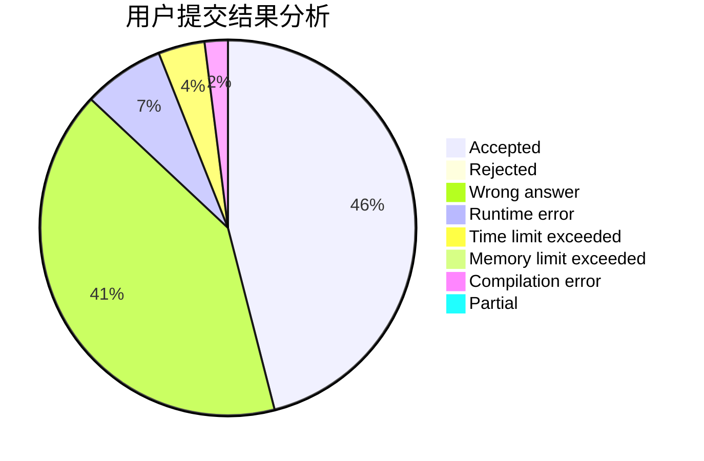
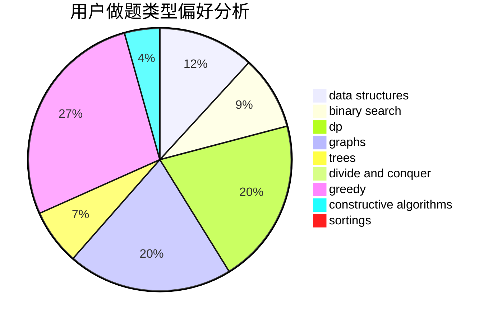
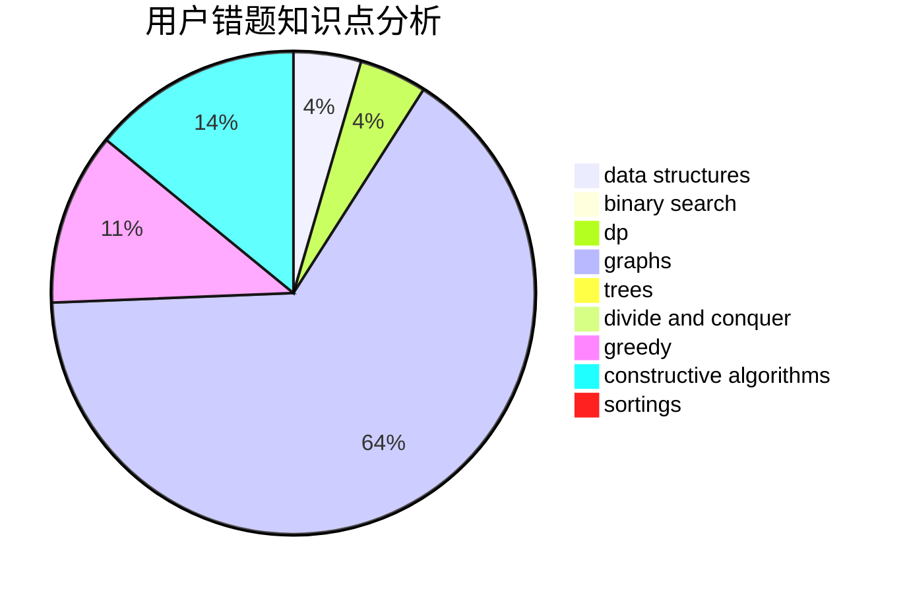

# HAUT_Xjl
<!-- tabs:start -->
#### **用户提交结果分析**

#### **用户做题类型偏好分析**

#### **用户错题知识点分析**

<!-- tabs:end -->
# 推荐题目
[1178F2](http://codeforces.com/problemset/problem/1178/F2)		dp		  
[29B](http://codeforces.com/problemset/problem/29/B)		implementation		  
[1277B](http://codeforces.com/problemset/problem/1277/B)		greedy,
                        number theory		  
[895B](http://codeforces.com/problemset/problem/895/B)		binary search,
                        math,
                        sortings,
                        two pointers		  
[224A](http://codeforces.com/problemset/problem/224/A)		brute force,
                        geometry,
                        math		  
[317D](http://codeforces.com/problemset/problem/317/D)		dp,
                        games		  
[810D](https://codeforces.com/contest/810/problem/D)		binary search,
                        interactive		  
[279B](http://codeforces.com/problemset/problem/279/B)		binary search,
                        brute force,
                        implementation,
                        two pointers		  
[870A](http://codeforces.com/problemset/problem/870/A)		brute force,
                        implementation		  
[675B](http://codeforces.com/problemset/problem/675/B)		brute force,
                        constructive algorithms,
                        math		  
<!-- tabs:start -->
#### **data structures**
[101B](http://codeforces.com/problemset/problem/101/B)		binary search,
                        data structures,
                        dp		  
[1334F](http://codeforces.com/problemset/problem/1334/F)		binary search,
                        data structures,
                        dp,
                        greedy		  
[205D](https://codeforces.com/contest/205/problem/D)		binary search,
                        data structures		  
[1401F](http://codeforces.com/problemset/problem/1401/F)		binary search,
                        bitmasks,
                        data structures		  
[1406D](http://codeforces.com/problemset/problem/1406/D)		constructive algorithms,
                        data structures,
                        greedy,
                        math		  
[1073D](http://codeforces.com/problemset/problem/1073/D)		binary search,
                        brute force,
                        data structures,
                        greedy		  
[1101D](http://codeforces.com/problemset/problem/1101/D)		data structures,
                        dfs and similar,
                        dp,
                        number theory,
                        trees		  
[173E](http://codeforces.com/problemset/problem/173/E)		data structures,
                        sortings		  
[1209H](http://codeforces.com/problemset/problem/1209/H)		data structures,
                        greedy,
                        math		  
[1504F](https://codeforces.com/contest/1504/problem/F)		2-sat,
                        constructive algorithms,
                        data structures,
                        greedy,
                        sortings,
                        two pointers		  
#### **binary search**
[895B](http://codeforces.com/problemset/problem/895/B)		binary search,
                        math,
                        sortings,
                        two pointers		  
[810D](https://codeforces.com/contest/810/problem/D)		binary search,
                        interactive		  
[279B](http://codeforces.com/problemset/problem/279/B)		binary search,
                        brute force,
                        implementation,
                        two pointers		  
[101B](http://codeforces.com/problemset/problem/101/B)		binary search,
                        data structures,
                        dp		  
[1334F](http://codeforces.com/problemset/problem/1334/F)		binary search,
                        data structures,
                        dp,
                        greedy		  
[205D](https://codeforces.com/contest/205/problem/D)		binary search,
                        data structures		  
[1401F](http://codeforces.com/problemset/problem/1401/F)		binary search,
                        bitmasks,
                        data structures		  
[1073D](http://codeforces.com/problemset/problem/1073/D)		binary search,
                        brute force,
                        data structures,
                        greedy		  
[1247E](https://codeforces.com/contest/1247/problem/E)		binary search,
                        dp		  
[1436D](http://codeforces.com/problemset/problem/1436/D)		binary search,
                        dfs and similar,
                        graphs,
                        greedy,
                        trees		  
#### **dp**
[1178F2](http://codeforces.com/problemset/problem/1178/F2)		dp		  
[317D](http://codeforces.com/problemset/problem/317/D)		dp,
                        games		  
[101B](http://codeforces.com/problemset/problem/101/B)		binary search,
                        data structures,
                        dp		  
[1334F](http://codeforces.com/problemset/problem/1334/F)		binary search,
                        data structures,
                        dp,
                        greedy		  
[348D](http://codeforces.com/problemset/problem/348/D)		dp,
                        matrices		  
[1067D](http://codeforces.com/problemset/problem/1067/D)		dp,
                        greedy,
                        math,
                        probabilities		  
[418B](https://codeforces.com/contest/418/problem/B)		bitmasks,
                        dp,
                        greedy,
                        sortings		  
[1101D](http://codeforces.com/problemset/problem/1101/D)		data structures,
                        dfs and similar,
                        dp,
                        number theory,
                        trees		  
[747D](http://codeforces.com/problemset/problem/747/D)		dp,
                        greedy,
                        sortings		  
[1247E](https://codeforces.com/contest/1247/problem/E)		binary search,
                        dp		  
#### **graph**
[1010D](http://codeforces.com/problemset/problem/1010/D)		dfs and similar,
                        graphs,
                        implementation,
                        trees		  
[196E](http://codeforces.com/problemset/problem/196/E)		dsu,
                        graphs,
                        shortest paths		  
[762F](http://codeforces.com/problemset/problem/762/F)		combinatorics,
                        graphs,
                        trees		  
[1284G](http://codeforces.com/problemset/problem/1284/G)		graphs		  
[1436D](http://codeforces.com/problemset/problem/1436/D)		binary search,
                        dfs and similar,
                        graphs,
                        greedy,
                        trees		  
[1487C](http://codeforces.com/problemset/problem/1487/C)		brute force,
                        constructive algorithms,
                        dfs and similar,
                        graphs,
                        greedy,
                        implementation,
                        math		  
[1437C](http://codeforces.com/problemset/problem/1437/C)		dp,
                        flows,
                        graph matchings,
                        greedy,
                        math,
                        sortings		  
[1470D](http://codeforces.com/problemset/problem/1470/D)		constructive algorithms,
                        dfs and similar,
                        graph matchings,
                        graphs,
                        greedy		  
[1476C](http://codeforces.com/problemset/problem/1476/C)		dp,
                        graphs,
                        greedy		  
[1304D](http://codeforces.com/problemset/problem/1304/D)		constructive algorithms,
                        graphs,
                        greedy,
                        two pointers		  
#### **trees**
[1010D](http://codeforces.com/problemset/problem/1010/D)		dfs and similar,
                        graphs,
                        implementation,
                        trees		  
[762F](http://codeforces.com/problemset/problem/762/F)		combinatorics,
                        graphs,
                        trees		  
[1101D](http://codeforces.com/problemset/problem/1101/D)		data structures,
                        dfs and similar,
                        dp,
                        number theory,
                        trees		  
[1436D](http://codeforces.com/problemset/problem/1436/D)		binary search,
                        dfs and similar,
                        graphs,
                        greedy,
                        trees		  
[1479D](http://codeforces.com/problemset/problem/1479/D)		binary search,
                        bitmasks,
                        brute force,
                        data structures,
                        probabilities,
                        trees		  
[1511C](http://codeforces.com/problemset/problem/1511/C)		brute force,
                        data structures,
                        implementation,
                        trees		  
[1499F](http://codeforces.com/problemset/problem/1499/F)		combinatorics,
                        dfs and similar,
                        dp,
                        trees		  
[1491E](http://codeforces.com/problemset/problem/1491/E)		brute force,
                        dfs and similar,
                        divide and conquer,
                        number theory,
                        trees		  
[1466D](http://codeforces.com/problemset/problem/1466/D)		data structures,
                        greedy,
                        sortings,
                        trees		  
[1495D](http://codeforces.com/problemset/problem/1495/D)		combinatorics,
                        dfs and similar,
                        graphs,
                        math,
                        shortest paths,
                        trees		  
#### **divide and conquer**
[1461D](http://codeforces.com/problemset/problem/1461/D)		binary search,
                        brute force,
                        data structures,
                        divide and conquer,
                        implementation,
                        sortings		  
[1466G](http://codeforces.com/problemset/problem/1466/G)		combinatorics,
                        divide and conquer,
                        hashing,
                        math,
                        string suffix structures,
                        strings		  
[1490D](http://codeforces.com/problemset/problem/1490/D)		dfs and similar,
                        divide and conquer,
                        implementation		  
[1483C](https://codeforces.com/contest/1483/problem/C)		data structures,
                        divide and conquer,
                        dp		  
[1491E](http://codeforces.com/problemset/problem/1491/E)		brute force,
                        dfs and similar,
                        divide and conquer,
                        number theory,
                        trees		  
[1303G](http://codeforces.com/problemset/problem/1303/G)		data structures,
                        divide and conquer,
                        geometry,
                        trees		  
[1494D](http://codeforces.com/problemset/problem/1494/D)		constructive algorithms,
                        data structures,
                        dfs and similar,
                        divide and conquer,
                        dsu,
                        greedy,
                        sortings,
                        trees		  
[1482E](http://codeforces.com/problemset/problem/1482/E)		data structures,
                        divide and conquer,
                        dp		  
[566C](http://codeforces.com/problemset/problem/566/C)		dfs and similar,
                        divide and conquer,
                        trees		  
[1428F](http://codeforces.com/problemset/problem/1428/F)		binary search,
                        data structures,
                        divide and conquer,
                        dp,
                        two pointers		  
#### **greedy**
[1277B](http://codeforces.com/problemset/problem/1277/B)		greedy,
                        number theory		  
[1334F](http://codeforces.com/problemset/problem/1334/F)		binary search,
                        data structures,
                        dp,
                        greedy		  
[316A1](http://codeforces.com/problemset/problem/316/A1)		greedy		  
[518B](http://codeforces.com/problemset/problem/518/B)		greedy,
                        implementation,
                        strings		  
[1388B](http://codeforces.com/problemset/problem/1388/B)		greedy,
                        math		  
[1067D](http://codeforces.com/problemset/problem/1067/D)		dp,
                        greedy,
                        math,
                        probabilities		  
[418B](https://codeforces.com/contest/418/problem/B)		bitmasks,
                        dp,
                        greedy,
                        sortings		  
[1406D](http://codeforces.com/problemset/problem/1406/D)		constructive algorithms,
                        data structures,
                        greedy,
                        math		  
[1073D](http://codeforces.com/problemset/problem/1073/D)		binary search,
                        brute force,
                        data structures,
                        greedy		  
[254C](http://codeforces.com/problemset/problem/254/C)		greedy,
                        strings		  
#### **constructive algorithms**
[675B](http://codeforces.com/problemset/problem/675/B)		brute force,
                        constructive algorithms,
                        math		  
[1406D](http://codeforces.com/problemset/problem/1406/D)		constructive algorithms,
                        data structures,
                        greedy,
                        math		  
[1265D](https://codeforces.com/contest/1265/problem/D)		brute force,
                        constructive algorithms,
                        greedy		  
[1504F](https://codeforces.com/contest/1504/problem/F)		2-sat,
                        constructive algorithms,
                        data structures,
                        greedy,
                        sortings,
                        two pointers		  
[1423J](http://codeforces.com/problemset/problem/1423/J)		bitmasks,
                        constructive algorithms,
                        dp,
                        math		  
[1493A](http://codeforces.com/problemset/problem/1493/A)		constructive algorithms,
                        greedy		  
[1463D](http://codeforces.com/problemset/problem/1463/D)		binary search,
                        constructive algorithms,
                        greedy,
                        two pointers		  
[1456B](https://codeforces.com/contest/1456/problem/B)		bitmasks,
                        brute force,
                        constructive algorithms		  
[1492D](http://codeforces.com/problemset/problem/1492/D)		bitmasks,
                        constructive algorithms,
                        greedy,
                        math		  
[1504D](https://codeforces.com/contest/1504/problem/D)		constructive algorithms,
                        games,
                        interactive		  
#### **sortings**
[895B](http://codeforces.com/problemset/problem/895/B)		binary search,
                        math,
                        sortings,
                        two pointers		  
[418B](https://codeforces.com/contest/418/problem/B)		bitmasks,
                        dp,
                        greedy,
                        sortings		  
[173E](http://codeforces.com/problemset/problem/173/E)		data structures,
                        sortings		  
[747D](http://codeforces.com/problemset/problem/747/D)		dp,
                        greedy,
                        sortings		  
[1504F](https://codeforces.com/contest/1504/problem/F)		2-sat,
                        constructive algorithms,
                        data structures,
                        greedy,
                        sortings,
                        two pointers		  
[1496C](https://codeforces.com/contest/1496/problem/C)		geometry,
                        greedy,
                        math,
                        sortings		  
[1495A](http://codeforces.com/problemset/problem/1495/A)		geometry,
                        greedy,
                        math,
                        sortings		  
[1497A](http://codeforces.com/problemset/problem/1497/A)		brute force,
                        data structures,
                        greedy,
                        sortings		  
[1427A](http://codeforces.com/problemset/problem/1427/A)		math,
                        sortings		  
[1461D](http://codeforces.com/problemset/problem/1461/D)		binary search,
                        brute force,
                        data structures,
                        divide and conquer,
                        implementation,
                        sortings		  
<!-- tabs:end -->
