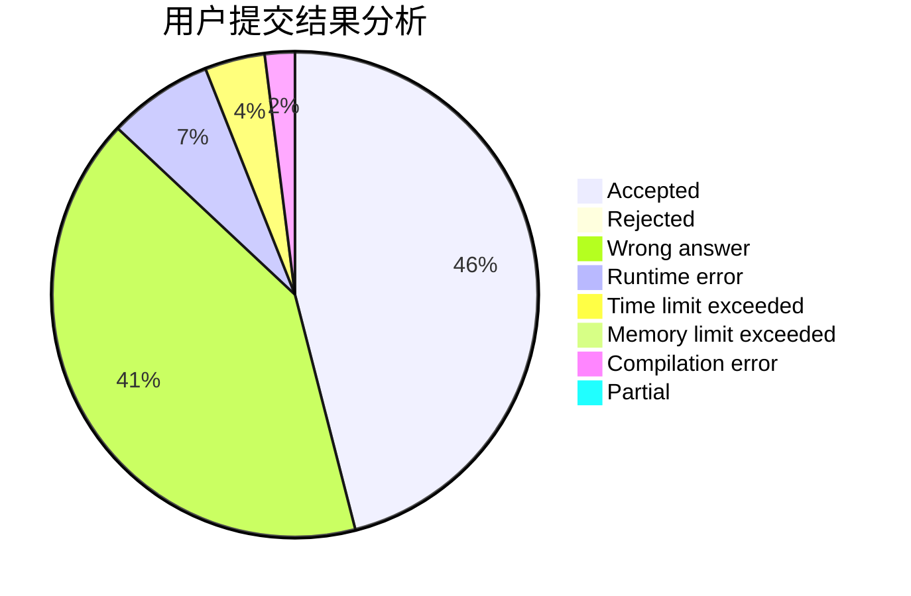
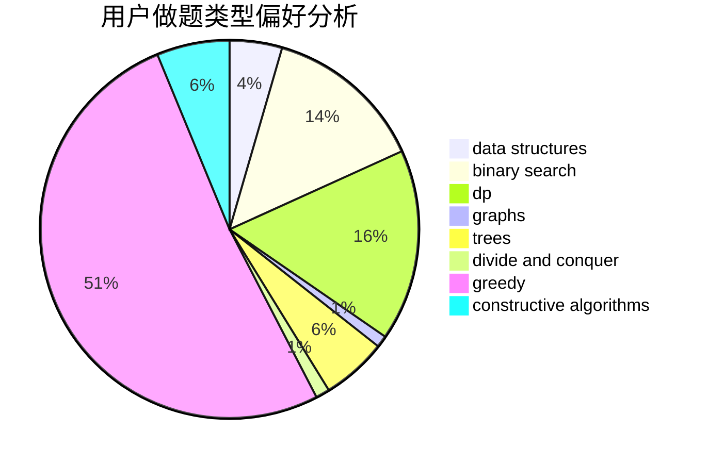
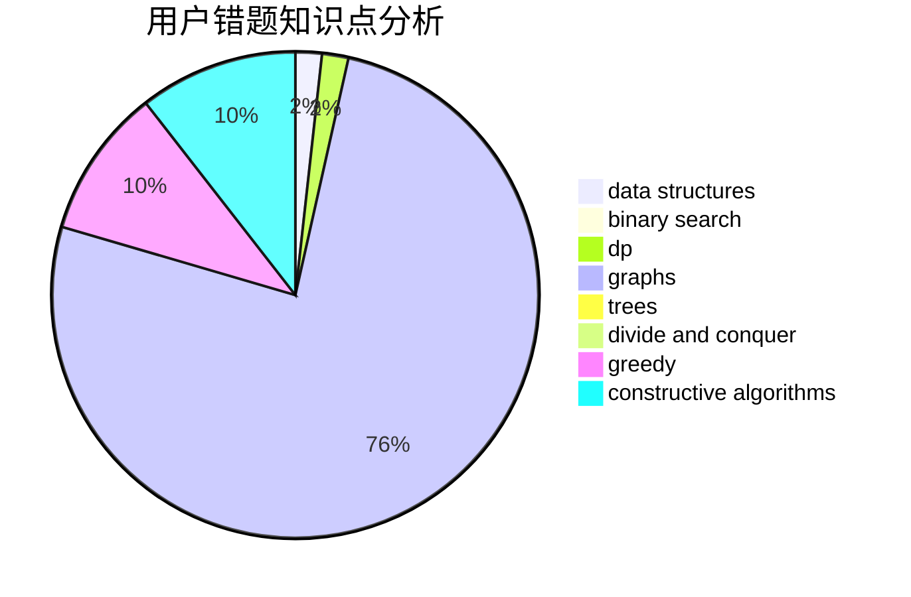

# HAUT_Xjl

<!-- tabs:start -->

#### **用户提交结果分析**

#### **用户做题类型偏好分析**

#### **用户错题知识点分析**

<!-- tabs:end -->
# 推荐题目
[1513E](https://codeforces.com/contest/1513/problem/E)		combinatorics,
                        constructive algorithms,
                        math,
                        sortings		  
[1283D](https://codeforces.com/contest/1283/problem/D)		graphs,
                        greedy,
                        shortest paths		  
[912E](https://codeforces.com/contest/912/problem/E)		binary search,
                        dfs and similar,
                        math,
                        meet-in-the-middle,
                        number theory,
                        two pointers		  
[347A](https://codeforces.com/contest/347/problem/A)		constructive algorithms,
                        implementation,
                        sortings		  
[317A](https://codeforces.com/contest/317/problem/A)		brute force		  
[1446B](https://codeforces.com/contest/1446/problem/B)		dp,
                        strings		  
[1181B](https://codeforces.com/contest/1181/problem/B)		greedy,
                        implementation,
                        strings		  
[1397E](https://codeforces.com/contest/1397/problem/E)		dsu,graphs,sortings,trees		  
[890B](https://codeforces.com/contest/890/problem/B)		dsu,graphs,sortings,trees		  
[1192B](https://codeforces.com/contest/1192/problem/B)		*special problem,
                        data structures,
                        dfs and similar,
                        divide and conquer,
                        trees		  
