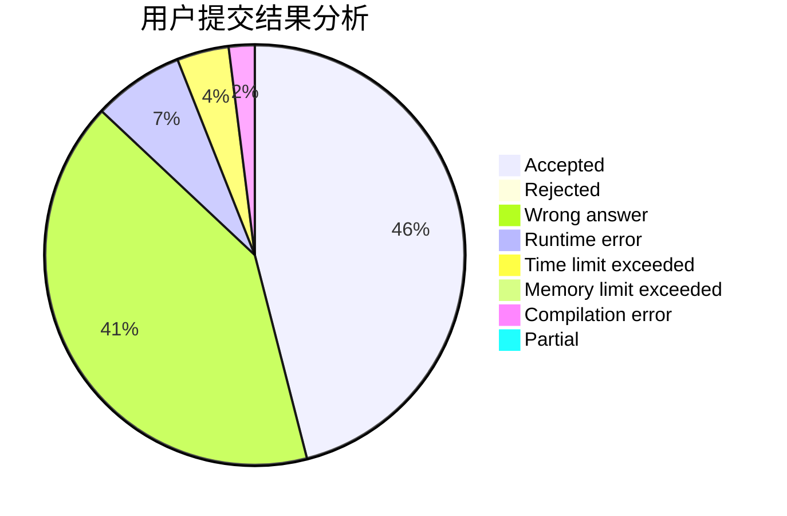
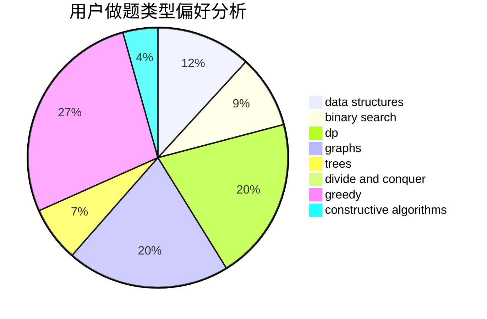
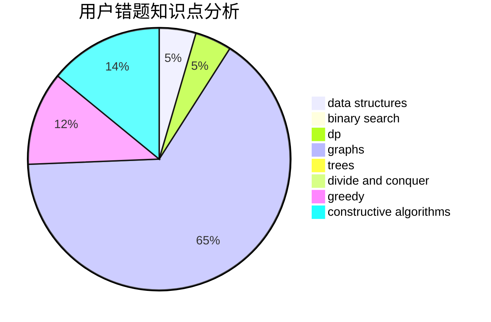

# HAUT_Xjl

<!-- tabs:start -->

#### **用户提交结果分析**

#### **用户做题类型偏好分析**

#### **用户错题知识点分析**

<!-- tabs:end -->
# 推荐题目
[1504F](https://codeforces.com/contest/1504/problem/F)		dsu,graphs,sortings,trees		  
[1277B](https://codeforces.com/contest/1277/problem/B)		greedy,
                        number theory		  
[895B](https://codeforces.com/contest/895/problem/B)		binary search,
                        math,
                        sortings,
                        two pointers		  
[317D](https://codeforces.com/contest/317/problem/D)		dp,
                        games		  
[29B](https://codeforces.com/contest/29/problem/B)		implementation		  
[1436D](https://codeforces.com/contest/1436/problem/D)		binary search,
                        dfs and similar,
                        graphs,
                        greedy,
                        trees		  
[1178F2](https://codeforces.com/contest/1178F/problem/2)		dp		  
[1388B](https://codeforces.com/contest/1388/problem/B)		greedy,
                        math		  
[870A](https://codeforces.com/contest/870/problem/A)		brute force,
                        implementation		  
[1188B](https://codeforces.com/contest/1188/problem/B)		math,
                        matrices,
                        number theory,
                        two pointers		  
