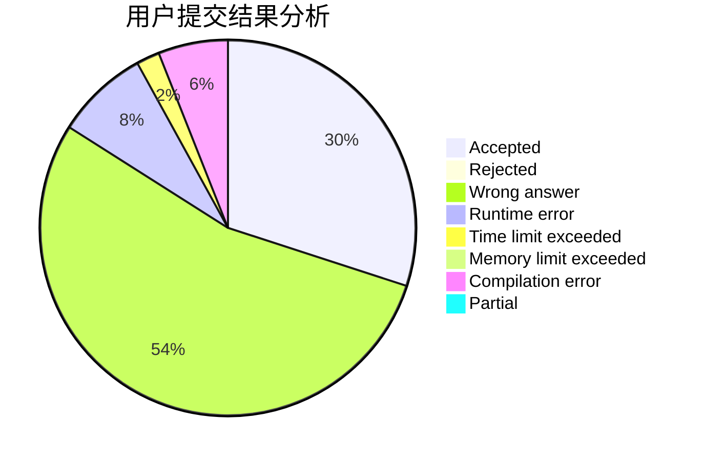
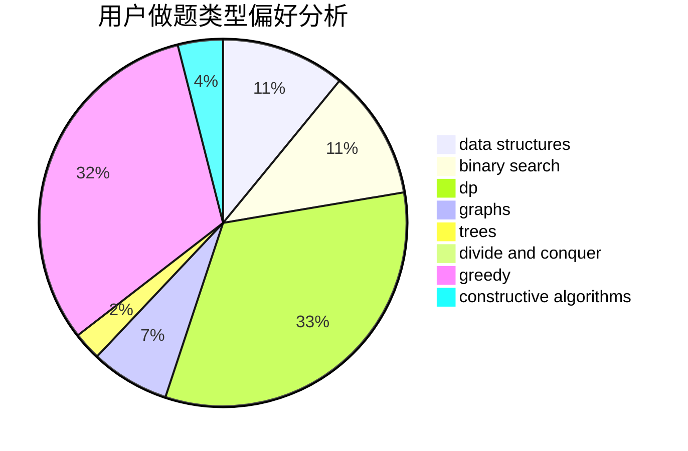
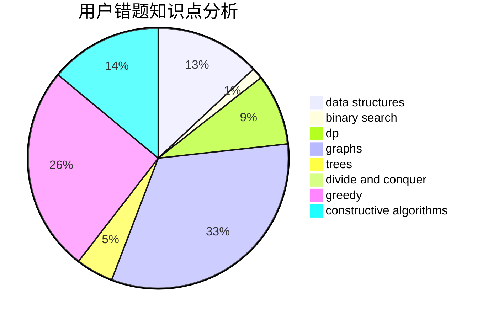

# 2020upOrange
<!-- tabs:start -->
#### **用户提交结果分析**

#### **用户做题类型偏好分析**

#### **用户错题知识点分析**

<!-- tabs:end -->
# 推荐题目
[Candies Division](http://codeforces.com/problemset/problem/1283/B)		math		  
[Food Buying](http://codeforces.com/problemset/problem/1296/B)		math		  
[MP3](https://codeforces.com/contest/1199/problem/C)		sortings,
                        two pointers		  
[Kanban Numbers](http://codeforces.com/problemset/problem/1145/B)		brute force		  
[Collecting Coins](http://codeforces.com/problemset/problem/1294/A)		math		  
[Swords](http://codeforces.com/problemset/problem/1216/D)		math		  
[Permutation Separation](http://codeforces.com/problemset/problem/1295/E)		data structures,
                        divide and conquer		  
[Berland Beauty](http://codeforces.com/problemset/problem/1296/F)		constructive algorithms,
                        dfs and similar,
                        greedy,
                        sortings,
                        trees		  
[Likes Display](http://codeforces.com/problemset/problem/1297/A)		*special problem,
                        implementation		  
[Good Contest](http://codeforces.com/problemset/problem/1295/F)		combinatorics,
                        dp,
                        probabilities		  
<!-- tabs:start -->
#### **data structures**
[Candies Division](http://codeforces.com/problemset/problem/1295/E)		data structures,
                        divide and conquer		  
[Food Buying](http://codeforces.com/problemset/problem/1070/C)		data structures,
                        greedy		  
[MP3](http://codeforces.com/problemset/problem/1220/F)		binary search,
                        data structures		  
[Kanban Numbers](http://codeforces.com/problemset/problem/1251/E2)		binary search,
                        data structures,
                        greedy		  
[Collecting Coins](https://codeforces.com/contest/1298/problem/E)		binary search,
                        data structures,
                        implementation		  
[Swords](http://codeforces.com/problemset/problem/1294/D)		data structures,
                        greedy,
                        implementation,
                        math		  
[Permutation Separation](https://codeforces.com/contest/1293/problem/C)		data structures,
                        dsu,
                        implementation		  
[Berland Beauty](http://codeforces.com/problemset/problem/1296/C)		data structures,
                        implementation		  
[Likes Display](http://codeforces.com/problemset/problem/1296/E2)		data structures,
                        dp		  
[Good Contest](http://codeforces.com/problemset/problem/1492/C)		binary search,
                        data structures,
                        dp,
                        greedy,
                        two pointers		  
#### **binary search**
[Candies Division](http://codeforces.com/problemset/problem/1297/D)		*special problem,
                        binary search,
                        greedy,
                        sortings		  
[Food Buying](https://codeforces.com/contest/1074/problem/A)		binary search,
                        two pointers		  
[MP3](http://codeforces.com/problemset/problem/1220/F)		binary search,
                        data structures		  
[Kanban Numbers](http://codeforces.com/problemset/problem/1251/E2)		binary search,
                        data structures,
                        greedy		  
[Collecting Coins](https://codeforces.com/contest/1298/problem/E)		binary search,
                        data structures,
                        implementation		  
[Swords](http://codeforces.com/problemset/problem/1492/C)		binary search,
                        data structures,
                        dp,
                        greedy,
                        two pointers		  
[Permutation Separation](http://codeforces.com/problemset/problem/1463/D)		binary search,
                        constructive algorithms,
                        greedy,
                        two pointers		  
[Berland Beauty](http://codeforces.com/problemset/problem/1490/G)		binary search,
                        data structures,
                        math		  
[Likes Display](http://codeforces.com/problemset/problem/1479/D)		binary search,
                        bitmasks,
                        brute force,
                        data structures,
                        probabilities,
                        trees		  
[Good Contest](http://codeforces.com/problemset/problem/1436/E)		binary search,
                        data structures,
                        two pointers		  
#### **dp**
[Candies Division](http://codeforces.com/problemset/problem/1295/F)		combinatorics,
                        dp,
                        probabilities		  
[Food Buying](http://codeforces.com/problemset/problem/1081/C)		combinatorics,
                        dp,
                        math		  
[MP3](http://codeforces.com/problemset/problem/1294/F)		dfs and similar,
                        dp,
                        greedy,
                        trees		  
[Kanban Numbers](https://codeforces.com/contest/1293/problem/E)		combinatorics,
                        dfs and similar,
                        dp,
                        greedy,
                        trees		  
[Collecting Coins](http://codeforces.com/problemset/problem/1149/B)		dp,
                        implementation,
                        strings		  
[Swords](http://codeforces.com/problemset/problem/1296/E1)		constructive algorithms,
                        dp,
                        graphs,
                        greedy,
                        sortings		  
[Permutation Separation](https://codeforces.com/contest/1248/problem/C)		combinatorics,
                        dp,
                        math		  
[Berland Beauty](http://codeforces.com/problemset/problem/1295/C)		dp,
                        greedy,
                        strings		  
[Likes Display](http://codeforces.com/problemset/problem/1296/E2)		data structures,
                        dp		  
[Good Contest](http://codeforces.com/problemset/problem/1492/C)		binary search,
                        data structures,
                        dp,
                        greedy,
                        two pointers		  
#### **graph**
[Candies Division](http://codeforces.com/problemset/problem/1051/F)		graphs,
                        shortest paths,
                        trees		  
[Food Buying](http://codeforces.com/problemset/problem/1000/E)		dfs and similar,
                        graphs,
                        trees		  
[MP3](http://codeforces.com/problemset/problem/1296/E1)		constructive algorithms,
                        dp,
                        graphs,
                        greedy,
                        sortings		  
[Kanban Numbers](http://codeforces.com/problemset/problem/1487/C)		brute force,
                        constructive algorithms,
                        dfs and similar,
                        graphs,
                        greedy,
                        implementation,
                        math		  
[Collecting Coins](http://codeforces.com/problemset/problem/1437/C)		dp,
                        flows,
                        graph matchings,
                        greedy,
                        math,
                        sortings		  
[Swords](http://codeforces.com/problemset/problem/1470/D)		constructive algorithms,
                        dfs and similar,
                        graph matchings,
                        graphs,
                        greedy		  
[Permutation Separation](http://codeforces.com/problemset/problem/1476/C)		dp,
                        graphs,
                        greedy		  
[Berland Beauty](http://codeforces.com/problemset/problem/1304/D)		constructive algorithms,
                        graphs,
                        greedy,
                        two pointers		  
[Likes Display](http://codeforces.com/problemset/problem/1475/C)		combinatorics,
                        graphs,
                        math		  
[Good Contest](http://codeforces.com/problemset/problem/553/E)		dp,
                        fft,
                        graphs,
                        math,
                        probabilities		  
#### **trees**
[Candies Division](http://codeforces.com/problemset/problem/1296/F)		constructive algorithms,
                        dfs and similar,
                        greedy,
                        sortings,
                        trees		  
[Food Buying](http://codeforces.com/problemset/problem/1051/F)		graphs,
                        shortest paths,
                        trees		  
[MP3](http://codeforces.com/problemset/problem/1000/E)		dfs and similar,
                        graphs,
                        trees		  
[Kanban Numbers](http://codeforces.com/problemset/problem/1294/F)		dfs and similar,
                        dp,
                        greedy,
                        trees		  
[Collecting Coins](https://codeforces.com/contest/1293/problem/E)		combinatorics,
                        dfs and similar,
                        dp,
                        greedy,
                        trees		  
[Swords](http://codeforces.com/problemset/problem/1479/D)		binary search,
                        bitmasks,
                        brute force,
                        data structures,
                        probabilities,
                        trees		  
[Permutation Separation](http://codeforces.com/problemset/problem/1511/C)		brute force,
                        data structures,
                        implementation,
                        trees		  
[Berland Beauty](http://codeforces.com/problemset/problem/1499/F)		combinatorics,
                        dfs and similar,
                        dp,
                        trees		  
[Likes Display](http://codeforces.com/problemset/problem/1491/E)		brute force,
                        dfs and similar,
                        divide and conquer,
                        number theory,
                        trees		  
[Good Contest](http://codeforces.com/problemset/problem/1466/D)		data structures,
                        greedy,
                        sortings,
                        trees		  
#### **divide and conquer**
[Candies Division](http://codeforces.com/problemset/problem/1295/E)		data structures,
                        divide and conquer		  
[Food Buying](http://codeforces.com/problemset/problem/1461/D)		binary search,
                        brute force,
                        data structures,
                        divide and conquer,
                        implementation,
                        sortings		  
[MP3](http://codeforces.com/problemset/problem/1466/G)		combinatorics,
                        divide and conquer,
                        hashing,
                        math,
                        string suffix structures,
                        strings		  
[Kanban Numbers](http://codeforces.com/problemset/problem/1490/D)		dfs and similar,
                        divide and conquer,
                        implementation		  
[Collecting Coins](https://codeforces.com/contest/1483/problem/C)		data structures,
                        divide and conquer,
                        dp		  
[Swords](http://codeforces.com/problemset/problem/1491/E)		brute force,
                        dfs and similar,
                        divide and conquer,
                        number theory,
                        trees		  
[Permutation Separation](http://codeforces.com/problemset/problem/1303/G)		data structures,
                        divide and conquer,
                        geometry,
                        trees		  
[Berland Beauty](http://codeforces.com/problemset/problem/1494/D)		constructive algorithms,
                        data structures,
                        dfs and similar,
                        divide and conquer,
                        dsu,
                        greedy,
                        sortings,
                        trees		  
[Likes Display](http://codeforces.com/problemset/problem/1482/E)		data structures,
                        divide and conquer,
                        dp		  
[Good Contest](http://codeforces.com/problemset/problem/566/C)		dfs and similar,
                        divide and conquer,
                        trees		  
#### **greedy**
[Candies Division](http://codeforces.com/problemset/problem/1296/F)		constructive algorithms,
                        dfs and similar,
                        greedy,
                        sortings,
                        trees		  
[Food Buying](http://codeforces.com/problemset/problem/1297/C)		*special problem,
                        greedy		  
[MP3](http://codeforces.com/problemset/problem/1297/D)		*special problem,
                        binary search,
                        greedy,
                        sortings		  
[Kanban Numbers](http://codeforces.com/problemset/problem/1294/C)		greedy,
                        math,
                        number theory		  
[Collecting Coins](http://codeforces.com/problemset/problem/1070/C)		data structures,
                        greedy		  
[Swords](http://codeforces.com/problemset/problem/1294/F)		dfs and similar,
                        dp,
                        greedy,
                        trees		  
[Permutation Separation](http://codeforces.com/problemset/problem/1294/E)		greedy,
                        implementation,
                        math		  
[Berland Beauty](http://codeforces.com/problemset/problem/1251/E2)		binary search,
                        data structures,
                        greedy		  
[Likes Display](https://codeforces.com/contest/1293/problem/E)		combinatorics,
                        dfs and similar,
                        dp,
                        greedy,
                        trees		  
[Good Contest](https://codeforces.com/contest/1298/problem/C)		greedy,
                        strings		  
#### **constructive algorithms**
[Candies Division](http://codeforces.com/problemset/problem/1296/F)		constructive algorithms,
                        dfs and similar,
                        greedy,
                        sortings,
                        trees		  
[Food Buying](http://codeforces.com/problemset/problem/1296/E1)		constructive algorithms,
                        dp,
                        graphs,
                        greedy,
                        sortings		  
[MP3](https://codeforces.com/contest/1293/problem/D)		brute force,
                        constructive algorithms,
                        geometry,
                        greedy,
                        implementation		  
[Kanban Numbers](http://codeforces.com/problemset/problem/1493/A)		constructive algorithms,
                        greedy		  
[Collecting Coins](http://codeforces.com/problemset/problem/1463/D)		binary search,
                        constructive algorithms,
                        greedy,
                        two pointers		  
[Swords](https://codeforces.com/contest/1456/problem/B)		bitmasks,
                        brute force,
                        constructive algorithms		  
[Permutation Separation](http://codeforces.com/problemset/problem/1492/D)		bitmasks,
                        constructive algorithms,
                        greedy,
                        math		  
[Berland Beauty](https://codeforces.com/contest/1504/problem/D)		constructive algorithms,
                        games,
                        interactive		  
[Likes Display](https://codeforces.com/contest/1483/problem/A)		brute force,
                        constructive algorithms,
                        greedy,
                        implementation		  
[Good Contest](https://codeforces.com/contest/1457/problem/D)		bitmasks,
                        brute force,
                        constructive algorithms		  
#### **sortings**
[Candies Division](https://codeforces.com/contest/1199/problem/C)		sortings,
                        two pointers		  
[Food Buying](http://codeforces.com/problemset/problem/1296/F)		constructive algorithms,
                        dfs and similar,
                        greedy,
                        sortings,
                        trees		  
[MP3](http://codeforces.com/problemset/problem/1297/D)		*special problem,
                        binary search,
                        greedy,
                        sortings		  
[Kanban Numbers](http://codeforces.com/problemset/problem/1294/B)		implementation,
                        sortings		  
[Collecting Coins](http://codeforces.com/problemset/problem/1297/B)		*special problem,
                        implementation,
                        sortings		  
[Swords](http://codeforces.com/problemset/problem/1296/E1)		constructive algorithms,
                        dp,
                        graphs,
                        greedy,
                        sortings		  
[Permutation Separation](http://codeforces.com/problemset/problem/1296/D)		greedy,
                        sortings		  
[Berland Beauty](http://codeforces.com/problemset/problem/1272/A)		brute force,
                        greedy,
                        math,
                        sortings		  
[Likes Display](https://codeforces.com/contest/1496/problem/C)		geometry,
                        greedy,
                        math,
                        sortings		  
[Good Contest](http://codeforces.com/problemset/problem/1495/A)		geometry,
                        greedy,
                        math,
                        sortings		  
<!-- tabs:end -->
