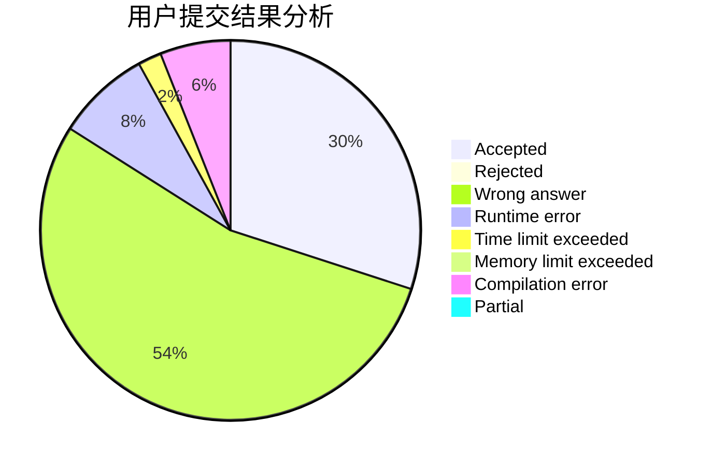
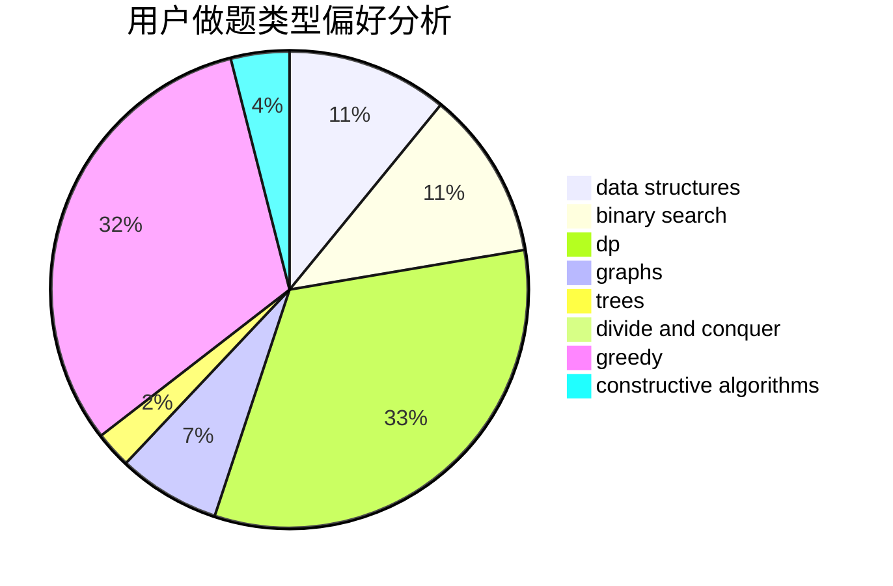
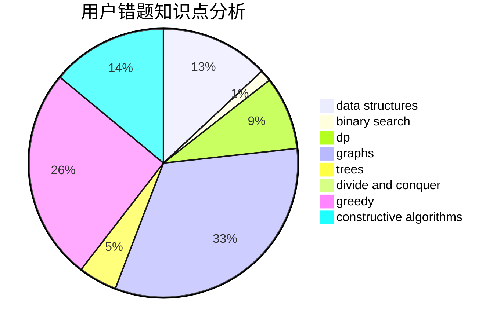

# 2020upOrange

<!-- tabs:start -->

#### **用户提交结果分析**

#### **用户做题类型偏好分析**

#### **用户错题知识点分析**

<!-- tabs:end -->
# 推荐题目
[1295D](https://codeforces.com/contest/1295/problem/D)		math,
                        number theory		  
[1216D](https://codeforces.com/contest/1216/problem/D)		math		  
[1199C](https://codeforces.com/contest/1199/problem/C)		dsu,graphs,sortings,trees		  
[1033B](https://codeforces.com/contest/1033/problem/B)		math,
                        number theory		  
[1294C](https://codeforces.com/contest/1294/problem/C)		greedy,
                        math,
                        number theory		  
[1294A](https://codeforces.com/contest/1294/problem/A)		math		  
[1074A](https://codeforces.com/contest/1074/problem/A)		dsu,graphs,sortings,trees		  
[1295F](https://codeforces.com/contest/1295/problem/F)		combinatorics,
                        dp,
                        probabilities		  
[1296F](https://codeforces.com/contest/1296/problem/F)		constructive algorithms,
                        dfs and similar,
                        greedy,
                        sortings,
                        trees		  
[114A](https://codeforces.com/contest/114/problem/A)		math		  
