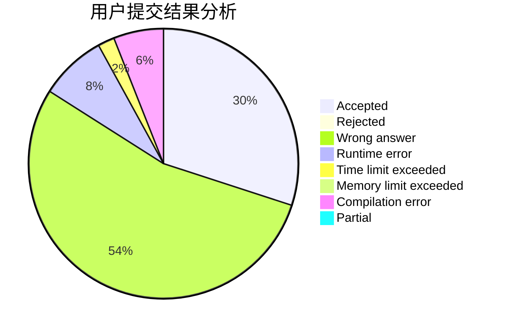
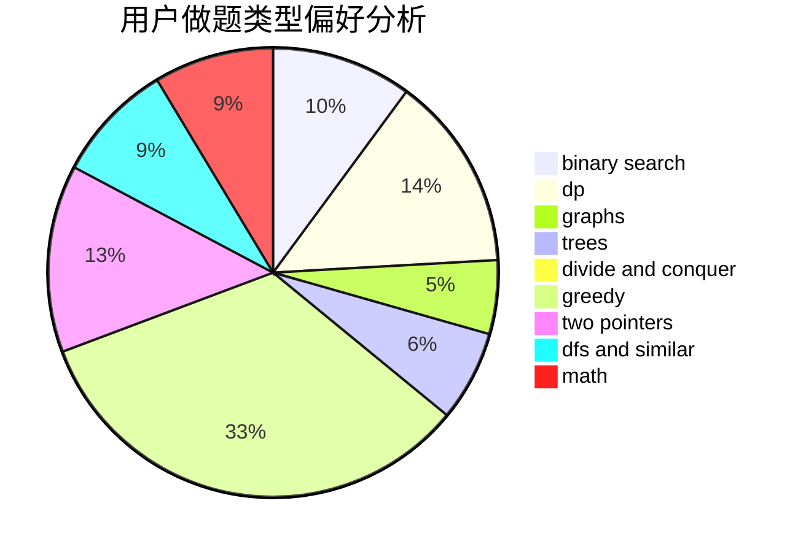

# 2020upOrange

<!-- tabs:start -->

#### **用户提交结果分析**

#### **用户做题类型偏好分析**

<!-- tabs:end -->
# 推荐题目
[1302F](https://codeforces.com/contest/1302/problem/F)
[1223A](https://codeforces.com/contest/1223/problem/A)
[12031](https://codeforces.com/contest/1203/problem/1)
[1033E](https://codeforces.com/contest/1033/problem/E)
[1300E](https://codeforces.com/contest/1300/problem/E)
[1300C](https://codeforces.com/contest/1300/problem/C)
[1075A](https://codeforces.com/contest/1075/problem/A)
[1303B](https://codeforces.com/contest/1303/problem/B)
[13042](https://codeforces.com/contest/1304/problem/2)
[1151D](https://codeforces.com/contest/1151/problem/D)
