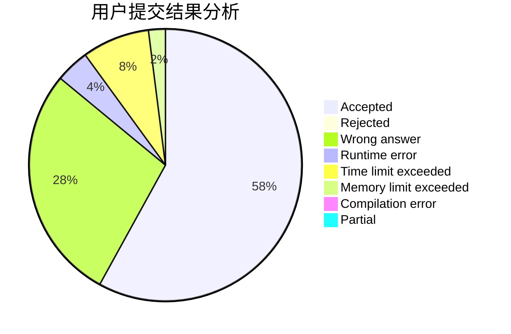
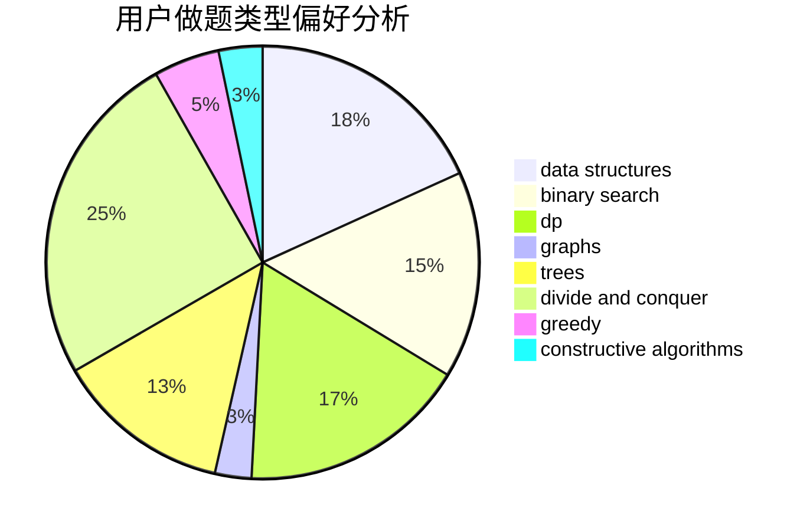
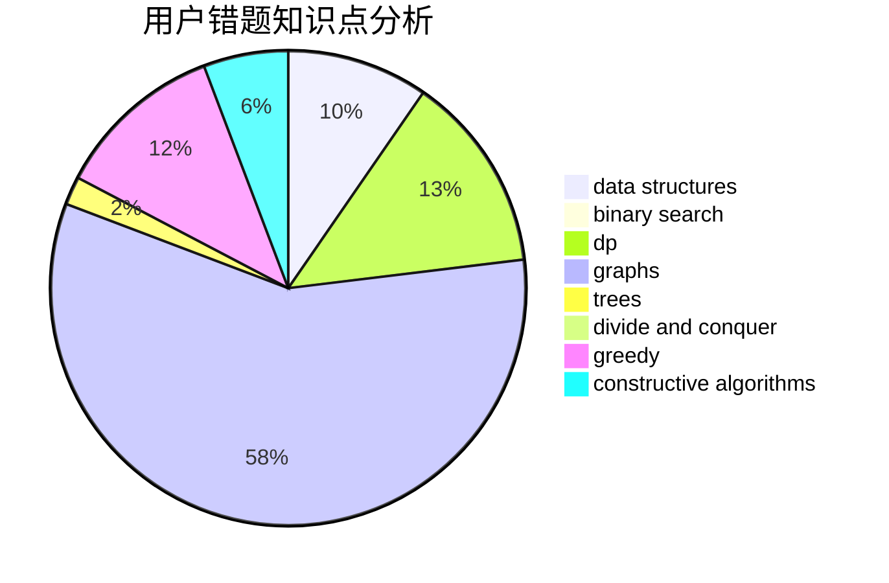

# HChhokmah

<!-- tabs:start -->

#### **用户提交结果分析**

#### **用户做题类型偏好分析**

#### **用户错题知识点分析**

<!-- tabs:end -->
# 推荐题目
[913A](https://codeforces.com/contest/913/problem/A)		implementation,
                        math		  
[7C](https://codeforces.com/contest/7/problem/C)		math,
                        number theory		  
[437B](https://codeforces.com/contest/437/problem/B)		bitmasks,
                        greedy,
                        implementation,
                        sortings		  
[1086C](https://codeforces.com/contest/1086/problem/C)		dsu,graphs,sortings,trees		  
[220C](https://codeforces.com/contest/220/problem/C)		data structures		  
[1038C](https://codeforces.com/contest/1038/problem/C)		greedy,
                        sortings		  
[913B](https://codeforces.com/contest/913/problem/B)		implementation,
                        trees		  
[1322E](https://codeforces.com/contest/1322/problem/E)		data structures		  
[1362D](https://codeforces.com/contest/1362/problem/D)		dsu,graphs,sortings,trees		  
[1033A](https://codeforces.com/contest/1033/problem/A)		dfs and similar,
                        graphs,
                        implementation		  
