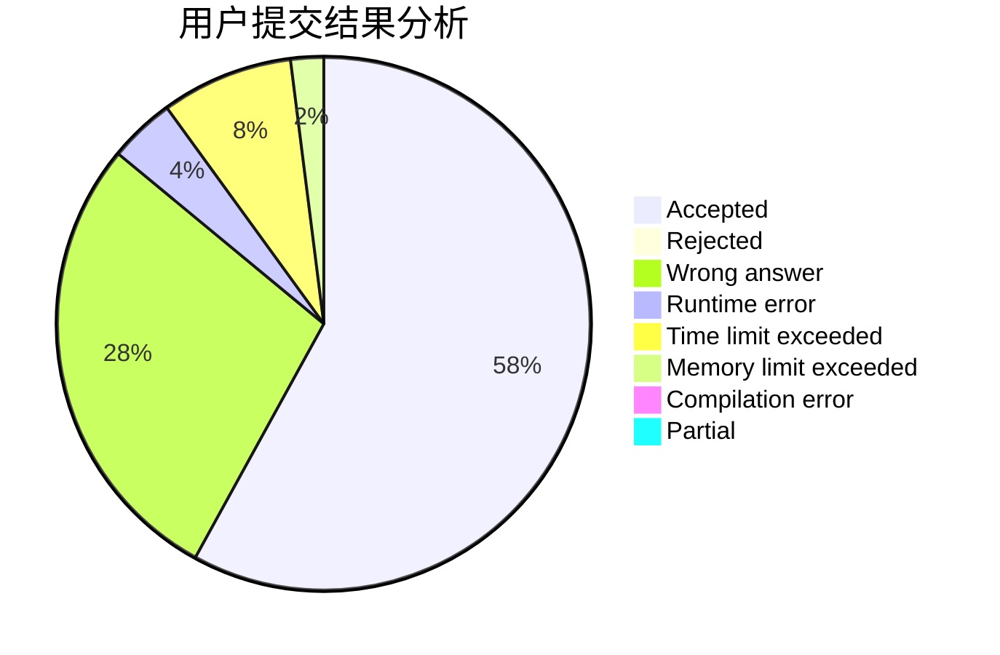
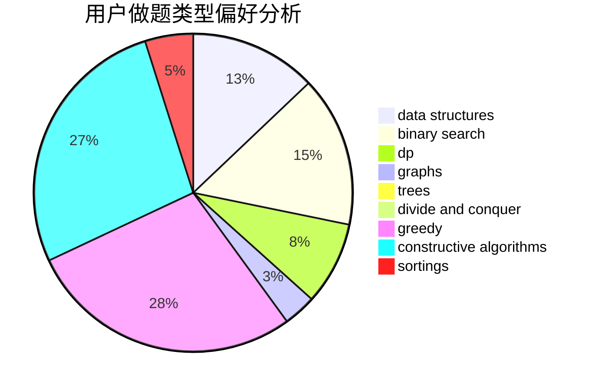
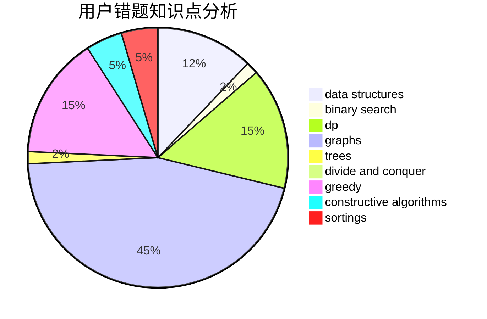

# HChhokmah
<!-- tabs:start -->
#### **用户提交结果分析**

#### **用户做题类型偏好分析**

#### **用户错题知识点分析**

<!-- tabs:end -->
# 推荐题目
[1355E](http://codeforces.com/problemset/problem/1355/E)		binary search,
                        greedy,
                        math,
                        sortings,
                        ternary search		  
[1329C](http://codeforces.com/problemset/problem/1329/C)		constructive algorithms,
                        data structures,
                        greedy,
                        implementation		  
[1037H](http://codeforces.com/problemset/problem/1037/H)		data structures,
                        string suffix structures		  
[181A](http://codeforces.com/problemset/problem/181/A)		brute force,
                        geometry,
                        implementation		  
[792E](http://codeforces.com/problemset/problem/792/E)		greedy,
                        math,
                        number theory		  
[1313B](http://codeforces.com/problemset/problem/1313/B)		constructive algorithms,
                        greedy,
                        implementation,
                        math		  
[1044D](http://codeforces.com/problemset/problem/1044/D)		data structures,
                        dsu		  
[1408G](http://codeforces.com/problemset/problem/1408/G)		combinatorics,
                        dp,
                        dsu,
                        fft,
                        graphs,
                        trees		  
[781E](https://codeforces.com/contest/781/problem/E)		data structures,
                        dp		  
[1268E](http://codeforces.com/problemset/problem/1268/E)		dp		  
<!-- tabs:start -->
#### **data structures**
[1329C](http://codeforces.com/problemset/problem/1329/C)		constructive algorithms,
                        data structures,
                        greedy,
                        implementation		  
[1037H](http://codeforces.com/problemset/problem/1037/H)		data structures,
                        string suffix structures		  
[1044D](http://codeforces.com/problemset/problem/1044/D)		data structures,
                        dsu		  
[781E](https://codeforces.com/contest/781/problem/E)		data structures,
                        dp		  
[1085G](http://codeforces.com/problemset/problem/1085/G)		combinatorics,
                        data structures,
                        dp		  
[895E](http://codeforces.com/problemset/problem/895/E)		data structures,
                        probabilities		  
[567D](http://codeforces.com/problemset/problem/567/D)		binary search,
                        data structures,
                        greedy,
                        sortings		  
[1182C](http://codeforces.com/problemset/problem/1182/C)		data structures,
                        greedy,
                        strings		  
[1294D](http://codeforces.com/problemset/problem/1294/D)		data structures,
                        greedy,
                        implementation,
                        math		  
[1157E](http://codeforces.com/problemset/problem/1157/E)		binary search,
                        data structures,
                        greedy		  
#### **binary search**
[1355E](http://codeforces.com/problemset/problem/1355/E)		binary search,
                        greedy,
                        math,
                        sortings,
                        ternary search		  
[837F](http://codeforces.com/problemset/problem/837/F)		binary search,
                        brute force,
                        combinatorics,
                        math,
                        matrices		  
[1279F](http://codeforces.com/problemset/problem/1279/F)		binary search,
                        dp		  
[567D](http://codeforces.com/problemset/problem/567/D)		binary search,
                        data structures,
                        greedy,
                        sortings		  
[1488C](http://codeforces.com/problemset/problem/1488/C)		*special problem,
                        binary search,
                        brute force,
                        math		  
[1247E](https://codeforces.com/contest/1247/problem/E)		binary search,
                        dp		  
[1157E](http://codeforces.com/problemset/problem/1157/E)		binary search,
                        data structures,
                        greedy		  
[1492C](http://codeforces.com/problemset/problem/1492/C)		binary search,
                        data structures,
                        dp,
                        greedy,
                        two pointers		  
[1463D](http://codeforces.com/problemset/problem/1463/D)		binary search,
                        constructive algorithms,
                        greedy,
                        two pointers		  
[1490G](http://codeforces.com/problemset/problem/1490/G)		binary search,
                        data structures,
                        math		  
#### **dp**
[1408G](http://codeforces.com/problemset/problem/1408/G)		combinatorics,
                        dp,
                        dsu,
                        fft,
                        graphs,
                        trees		  
[781E](https://codeforces.com/contest/781/problem/E)		data structures,
                        dp		  
[1268E](http://codeforces.com/problemset/problem/1268/E)		dp		  
[1085G](http://codeforces.com/problemset/problem/1085/G)		combinatorics,
                        data structures,
                        dp		  
[895C](http://codeforces.com/problemset/problem/895/C)		bitmasks,
                        combinatorics,
                        dp,
                        math		  
[1279F](http://codeforces.com/problemset/problem/1279/F)		binary search,
                        dp		  
[547C](http://codeforces.com/problemset/problem/547/C)		bitmasks,
                        combinatorics,
                        dp,
                        math,
                        number theory		  
[1247E](https://codeforces.com/contest/1247/problem/E)		binary search,
                        dp		  
[1327E](http://codeforces.com/problemset/problem/1327/E)		combinatorics,
                        dp,
                        math		  
[1461F](http://codeforces.com/problemset/problem/1461/F)		constructive algorithms,
                        dp,
                        greedy		  
#### **graph**
[1408G](http://codeforces.com/problemset/problem/1408/G)		combinatorics,
                        dp,
                        dsu,
                        fft,
                        graphs,
                        trees		  
[1487C](http://codeforces.com/problemset/problem/1487/C)		brute force,
                        constructive algorithms,
                        dfs and similar,
                        graphs,
                        greedy,
                        implementation,
                        math		  
[1437C](http://codeforces.com/problemset/problem/1437/C)		dp,
                        flows,
                        graph matchings,
                        greedy,
                        math,
                        sortings		  
[1470D](http://codeforces.com/problemset/problem/1470/D)		constructive algorithms,
                        dfs and similar,
                        graph matchings,
                        graphs,
                        greedy		  
[1476C](http://codeforces.com/problemset/problem/1476/C)		dp,
                        graphs,
                        greedy		  
[1304D](http://codeforces.com/problemset/problem/1304/D)		constructive algorithms,
                        graphs,
                        greedy,
                        two pointers		  
[1475C](http://codeforces.com/problemset/problem/1475/C)		combinatorics,
                        graphs,
                        math		  
[553E](http://codeforces.com/problemset/problem/553/E)		dp,
                        fft,
                        graphs,
                        math,
                        probabilities		  
[1495C](http://codeforces.com/problemset/problem/1495/C)		constructive algorithms,
                        graphs		  
[1510K](http://codeforces.com/problemset/problem/1510/K)		brute force,
                        graphs,
                        implementation		  
#### **trees**
[1408G](http://codeforces.com/problemset/problem/1408/G)		combinatorics,
                        dp,
                        dsu,
                        fft,
                        graphs,
                        trees		  
[1479D](http://codeforces.com/problemset/problem/1479/D)		binary search,
                        bitmasks,
                        brute force,
                        data structures,
                        probabilities,
                        trees		  
[1511C](http://codeforces.com/problemset/problem/1511/C)		brute force,
                        data structures,
                        implementation,
                        trees		  
[1499F](http://codeforces.com/problemset/problem/1499/F)		combinatorics,
                        dfs and similar,
                        dp,
                        trees		  
[1491E](http://codeforces.com/problemset/problem/1491/E)		brute force,
                        dfs and similar,
                        divide and conquer,
                        number theory,
                        trees		  
[1466D](http://codeforces.com/problemset/problem/1466/D)		data structures,
                        greedy,
                        sortings,
                        trees		  
[1495D](http://codeforces.com/problemset/problem/1495/D)		combinatorics,
                        dfs and similar,
                        graphs,
                        math,
                        shortest paths,
                        trees		  
[1303G](http://codeforces.com/problemset/problem/1303/G)		data structures,
                        divide and conquer,
                        geometry,
                        trees		  
[1454E](http://codeforces.com/problemset/problem/1454/E)		combinatorics,
                        dfs and similar,
                        graphs,
                        trees		  
[1494D](http://codeforces.com/problemset/problem/1494/D)		constructive algorithms,
                        data structures,
                        dfs and similar,
                        divide and conquer,
                        dsu,
                        greedy,
                        sortings,
                        trees		  
#### **divide and conquer**
[1461D](http://codeforces.com/problemset/problem/1461/D)		binary search,
                        brute force,
                        data structures,
                        divide and conquer,
                        implementation,
                        sortings		  
[1466G](http://codeforces.com/problemset/problem/1466/G)		combinatorics,
                        divide and conquer,
                        hashing,
                        math,
                        string suffix structures,
                        strings		  
[1490D](http://codeforces.com/problemset/problem/1490/D)		dfs and similar,
                        divide and conquer,
                        implementation		  
[1483C](https://codeforces.com/contest/1483/problem/C)		data structures,
                        divide and conquer,
                        dp		  
[1491E](http://codeforces.com/problemset/problem/1491/E)		brute force,
                        dfs and similar,
                        divide and conquer,
                        number theory,
                        trees		  
[1303G](http://codeforces.com/problemset/problem/1303/G)		data structures,
                        divide and conquer,
                        geometry,
                        trees		  
[1494D](http://codeforces.com/problemset/problem/1494/D)		constructive algorithms,
                        data structures,
                        dfs and similar,
                        divide and conquer,
                        dsu,
                        greedy,
                        sortings,
                        trees		  
[1482E](http://codeforces.com/problemset/problem/1482/E)		data structures,
                        divide and conquer,
                        dp		  
[566C](http://codeforces.com/problemset/problem/566/C)		dfs and similar,
                        divide and conquer,
                        trees		  
[1428F](http://codeforces.com/problemset/problem/1428/F)		binary search,
                        data structures,
                        divide and conquer,
                        dp,
                        two pointers		  
#### **greedy**
[1355E](http://codeforces.com/problemset/problem/1355/E)		binary search,
                        greedy,
                        math,
                        sortings,
                        ternary search		  
[1329C](http://codeforces.com/problemset/problem/1329/C)		constructive algorithms,
                        data structures,
                        greedy,
                        implementation		  
[792E](http://codeforces.com/problemset/problem/792/E)		greedy,
                        math,
                        number theory		  
[1313B](http://codeforces.com/problemset/problem/1313/B)		constructive algorithms,
                        greedy,
                        implementation,
                        math		  
[810B](http://codeforces.com/problemset/problem/810/B)		greedy,
                        sortings		  
[616B](http://codeforces.com/problemset/problem/616/B)		games,
                        greedy		  
[567D](http://codeforces.com/problemset/problem/567/D)		binary search,
                        data structures,
                        greedy,
                        sortings		  
[1182C](http://codeforces.com/problemset/problem/1182/C)		data structures,
                        greedy,
                        strings		  
[1294D](http://codeforces.com/problemset/problem/1294/D)		data structures,
                        greedy,
                        implementation,
                        math		  
[1157E](http://codeforces.com/problemset/problem/1157/E)		binary search,
                        data structures,
                        greedy		  
#### **constructive algorithms**
[1329C](http://codeforces.com/problemset/problem/1329/C)		constructive algorithms,
                        data structures,
                        greedy,
                        implementation		  
[1313B](http://codeforces.com/problemset/problem/1313/B)		constructive algorithms,
                        greedy,
                        implementation,
                        math		  
[409H](http://codeforces.com/problemset/problem/409/H)		*special problem,
                        brute force,
                        constructive algorithms,
                        dsu,
                        implementation		  
[727C](http://codeforces.com/problemset/problem/727/C)		constructive algorithms,
                        interactive,
                        math		  
[710C](http://codeforces.com/problemset/problem/710/C)		constructive algorithms,
                        math		  
[1227G](http://codeforces.com/problemset/problem/1227/G)		constructive algorithms		  
[1401B](http://codeforces.com/problemset/problem/1401/B)		constructive algorithms,
                        greedy,
                        math		  
[1450C1](http://codeforces.com/problemset/problem/1450/C1)		constructive algorithms,
                        math		  
[1461F](http://codeforces.com/problemset/problem/1461/F)		constructive algorithms,
                        dp,
                        greedy		  
[1493A](http://codeforces.com/problemset/problem/1493/A)		constructive algorithms,
                        greedy		  
#### **sortings**
[1355E](http://codeforces.com/problemset/problem/1355/E)		binary search,
                        greedy,
                        math,
                        sortings,
                        ternary search		  
[810B](http://codeforces.com/problemset/problem/810/B)		greedy,
                        sortings		  
[567D](http://codeforces.com/problemset/problem/567/D)		binary search,
                        data structures,
                        greedy,
                        sortings		  
[1496C](https://codeforces.com/contest/1496/problem/C)		geometry,
                        greedy,
                        math,
                        sortings		  
[1495A](http://codeforces.com/problemset/problem/1495/A)		geometry,
                        greedy,
                        math,
                        sortings		  
[1497A](http://codeforces.com/problemset/problem/1497/A)		brute force,
                        data structures,
                        greedy,
                        sortings		  
[1427A](http://codeforces.com/problemset/problem/1427/A)		math,
                        sortings		  
[1461D](http://codeforces.com/problemset/problem/1461/D)		binary search,
                        brute force,
                        data structures,
                        divide and conquer,
                        implementation,
                        sortings		  
[1437C](http://codeforces.com/problemset/problem/1437/C)		dp,
                        flows,
                        graph matchings,
                        greedy,
                        math,
                        sortings		  
[1473A](http://codeforces.com/problemset/problem/1473/A)		greedy,
                        implementation,
                        math,
                        sortings		  
<!-- tabs:end -->
