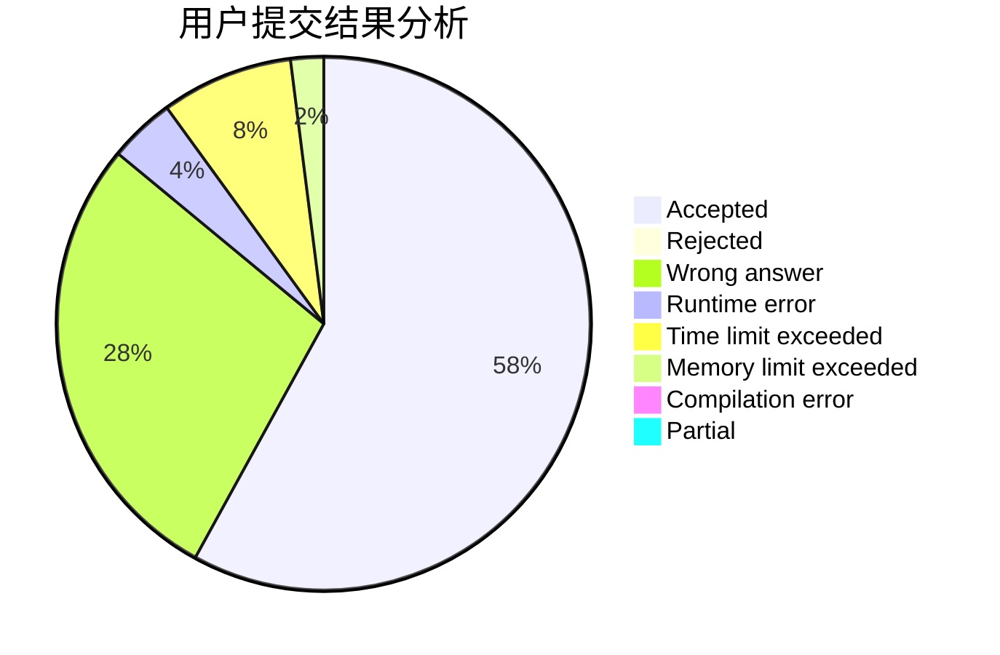
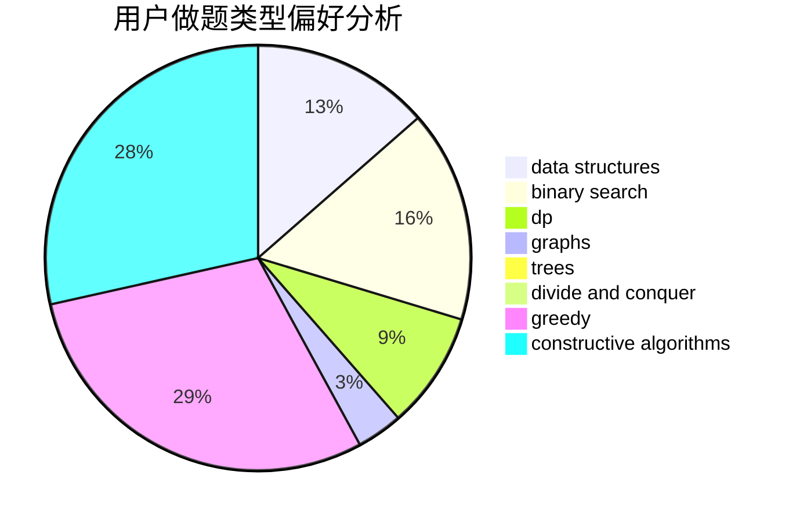
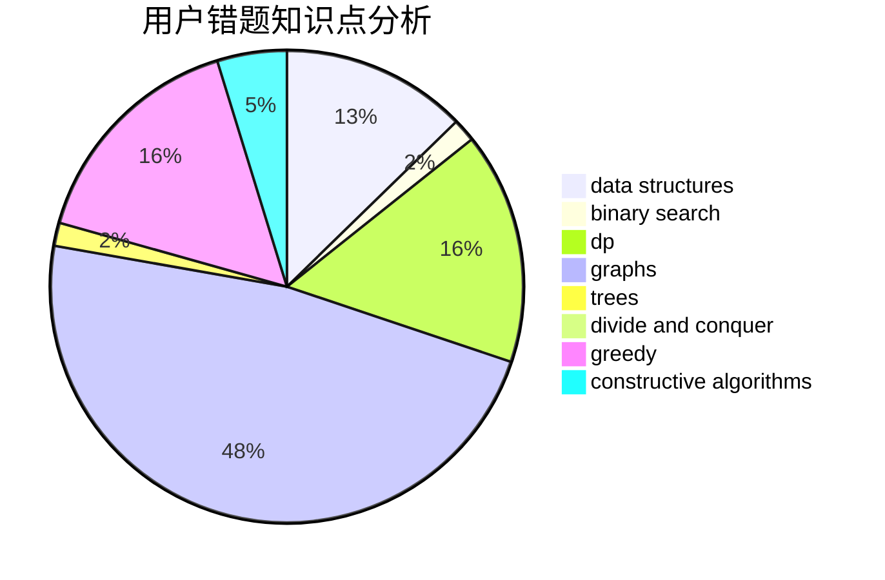

# HChhokmah

<!-- tabs:start -->

#### **用户提交结果分析**

#### **用户做题类型偏好分析**

#### **用户错题知识点分析**

<!-- tabs:end -->
# 推荐题目
[895C](https://codeforces.com/contest/895/problem/C)		bitmasks,
                        combinatorics,
                        dp,
                        math		  
[781E](https://codeforces.com/contest/781/problem/E)		dsu,graphs,sortings,trees		  
[409H](https://codeforces.com/contest/409/problem/H)		*special problem,
                        brute force,
                        constructive algorithms,
                        dsu,
                        implementation		  
[1085G](https://codeforces.com/contest/1085/problem/G)		combinatorics,
                        data structures,
                        dp		  
[199D](https://codeforces.com/contest/199/problem/D)		dsu,graphs,sortings,trees		  
[1037H](https://codeforces.com/contest/1037/problem/H)		data structures,
                        string suffix structures		  
[895D](https://codeforces.com/contest/895/problem/D)		combinatorics,
                        math,
                        strings		  
[1313B](https://codeforces.com/contest/1313/problem/B)		constructive algorithms,
                        greedy,
                        implementation,
                        math		  
[1355E](https://codeforces.com/contest/1355/problem/E)		binary search,
                        greedy,
                        math,
                        sortings,
                        ternary search		  
[1032D](https://codeforces.com/contest/1032/problem/D)		geometry,
                        implementation		  
